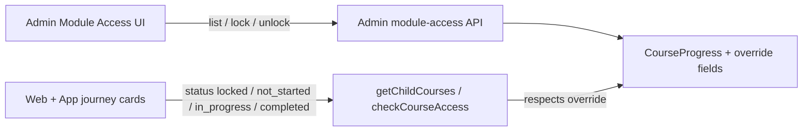

# Plan: Admin Module Access Control (Lock / Unlock per Child)

> **Status:** Phase 1 implemented (backend + admin UI). App/web journey consume `status` as before.  
> **Scope:** Backend API + Admin web UI + App/Web child clients (consume status only)  
> **Audience:** Engineering + client review

---

## Goal

Give admins a dedicated screen to **view each child’s progress across journey modules (steps)** and **manually lock or unlock** incomplete modules for that child.

Today, module access is decided automatically by:

1. **Prerequisites** (`Course.isSequential` + `prerequisites`)
2. **One-active-module rule** (`MAX_IN_PROGRESS = 1` in `getChildCourses`)
3. **Auto-unlock next** after completion (`unlockNextCourse`)

The client needs an **admin override** so a specific child can be given (or denied) access to a specific module without waiting for sequential completion.

---

## Naming (navigation + product language)

| Layer | Recommended name | Why |
|-------|------------------|-----|
| Admin sidebar | **Module Access** | Matches existing “Module” under Courses; clear for ops |
| Page title | Module Access Control | Explicit about lock/unlock |
| API resource | `/api/admin/module-access` | Admin-only, not mixed into child-facing progress routes |
| In-app child copy | Unchanged (“Locked Step”) | Child UX stays the same |

**Avoid:** “Students” as nav label if the rest of admin says “Users / children”. Prefer **children** in API/docs and **Module Access** in the UI.

Alternate names (if client prefers): *Step Control*, *Learner Progress*, *Unlock Control*.

---

## Current system (what we must not break)

### Data

- **`Course`** = one journey “step” / module (`stepOrder`, `isSequential`, `prerequisites`, `contents[]`).
- **`CourseProgress`** = per child × course (`status`: `not_started` | `in_progress` | `completed` | `locked`).

Relevant files:

- `backend/models/CourseProgress.js`
- `backend/services/courseProgress.services.js` (`checkCourseAccess`, `getChildCourses`, `unlockNextCourse`, `checkStepAccess`)
- `backend/routes/courseProgress.routes.js`
- Child UI: `frontend/.../ChildJourneyCards.jsx`, `app/components/child/journey/journey-cards.tsx`
- Admin nav: `frontend/src/components/admin/common/AdminSidebar.jsx`

### Important conflict

`getChildCourses` **re-writes** progress on every list call:

- Auto-unlocks the next accessible locked module when none are active
- Re-locks modules beyond the 1-active limit

**Any admin unlock that only sets `status: 'in_progress'` will be undone** the next time the journey loads, unless we persist an override the auto-logic respects.

---

## Product rules (proposed)

1. **Unit of control = course/module** (journey card), not an inner content step inside a module.
2. **Completed modules cannot be locked or unlocked** via this UI (read-only “Completed”).
3. **Unlock** sets the module accessible for that child even if prerequisites are incomplete.
4. **Lock** blocks the module for that child even if prerequisites would otherwise allow it.
5. **Admin unlock may temporarily allow more than one active module** for that child (support / exception cases). Document this to the client; optional later: “unlock replaces current active module.”
6. **Clear override** returns the module to automatic sequential rules (optional Phase 2 button: “Reset to automatic”).
7. Actions are **audited** (who / when / why optional note).

---

## Architecture overview



Child clients already render from `status` returned by the progress API. **No new child screens** if status stays accurate.

---

## Backend changes

### 1. Model — `CourseProgress` override fields

Add fields (names can be adjusted; keep them explicit):

```js
accessOverride: {
  type: String,
  enum: ['none', 'force_unlock', 'force_lock'],
  default: 'none',
},
accessOverrideAt: { type: Date, default: null },
accessOverrideBy: {
  type: mongoose.Schema.Types.ObjectId,
  ref: 'User',
  default: null,
},
accessOverrideNote: {
  type: String,
  maxlength: 500,
  default: '',
},
```

**Semantics**

| `accessOverride` | Effect on access / list status |
|------------------|--------------------------------|
| `none` | Existing automatic rules |
| `force_unlock` | Treat as accessible; if status was `locked`, set to `not_started` or keep `in_progress` |
| `force_lock` | Treat as locked; set `status: 'locked'` (only if not `completed`) |

**Never change `completed` via lock/unlock.**

### 2. Service — honor override everywhere access is decided

Update:

| Function | Change |
|----------|--------|
| `checkCourseAccess` | If `force_unlock` → `{ accessible: true, reason: 'admin_override' }`. If `force_lock` → `{ accessible: false, reason: 'admin_locked' }` |
| `getChildCourses` | Skip auto lock/unlock for courses with non-`none` override; never re-lock a `force_unlock` course under `MAX_IN_PROGRESS` |
| `getOrCreateCourseProgress` / content update / mark complete | Respect override before throwing “Course is locked” |
| `unlockNextCourse` | Do not auto-unlock a course that is `force_lock`; do not clear `force_unlock` |

Optional helper:

```js
applyAccessOverride(progress, accessCheck) → { accessible, statusHint, reason }
```

### 3. Admin API (new)

Mount under something like `/api/admin/module-access`, protected with `protect` + `authorize('admin')` (and optionally `teacher` if product allows).

| Method | Path | Purpose |
|--------|------|---------|
| `GET` | `/` | Paginated children with summary (name, parent email, active module, completed count, locked count, hasOverrides) |
| `GET` | `/children/:childId` | Full module list for one child: course title, `stepOrder`, progress %, status, `accessOverride`, content completed counts |
| `POST` | `/children/:childId/courses/:courseId/unlock` | Set `force_unlock`, update status if needed |
| `POST` | `/children/:childId/courses/:courseId/lock` | Set `force_lock`, set status `locked` if not completed |
| `POST` | `/children/:childId/courses/:courseId/clear-override` | Set override back to `none`, then recompute status from automatic rules |

**Query params for list:** `search`, `page`, `limit`, `hasOverride`, `program` / filters as needed.

**Response shape (child detail) — illustrative:**

```json
{
  "child": { "_id": "...", "name": "...", "parent": { "email": "..." } },
  "modules": [
    {
      "courseId": "...",
      "title": "Week 1",
      "stepOrder": 1,
      "status": "completed",
      "progressPercentage": 100,
      "accessible": true,
      "accessOverride": "none",
      "canLock": false,
      "canUnlock": false,
      "completedContent": 5,
      "totalContent": 5
    },
    {
      "courseId": "...",
      "title": "Week 3",
      "stepOrder": 3,
      "status": "locked",
      "progressPercentage": 0,
      "accessible": false,
      "accessOverride": "none",
      "canLock": false,
      "canUnlock": true,
      "completedContent": 0,
      "totalContent": 4
    }
  ]
}
```

Button enablement:

- `canUnlock` = status ≠ `completed` AND (status === `locked` OR `accessOverride === 'force_lock'`)
- `canLock` = status ≠ `completed` AND status ≠ `locked` (or allow lock even when already locked only to set override — prefer hide when already effectively locked without override)

### 4. Audit (recommended)

Either:

- Store last override on `CourseProgress` (minimum), or
- Append to a small `ModuleAccessAudit` collection: `{ child, course, action, by, note, at, previousStatus, previousOverride }`

### 5. Files to add / touch (backend)

| Action | Path |
|--------|------|
| Edit | `backend/models/CourseProgress.js` |
| Edit | `backend/services/courseProgress.services.js` |
| Add | `backend/services/moduleAccess.services.js` |
| Add | `backend/controllers/moduleAccess.controller.js` |
| Add | `backend/routes/moduleAccess.routes.js` |
| Edit | App router mount (`backend/app.js` or equivalent) |
| Add | `backend/tests/moduleAccess.service.test.js` (+ e2e if pattern exists) |

### 6. Tests (backend)

- Unlock child A for course N → `checkCourseAccess` true even if prereqs incomplete
- Lock child A for course M → journey list returns `locked`; content update rejected
- `getChildCourses` does **not** re-lock a `force_unlock` module
- `getChildCourses` does **not** auto-unlock a `force_lock` module
- Completed course → lock/unlock endpoints return 400
- Clear override → status returns to sequential expectation
- Non-admin → 403

---

## Admin frontend changes

### Navigation

In `AdminSidebar.jsx`, add (near Users / Check Audio):

```text
Module Access  →  /admin/module-access
```

Icon suggestion: `LockOpenOutlined` or `ManageAccountsOutlined`.

### Routing

In `AppRouter.jsx`:

- `path="/admin/module-access"` → `AdminModuleAccess` page (admin-protected like other admin routes).

### Page structure (mirror Check Audio / Users patterns)

```
frontend/src/pages/admin/AdminModuleAccess.jsx
frontend/src/components/admin/moduleAccess/
  ModuleAccessHeader.jsx
  ModuleAccessFilters.jsx
  ModuleAccessChildrenTable.jsx      // list of children + summary chips
  ModuleAccessChildDetailDrawer.jsx  // or expand row / detail page
  ModuleAccessModuleRow.jsx          // status + Lock / Unlock / Clear
  ModuleAccessPagination.jsx
frontend/src/services/moduleAccessService.js
frontend/src/hooks/moduleAccessHook.js   // optional; keep logic out of JSX
```

### UX flow

1. **List children** — search by child name / parent email; columns: Child, Parent, Active module, Progress summary, Overrides badge, Actions (“Manage”).
2. **Manage** opens drawer/page with ordered modules (`stepOrder`).
3. Each incomplete module row:
   - Status chip: Completed / In progress / Not started / Locked / Admin unlocked / Admin locked
   - Progress bar + `completed/total` content
   - **Unlock** / **Lock** buttons (confirm dialog)
   - Optional note field on confirm
4. Toast on success; refresh that child’s module list.
5. Loading / empty / error states consistent with admin pages.

### Permissions

Admin only (same gate as other admin pages). Teachers only if backend allows and product confirms.

---

## App (React Native) changes

Journey already uses API `status` (`locked` | …) in:

- `app/services/journeyService.ts`
- `app/hooks/journeyHook.ts`
- `app/components/child/journey/journey-cards.tsx`

**Expected app work is small:**

1. Confirm unlock/lock after admin action is visible after a journey refetch (pull-to-refresh or re-enter journey).
2. Do **not** add local lock rules that ignore server `status` / `accessible`.
3. Optional: if any client caches journey list aggressively, invalidate on focus when returning to journey.
4. Same for web child journey (`ChildJourneyCards.jsx`) — no new UI; status-driven only.

**No EAS / native build change** unless caching bugs appear.

---

## Web child (non-admin) changes

Same as app: rely on `courseProgressService` / journey list. Verify locked cards still non-clickable when `force_lock`, and clickable when `force_unlock`.

Also verify **program materials / printables** unlocking (`programMaterials.service.js` uses `checkCourseAccess`) respects the same override so unlocked modules expose materials consistently.

---

## Edge cases

| Case | Behavior |
|------|----------|
| Unlock mid-sequence (skip ahead) | Allowed; child can open that module. Earlier incomplete modules stay as-is unless also unlocked. |
| Lock current in-progress module | Status → `locked`; progress % and `contentProgress` **preserved** so unlock later resumes. |
| Two force-unlocked modules | Allowed under proposed rules; document for client. |
| Child completes force-unlocked module | Status → `completed`; clear override to `none` (recommended) so auto-chain continues cleanly. |
| Course unpublished/archived | Hide from admin detail or show disabled. |
| No `CourseProgress` row yet | Create on first lock/unlock with appropriate status + override. |

---

## Phased delivery

### Phase 1 — MVP (recommended first ship)

- [x] Model override fields
- [x] Wire override into `checkCourseAccess` + `getChildCourses`
- [x] Admin list + detail + lock/unlock APIs (+ clear override)
- [x] Admin UI: Module Access page
- [x] Tests for override vs auto-rules
- [x] Docs (this file) marked Implemented when done

### Phase 2

- [x] Clear override (“Reset automatic”) — included in Phase 1
- [ ] Audit log collection + admin “history” panel
- [x] Filters: “has manual override” on list
- [ ] Optional: unlock replaces other active module (strict 1-active again)

### Phase 3 (only if client asks)

- Per-**content**-step lock inside a module (different model; do not conflate with journey modules)

---

## Implementation checklist

### Backend

- [x] Add `accessOverride*` fields to `CourseProgress`
- [x] Honor override in `checkCourseAccess` / `getChildCourses` / content gates
- [x] Admin module-access service + controller + routes
- [x] Mount routes + authorize admin
- [x] Unit/e2e tests

### Frontend (admin)

- [x] Sidebar + route
- [x] Service + page + table/drawer components
- [x] Lock / Unlock confirm + toasts
- [x] Loading / error / empty states

### App + web child

- [x] Journey already uses API `status` (no app code change required)
- [x] Printables/program materials use `checkCourseAccess` (honors override)
- [x] No divergent local lock logic

### Docs / QA

- [x] Update this plan status when shipped
- [ ] Client QA: unlock Week N for Child X → open in app; lock again → blocked

---

## Out of scope

- Parent-facing lock/unlock UI
- Bulk unlock for all children of a school (can be a later endpoint)
- Editing progress percentage or marking content complete from this screen
- Changing global course prerequisites / `stepOrder`

---

## Open questions for client

1. Confirm nav label: **Module Access** vs Step Control vs other.
2. May one child have **multiple** admin-unlocked modules at once? (Plan assumes **yes**.)
3. Should teachers get this screen, or **admin only**?
4. On lock of in-progress work: **preserve progress** (recommended) or reset?
5. After child completes an admin-unlocked module, auto-clear override? (Recommended **yes**.)

---

## Related code references

- Sequential + 1-active enforcement: `backend/services/courseProgress.services.js` (`getChildCourses`, `unlockNextCourse`)
- Progress schema: `backend/models/CourseProgress.js`
- Child journey lock UI: `app/components/child/journey/journey-cards.tsx`, `frontend/src/components/child/journey/ChildJourneyCards.jsx`
- Admin nav pattern: `frontend/src/components/admin/common/AdminSidebar.jsx`
- Similar admin list UX: `frontend/src/pages/admin/AdminCheckingAudio.jsx`
