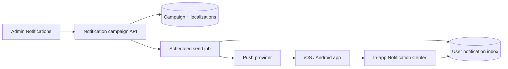

# Plan: Notification System V1 (Phasing)

> **Status (August 2026):** Phase 1 implemented (admin campaign manager + tests). Phase 2 implemented (schedule / send now / test / cancel, timezone-aware scheduler, admin UI, unit + e2e tests). Phase 3 implemented (parent device tokens, Expo push payload/delivery with mocked provider in CI, permission helper, deep-link parser, unit + e2e tests). Phase 4 implemented (parent inbox API, unread badge, bell + history in the app, unit + e2e tests). Real iOS/Android closed-app device QA remains a manual checklist. Phase 5 not started.  
> **Source:** Client email to Jejomar (Rise Up Kids — Notification System V1 Specifications)  
> **Scope:** LMS backend + Admin web (`frontend/`) + mobile app (`app/`)  
> **Out of scope:** Sales site (`riseupkids-sale`), checkout, automated streak/progress/inactivity triggers (design for later, do not build now)

---

## What we think

The spec is clear and the architecture is the right one:

- One **campaign** with many **localizations**, not one notification object per language.
- Admin-controlled timing. No hard-coded weekly schedule.
- Manual send in V1, same service later for automated triggers.
- Language list must come from the platform, not a hard-coded EN / PT / ES limit.
- Meaningful notifications, not volume.

This is a **new product surface**, not a small CMS tweak. Today there is no push stack, no campaign manager, and no in-app notification history. The existing `Announcement` model is a single-language CMS draft and should **not** be stretched into this system.

The one product decision to confirm with the client:

**Children are not User accounts.** A parent logs in, then selects a child. Push tokens live on the **device / parent session**. V1 “Parents / Children / All Users” should mean **which copy and destination** to use, and **which parent devices** to target — not a separate child login. Granular segments (country, module, inactive) stay out of V1, as specified.

---

## Estimate

| View | Range |
|------|--------|
| **Client-facing** | **5–6 weeks** for V1, one engineer, including device QA |
| Engineering hours | **~160–200 hours** |
| With review / store / extra polish | up to **7 weeks** |

Push (iOS + Android, closed-app delivery, test devices) is the risky part. Admin CRUD is the predictable part.

Do **not** promise a few days. Do **not** build automations in this estimate.

---

## Current system (what exists today)

| Piece | Today |
|-------|--------|
| Admin nav | `Notifications` is **commented out** in `AdminSidebar.jsx` (`/admin/notifications`) |
| Admin bell | `AdminNavigation.jsx` has a placeholder menu (“No new notifications”) |
| Data | `backend/models/Announcement.js` — single title/message, no locales, no push, no schedule statuses |
| Children | `ChildProfile` only; `preferences.language` exists (default `en`) |
| Parent language | App language settings still MVP English-only in `LanguageSettingsLanguages.jsx` |
| Jobs | Interval + lock pattern in `backend/jobs/deletionScheduler.js` (no Redis/Bull queue yet) |
| Media | `Media` model + S3 (`s3.service.js`) |
| Mobile | Expo app, scheme `riseupkids`. **No** `expo-notifications` |
| Child header | Logo + stars only (`app/components/child/common/header-nav.tsx`) — no bell |
| Live lessons | `YouTubeLive` + `Meeting` (deep-link targets later) |
| Auth | Admin routes use `protect` + `authorize('admin')` |

---

## Architecture principle

**Architect for the future, implement what provides value today.**



One send pipeline. Manual V1 campaigns and future automations both call the same service: resolve audience → pick localization (fallback English) → write inbox row → send push.

---

## Data model (V1)

Do not create one Mongo document per language.

### `NotificationCampaign`

- `internalName`
- `type` (string, not a frozen enum — seed the V1 list, allow more later)
- `audience` (`all` \| `parents` \| `children` in V1; extra segment fields nullable for later)
- `status` (`draft` \| `scheduled` \| `sending` \| `sent` \| `failed` \| `cancelled`)
- `sendAt` + `timezone`
- `destination` `{ kind, contentId? }`
- `fallbackLanguage` (default `en`)
- `localizations` array: `{ languageCode, imageMediaId, title, message }`
- audit: `createdBy`, `updatedBy`, `scheduledBy`, `sentBy`, timestamps
- delivery totals: targeted / sent / failed / opened (provider-backed)

### `NotificationReceipt` (inbox + delivery)

Per recipient (parent user, plus optional `childId` when the campaign is child-facing):

- campaign id, localization used
- `readAt`
- push result (`queued` \| `sent` \| `failed`) + error code
- device / token snapshot if useful for failure logs

### `DevicePushToken`

- `userId` (parent)
- `platform` (`ios` \| `android`)
- token, last seen, invalid/expired flag

### Platform languages

Editor language tabs come from a **language catalog** (or existing i18n source of truth), not a hard-coded `['en','pt','es']` in the notification UI. V1 catalog can start with EN / PT / ES. Adding a language later should add a tab without a notification-schema rewrite.

Reuse `Media` + S3 for 1920×600 JPG / PNG / WebP. Compress on upload; keep original aspect ratio; do not crop. After send, replacing an image must not break history (receipts store the URL/media id used at send time, or media is immutable once sent).

Do **not** put FCM / APNs / Expo secrets in `frontend/` or `app/`.

---

## V1 notification types (seed list)

Learning / Engagement, Live Lesson, Story Time, New Content, New Book, Mini Mission, Reward, Achievement, Streak, Parent Progress, General Announcement.

Stored as strings (or a small `NotificationType` collection). Admin can gain new types later without a rebuild.

---

## Deep links (V1)

Expo scheme already exists: `riseupkids`.

| Destination | Map onto today | V1 note |
|-------------|----------------|---------|
| Home | `/child/[id]/home` | |
| Journey | `/child/[id]/journey` | |
| Explore | `/child/[id]/explore` | |
| Wall | `/child/[id]/wall` | |
| Live Lesson | YouTube Live / Meetings | Pick a specific live item when type is Live Lesson |
| Specific Book | CMS / module book | Pick book when type is New Book |
| Mini Mission | Star Cam mission | Pick mission when type is Mini Mission |
| Rewards | Child profile / stars | Confirm with client if this is profile |
| Parent Progress | Parent settings / progress | Confirm screen |
| Story Time | **No dedicated route today** | Confirm mapping (Explore vs a future screen) |
| General Announcement | Notification Center detail | |

Unknown destinations stay data-driven (`kind` + optional id) so new ones do not need a schema change.

Live Lesson reminders: **any date**, not hard-coded Mon–Fri. Auto-hook to the live scheduler is **not** V1.

---

## Phases

Ship in order. Each phase should be reviewable. Do not start push until the campaign object and inbox write path exist.

**A phase is not done until its written tests pass.** Manual device checks are extra, not a substitute.

Suggested commands when implementing:

```bash
# backend (from backend/)
npm test -- notificationCampaign notificationScheduler devicePushToken notificationInbox notificationAnalytics

# app (from app/)
npm test -- notification
```

---

### Phase 1 — Admin campaign manager

**Status:** Implemented (August 2026)

**Value:** Ops can create, localize, preview, and save drafts.

- Uncomment / add **Admin → Notifications**
- Campaign list (pagination, filters by status / type)
- Create / edit: internal name, type, audience, destination
- Dynamic language sections from the catalog (image + title + message per language)
- Image upload (1920×600 recommended, 3.2:1, JPG/PNG/WebP, no crop)
- Preview per language (image, title, message, destination)
- Duplicate campaign
- Admin-only (`protect` + `authorize('admin')`)

**Not in this phase:** live push, schedule worker, mobile bell.

**Estimate:** 40–50 hours

#### Written tests (Phase 1)

Create `backend/tests/notificationCampaign.service.test.js` and `backend/tests/adminNotifications.routes.test.js`.

| # | Test | Expected |
|---|------|----------|
| 1.1 | Create campaign with EN + PT + ES localizations | **One** campaign document; three `localizations` entries; not three campaigns |
| 1.2 | Language tabs come from the platform catalog | Adding a catalog language (e.g. `fr`) makes that code valid without changing the campaign schema |
| 1.3 | EN / PT / ES are not a hard-coded permanent limit in the model | Schema accepts any catalog `languageCode`; no `enum: ['en','pt','es']` on localizations |
| 1.4 | Title and message are stored separately from the image | Localization has `title`, `message`, and `imageMediaId` as distinct fields |
| 1.5 | Duplicate campaign | New draft with copied type, audience, destination, and localizations; new `_id`; original unchanged |
| 1.6 | Parent / teacher cannot hit admin notification routes | `401` / `403`; only `authorize('admin')` succeeds |
| 1.7 | List supports pagination and filter by status / type | Page size respected; filter returns only matching campaigns |
| 1.8 | Image upload accepts JPG / PNG / WebP and stores via existing Media/S3 | Reject other types; stored media keeps width/height (no forced crop) |
| 1.9 | Preview payload returns image, title, message, destination, language | Same data admin will later send; no send side effects |

Manual (after tests pass): Admin → Notifications, create, switch language tabs, preview, duplicate.

---

### Phase 2 — Schedule, send, test, statuses

**Status:** Implemented (August 2026)

**Value:** Admin controls when a campaign goes out.

- Draft / Send now / Schedule (date, time, timezone)
- Edit, reschedule, cancel before send
- Statuses: Draft, Scheduled, Sending, Sent, Failed, Cancelled
- Scheduler job (follow `deletionScheduler` lock pattern for V1; queue later if volume needs it)
- **Send test** to designated admin/test devices
- English fallback when a localization is missing
- Log missing localization / job failures

**Estimate:** 30–40 hours (plus overlap with Phase 3 for a real test send)

#### Written tests (Phase 2)

Create `backend/tests/notificationScheduler.service.test.js` and extend campaign route tests.

| # | Test | Expected |
|---|------|----------|
| 2.1 | Save as draft | Status `draft`; `sendAt` empty; no receipts; no push |
| 2.2 | Schedule in a named timezone | Stored `sendAt` + `timezone`; due time converts correctly (e.g. `America/Sao_Paulo` vs UTC) |
| 2.3 | Scheduler does not treat a local wall-clock as UTC | A campaign scheduled for 09:00 in the chosen zone is not sent at 09:00 UTC |
| 2.4 | Send now | Status moves `draft` → `sending` → `sent` (or `failed`); receipts created |
| 2.5 | Edit / reschedule while `scheduled` | New time saved; still `scheduled`; not sent early |
| 2.6 | Cancel while `scheduled` | Status `cancelled`; scheduler skips it; no receipts |
| 2.7 | Edit / cancel after `sent` | Rejected; sent campaign stays immutable |
| 2.8 | Missing user language uses English fallback | User `pt` with only EN localization → receipt uses `en` title/message |
| 2.9 | Missing English when fallback is needed | Status `failed` (or that recipient failed); reason `missing_localization` logged |
| 2.10 | Send test does not mark the campaign `sent` and does not fan out to all users | Only designated test user/device; campaign stays `draft` or `scheduled` |
| 2.11 | No hard-coded weekly cadence | No cron like “every Monday”; only `sendAt` drives due jobs |
| 2.12 | Scheduler lock | Two overlapping ticks: only one send; no duplicate receipts |

Manual (after tests pass): schedule a campaign a few minutes ahead, wait, confirm status; cancel another before send.

Automated coverage also includes `backend/tests/notificationScheduler.e2e.test.js` (create → schedule in `America/Sao_Paulo` → 09:00 UTC does not send → 12:00 UTC sends with English fallback) and frontend tests for schedule payload, table edit/cancel, and the schedule / send-now / test / cancel API calls.

---

### Phase 3 — Push delivery (iOS + Android)

**Status:** Implemented (August 2026) — written tests + e2e with a mocked Expo provider. Manual real-device closed-app checks still required.

**Value:** Families receive the notification on the phone.

- Expo Push (fits this Expo app) with FCM/APNs via EAS — credentials **backend / EAS only**
- Register / refresh / prune tokens
- Deliver when app is open, backgrounded, or closed
- Permission copy (ask once, do not nag):  
  *“Enable notifications to receive Live lesson reminders, new adventures, and important Rise Up Kids updates.”*
- Deep link from the push tap
- Failure handling: invalid/expired token, provider error

**Estimate:** 40–55 hours including real device QA

#### Written tests (Phase 3)

Create `backend/tests/devicePushToken.service.test.js`, `backend/tests/notificationPush.service.test.js`, and `app/__tests__/services/notificationPermission.test.ts` (or equivalent). Mock the Expo/FCM client — do not call the live provider in CI.

| # | Test | Expected |
|---|------|----------|
| 3.1 | Register token stores `userId`, platform, token | Parent user; `ios` or `android` |
| 3.2 | Refresh same device updates `lastSeen`, does not duplicate rows | One row per user + token |
| 3.3 | Invalid / expired token is marked and skipped on the next send | Provider error → token invalid; later send does not retry that token |
| 3.4 | Push payload includes title, message, and destination | Localization fields + `destination.kind` / `contentId` |
| 3.5 | Push secrets are not in app or admin frontend source | Grep/test: no FCM/APNs/Expo access keys under `app/` or `frontend/src` |
| 3.6 | Parent vs children audience resolves to parent devices | No ChildProfile used as a push-token owner |
| 3.7 | Permission helper: denied → do not re-prompt in a loop | One explanation path; settings deep-link available; no spam |
| 3.8 | Deep-link parser maps `kind` + id to an app route | e.g. book id → book screen; live id → live screen; unknown kind does not crash |
| 3.9 | Provider failure on one token does not abort the whole campaign | Other tokens still sent; failed token logged |

Automated coverage also includes `backend/tests/notificationPush.e2e.test.js` (register parent tokens → send → invalid token skipped on next send) and app tests for permission (no nag loop), deep-link mapping, and token registration.

Manual on a **real iOS and Android device** (required for this phase; CI cannot prove closed-app delivery):

- [ ] App open: push appears
- [ ] App backgrounded: push appears
- [ ] App killed: push appears
- [ ] Tap opens the chosen destination
- [ ] Permission denied: no nag loop; settings path works
- [ ] Test-send from admin reaches the designated device

---

### Phase 4 — In-app Notification Center

**Status:** Implemented (August 2026) — parent inbox API, unread badge, bell + history screen, unit + e2e tests. Manual device check still required after backend deploy.

**Value:** History remains if the push was dismissed.

- Bell on the child header and the parent pick-profile screen
- Unread badge from `GET /api/notifications/inbox/unread-count`
- History: image, title, message, date/time, read/unread (`GET /api/notifications/inbox`)
- Open → destination (`childId` on the receipt wins); mark read; mark all read
- Inbox rows are production receipts (`isTest: false`) written at send time, including skipped push (`no_device_token`). Admin Send test rows stay out of the family inbox. Expired quiet-hour copies are hidden.
- Parent A cannot mark Parent B’s rows (`403`)
- V1 inbox is the **parent user**. Child-facing campaigns still appear there with optional `childId` so the tap opens that child’s screen.

**Estimate:** 30–40 hours

#### Written tests (Phase 4)

| # | Test | Expected |
|---|------|----------|
| 4.1 | Send writes inbox receipts even if push is skipped/mocked | History exists without a successful push |
| 4.2 | List returns image, title, message, date/time, read/unread | Sorted newest first; pagination works |
| 4.3 | Unread count matches receipts with `readAt` empty | Badge count stays in sync after mark-read |
| 4.4 | Mark one as read | That row `readAt` set; others unchanged |
| 4.5 | Mark all as read | All current-user receipts `readAt` set; count `0` |
| 4.6 | Parent A cannot read parent B’s inbox | `403` / empty list |
| 4.7 | Tap payload includes destination | Client can route to Home / Journey / book / live / etc. |
| 4.8 | Child-facing campaign still appears on the parent device inbox when that is the V1 targeting model | Receipt tied to parent `userId` (+ optional `childId`) |

Automated coverage: `backend/tests/notificationInbox.service.test.js`, `backend/tests/notificationInbox.e2e.test.js` (send with skipped push → list → unread → mark read → 403), `app/__tests__/utils/notificationCenter.test.ts`, `app/__tests__/services/notificationInboxService.test.ts`, `app/__tests__/services/notificationInbox.e2e.test.ts` (store badge + child destination).

Manual: dismiss the system push, open the bell, confirm the same campaign is there with image; tap it and land on the destination.

---

### Phase 5 — Analytics, audit, hardening

**Value:** “Did it send? Did families open it?”

- Per campaign: targeted, sent, failed, opened/clicked if the provider gives it
- Admin history columns from the spec
- Audit: who created / edited / scheduled / sent, and when
- Sent-image safety (history does not break if CMS image is later replaced)

**Estimate:** 20–28 hours

#### Written tests (Phase 5)

Create `backend/tests/notificationAnalytics.service.test.js`. Regression: re-run Phase 1–4 test files.

| # | Test | Expected |
|---|------|----------|
| 5.1 | Totals: targeted / sent / failed | Match receipt counts after a mocked send |
| 5.2 | Open/click increments only when provider (or in-app open) reports it | No invented open rate |
| 5.3 | Audit fields set on create / edit / schedule / send | `createdBy`, `updatedBy`, `scheduledBy`, `sentBy` + timestamps |
| 5.4 | Admin list columns | Internal name, type, audience, send date, status, languages, targeted, sent, failed, opens if present |
| 5.5 | After send, replacing campaign image does not change inbox history image | Receipt stores sent URL/media snapshot |
| 5.6 | Deleting unused draft image is allowed; deleting a sent snapshot is blocked or history still resolves | History never 404s |
| 5.7 | Failed deliveries expose a reason when known | `invalid_token`, `provider_error`, `missing_localization`, `job_failed` |
| 5.8 | Non-admin cannot read analytics | `403` |

Manual: send a small test campaign, confirm admin row matches device reality (sent vs opened).

### Later (not V1 build)

Keep the same campaign + send service. Do **not** start a second notification architecture.

- Streak, progress, rewards, parent weekly summary, content assignment, inactivity
- School / country / module / family-plan segments
- Auto Live Lesson reminders from the live scheduler
- Extra languages beyond the catalog
- Fine-grained admin roles (V1 = all admins)

---

## Recommended V1 admin workflow (done when this works)

1. Admin → Notifications → Create
2. Internal name, type, audience
3. Localized image + title + message per language
4. Destination / deep link (content picker when the type needs it)
5. Preview each language
6. Send test
7. Save draft **or** send now **or** schedule (date / time / timezone)
8. Review status and delivery results

---

## Definition of Done (client spec → phase)

| Spec item | Phase |
|-----------|--------|
| Create campaign with multiple dynamic language versions | 1 |
| Upload branded image per localization | 1 |
| Title and message stored separately | 1 |
| Audience + destination | 1 |
| Preview | 1 |
| Duplicate | 1 |
| Send test / send now / schedule / edit / cancel | 2 |
| Timezone-aware schedule | 2 |
| iOS + Android, including closed app | 3 |
| Token storage + cleanup | 3 |
| Permission handling | 3 |
| Bell, history, read/unread | 4 |
| Basic delivery results + failure logs | 5 |
| Admin permission + secrets backend-only | 1 + 3 |
| Future languages + future automations (architecture only) | 1 data model |

---

## Test files by phase

| Phase | Written tests (create while implementing) |
|-------|-------------------------------------------|
| 1 | `backend/tests/notificationCampaign.service.test.js`, `backend/tests/adminNotifications.routes.test.js` |
| 2 | `backend/tests/notificationScheduler.service.test.js` |
| 3 | `backend/tests/devicePushToken.service.test.js`, `backend/tests/notificationPush.service.test.js`, `backend/tests/notificationPush.e2e.test.js`, `app/__tests__/services/notificationPermission.test.ts` |
| 4 | `backend/tests/notificationInbox.service.test.js`, `backend/tests/notificationInbox.e2e.test.js`, `app/__tests__/utils/notificationCenter.test.ts`, `app/__tests__/services/notificationInboxService.test.ts`, `app/__tests__/services/notificationInbox.e2e.test.ts` |
| 5 | `backend/tests/notificationAnalytics.service.test.js` + re-run Phase 1–4 |

Phase 3 still needs a real iOS and Android pass for closed-app delivery. That does not replace the mocked CI tests.

---

## Files to add or touch (expected)

| Area | Likely files |
|------|----------------|
| Models | `backend/models/NotificationCampaign.js`, `NotificationReceipt.js`, `DevicePushToken.js` (+ `models/index.js`) |
| API | `backend/routes/adminNotifications.routes.js`, `backend/routes/appNotifications.routes.js`, services/controllers |
| Job | `backend/jobs/notificationScheduler.js` (pattern from `deletionScheduler.js`) |
| Media | Existing `Media` + `s3.service.js` + image compress util |
| Admin UI | `frontend/src/pages/admin/AdminNotifications.jsx`, campaign form/list/preview, uncomment sidebar item |
| App | `expo-notifications` plugin, token register, permission sheet, bell on `header-nav.tsx` + parent pick-profile, `app/parent/notifications.tsx`, inbox service/store/hook, deep-link handler in `app/_layout.tsx` |
| Tests | Files in **Test files by phase** above |

Do not put push private keys in the app binary.

---

## Risks

1. **Child vs parent identity** — confirm audience targeting before Phase 3.
2. **Store / EAS credentials** — iOS + Android push cannot be fully proven without real devices and store credentials.
3. **Story Time / Rewards / Parent Progress** — some destinations have no dedicated screen yet; map or add a detail view.
4. **WhatsApp / Facebook share previews** are **sales-site SEO**, not this system.
5. **Announcement model** — leave in place; do not migrate mid-V1 unless unused.

---

## Client reply (estimate)

A reasonable reply:

The spec makes sense, and it is the right shape for V1: one campaign, many languages, admin-controlled send, and room later for automation without a rebuild.

This is a full notification product (admin, backend, iOS, and Android). Estimate **about 5 to 6 weeks** for V1. Automated streak/progress reminders stay for a later phase, on the same system.
