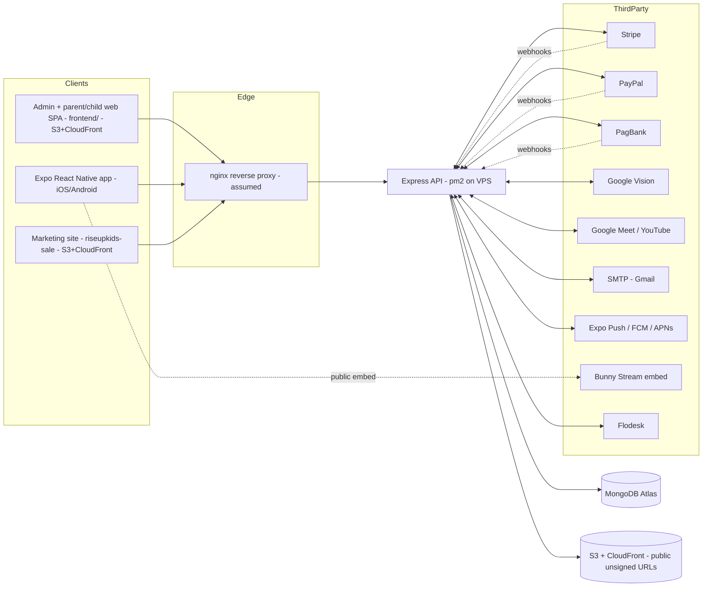

# Rise Up Kids — Security Audit 2026

> **This is Chunk 1 / "Phase 1" of** [SECURITY_STRENGTHENING_IMPLEMENTATION_PLAN.md](SECURITY_STRENGTHENING_IMPLEMENTATION_PLAN.md).
> Every finding here has an **owning chunk (2–14)**. No code was changed to produce this document.
> **Date:** 2026-09-01 · **Auditor:** Engineering (internal) · **Status:** Delivered, pending client review of severity + ordering.

## Remediation status update — 2026-09-03

All three **Critical** findings are **fixed and verified**. Progress has also started on the High/Medium backlog. Details, diffs-in-words, and test evidence are inline on each finding below (search "**Status:**").

| ID | Sev | Fix | Verified by |
|----|-----|-----|-------------|
| **RUK-SEC-001** | Critical | SCORM wrapper hardened in place: a valid `token` is now mandatory (401 without one) and `path`/`entryPoint` are rejected (400) unless they resolve inside `backend/uploads/scorm` | 14 tests (`scormWrapper.security.test.js`) + a live HTTP run of the exact PoC against the real, unmocked route |
| **RUK-SEC-002** | Critical | Public `POST /api/auth/register` always creates `role: 'parent'` server-side; any client `role`/`linkedParent` is ignored, not just defaulted | 11 tests (`auth.register.roleGuard.test.js`) — every role value from the PoC |
| **RUK-SEC-003** | Critical | Server refuses to boot with a missing/known-weak `JWT_SECRET` (any env), or one <32 chars in production/staging (`backend/config/jwtSecret.js` → `server.js` startup) | 10 tests (`jwtSecretPolicy.test.js`) + a manual boot test |
| **RUK-SEC-007** | High | **Closed.** (a) Per-IP rate limiting on all public auth endpoints — generic `429` + `Retry-After`. (b) Per-account lockout: exponential silent temporary lock after repeated wrong passwords, auto-unlock, admin list/unlock endpoints. (c) 6-digit code caps: the admin OTP / password-reset code is destroyed after 5 wrong guesses. (pm2 is `fork` mode — no shared limiter store needed.) | 67 tests, including three full-stack `supertest` e2e suites (one against the real router, two against the whole stack + a real in-memory MongoDB) |
| **RUK-SEC-029** | Medium | `app.set('trust proxy', …)` now driven by `TRUST_PROXY` env (default 1) so the rate limiter keys on the real client IP | Covered by the RUK-SEC-007 e2e tests (per-IP isolation via `X-Forwarded-For`) |

**Also fixed:** RUK-SEC-022 — all three unauthenticated public write endpoints (`subscribe-flodesk`, `/api/invitation`, `/api/school-application`) are now per-IP rate limited. A bot check (CAPTCHA) stays a recommended later enhancement.

**Still open on RUK-SEC-007 (Chunk 2):** per-token attempt caps on the 6-digit OTP / reset codes, and a shared Redis/Mongo store for the *rate limiter* under pm2 cluster mode. (Per-account lockout landed 2026-09-03.)

**Client actions required:**
1. **Set (or confirm) a real, random `JWT_SECRET` on the production server (`openssl rand -hex 32`) before deploying** — the API will otherwise refuse to start. If there's any chance the current secret is the shipped example value, also rotate the other secrets in that `.env` (RUK-SEC-001 may have exposed them prior to that fix).
2. **Confirm the reverse-proxy hop count** and set `TRUST_PROXY` accordingly (default 1 = a single nginx). Wrong value → either all users share one rate-limit bucket, or clients can spoof `X-Forwarded-For`.

**Not yet started:** RUK-SEC-004 (JWT issuance from unauthenticated payment-session GETs) — larger change, Chunk 8/9. Full removal of the SCORM module (rather than in-place hardening) remains a recommended future cleanup — see RUK-SEC-001.

---

## 0. Executive summary

The platform is functionally mature but was built feature-first, with security controls that are largely **absent rather than weak**: there is no rate limiting, no security headers, no request sanitisation layer, no signed media, no session revocation, no CI security gate, and no structured/redacted logging. Authentication is a single 7‑day JWT for every role.

Three findings were **Critical**. **All three are now fixed** (see the remediation status block above) — the table below is kept as the original assessment for the record.

| ID | Critical finding | One-line impact | Status |
|----|------------------|-----------------|--------|
| **RUK-SEC-001** | Unauthenticated path traversal / arbitrary file read in the SCORM wrapper endpoint | Anyone on the internet can read `backend/.env` (all secrets) and any file the API process can read | **FIXED** 2026-09-01 |
| **RUK-SEC-002** | Public registration accepts `role: "admin"` | Anyone can create an admin account and complete its email OTP (sent to their own inbox) | **FIXED** 2026-09-01 |
| **RUK-SEC-003** | Default/weak `JWT_SECRET` shipped in `.env.example`, no strength enforcement | If the default (or any weak value) reached production, any user — including admin — can be forged | **FIXED** 2026-09-01 (secret-strength enforcement only — 7-day tokens + no revocation stay tracked under Chunk 9) |

RUK-SEC-001 alone was enough to compromise the entire platform (read `.env` → forge JWTs → full admin → database, S3, Stripe/PayPal/PagBank, Google service account).

**Child-privacy exposure is material.** Kids Wall shares children's display names, ages, avatars and photos across all families by default, without verifiable parental consent, and unmoderated posts are retrievable by any authenticated parent (RUK-SEC-006). All uploaded media, including children's photos, is served from public unsigned CloudFront URLs (RUK-SEC-005).

**Good news, confirmed by code:**
- Children are never `User` accounts; child API access is always mediated by a parent JWT + `childId`.
- Star Cam camera captures are sent to Google Vision **in memory only** and are **not stored** server-side (no S3 write, `StarCamEvent` holds only game telemetry). This removes a large COPPA concern the draft plan had assumed.
- Payment webhooks for Stripe and PagBank **do** verify signatures; PagBank uses `crypto.timingSafeEqual`.
- The account-deletion pipeline is real, automatic (30‑day scheduler), and purges most child collections + S3 media.
- No live secrets were found in a quick git-history scan (full entropy scan still pending — Chunk 4).
- Admin management routes (`/api/parents`, `/api/teachers`, `/api/admin/*`) are correctly gated with `authorize('admin')`.

**Counts (as originally assessed):** 3 Critical · 10 High · 16 Medium · 7 Low/Info (36 total). **As of 2026-09-03 (Chunk 2 complete):** 0 Critical open (3 fixed) · **9 High open** (RUK-SEC-007 closed) · **14 Medium open** (RUK-SEC-029 and RUK-SEC-022 closed) · 7 Low/Info open. → **6 findings fixed, 30 remaining.**

---

## 1. Scope & methodology

### Commit SHAs reviewed

| Component | Path | SHA |
|-----------|------|-----|
| Monorepo (backend, frontend, app, docs) | `D:\UPWORK\RiseUpKids` | `725c90a3b89c5711ee02324429a31ebaa8b68356` (branch `master`) |
| Sales site (submodule) | `riseupkids-sale` | `fb3780726628ad0e35e35ef50fb1012e8a0c0622` |

### Method

- Manual source review of `backend/` (51 routes, 51 controllers, 73 services, 49 models, 7 middleware), targeted review of `frontend/src`, `app/`, and the deployment docs.
- `npm audit` on all four workspaces.
- Quick git-history scan for common secret patterns (`sk_live_`, `AKIA…`, `BEGIN PRIVATE KEY`).
- No dynamic testing against a running environment was performed (no staging URL supplied). Reproduction steps below are derived from code and must be confirmed on staging as each fix lands.

### Out of scope for this pass (tracked, not assessed in depth)

- The `riseupkids-sale` marketing site's own code (only its submodule SHA is pinned here).
- Live infrastructure configuration (VPS hardening, nginx config, MongoDB Atlas network list, WAF) — assessed from deployment docs only; full review is **Chunk 13**.
- Third-party penetration testing — **Chunk 14**.
- A full entropy-based secret-history scan (`gitleaks`/`trufflehog`) — **Chunk 4**.

### Environment facts established

| Fact | Source |
|------|--------|
| API is served over HTTPS at `https://api.riseup.kids/api` | `app/eas.json` (`EXPO_PUBLIC_API_URL`) |
| Historic frontend config referenced the API as `http://<ip>:5000/api` | `frontend/S3_DEPLOYMENT_CONFIG.md` — confirm no plaintext path remains (Chunk 13) |
| Deploy is manual: `npm run build` → S3 → CloudFront invalidation (web); `git pull && npm install && pm2 restart all` (API) | client, `frontend/DEPLOYMENT_GUIDE.md` |
| No `.github/workflows` — no CI of any kind | repo root |
| `.env` is git-ignored; only `.env.example` is tracked | `backend/.gitignore`, `git ls-files` |

---

## 2. Architecture & trust boundaries



**Trust boundaries & notes**

| Boundary | State |
|----------|-------|
| Client → API | JWT bearer only. No refresh, no revocation, no rate limit, no WAF. CORS env-driven in prod, permissive regex in dev. |
| API → MongoDB Atlas | Connection string in `.env`. Atlas network list not reviewed (Chunk 13). No `express-mongo-sanitize`. |
| API → S3/CloudFront | **All objects public and unsigned** — no per-user authorization on any media (RUK-SEC-005). |
| API ← payment webhooks | Stripe & PagBank verify signatures; PayPal has **no webhook** (client-driven capture). Idempotency partial (RUK-SEC-014). |
| API → Google Vision | Service-account private key in `.env`. Images sent in-memory, not stored. |
| App ↔ device storage | Plaintext `AsyncStorage` for the auth token (RUK-SEC-012). |
| Static content (SCORM/HTML5) | Extracted to disk / S3 and served from the CloudFront/API origin; wrapper endpoint is unauthenticated (RUK-SEC-001). |

---

## 3. Asset & data inventory

Classification: **C-PII** = child personal data (COPPA/LGPD sensitive) · **PII** = adult personal data · **PAY** = payment/billing · **CRED** = credential/secret · **INT** = internal.

| Collection (`backend/models/`) | Class | Sensitive fields | Notes |
|---|---|---|---|
| `User` | PII, PAY, CRED | `email`, `password` (bcrypt), `taxId` (CPF), `stripe*`/`paypal*`/`pagseguro*` ids, `termsAcceptedIp` | 7‑day JWT subject. `role` incl `admin`. |
| `ChildProfile` | **C-PII** | `displayName`, `age` (0–18), `avatar` | Age band, not DOB — good minimisation. `kidsWallEnabled` default **true**. |
| `ChildStats`, `StarEarning`, `Progress`, `CourseProgress`, `BookReading`, `VideoWatch`, `AudioAssignmentProgress`, `ChantProgress` | C-PII (behavioural) | per-child activity/timestamps | Purged on deletion. |
| `KidsWallPost` | **C-PII** | `title`, `content`, `images[]`/`videos[]` (Media), `child` | Cross-family feed exposure (RUK-SEC-006). |
| `StarCamEvent` | C-PII (telemetry) | `targetWord`, `recognizedWord`, `attempts`, `metadata` (Mixed) | **No images stored.** `metadata` is unbounded `Mixed`. |
| `Media` | **C-PII** possible | `url`, `filePath`, `uploadedBy` | Public unsigned URLs (RUK-SEC-005). |
| `PasswordResetToken`, `LoginOtpToken` | CRED | 6-digit `code`, `expiresAt` | No per-token attempt counter (RUK-SEC-007). |
| `PagSeguroCheckout`, `StripeWebhookEvent` | PAY | ids, `webhookEvents[]`, amounts | Idempotency store (Stripe partial). |
| `AccountDeletionRequest` | PII | `requesterIp`, `subscriptionNotes`, `purgeSummary` | `requesterIp` from spoofable header. |
| `ContactSupport`, `Leads`, `SchoolProspect` | PII | `email`, `whatsapp`, `parentName`, child `age` | `Leads`/`SchoolProspect` fed by **unauthenticated** public forms (RUK-SEC-022). |
| `GoogleIntegration`, `YouTubeIntegration` | CRED | OAuth tokens | Not reviewed in depth. |
| `DevicePushToken`, `NotificationReceipt`, `NotificationCampaign` | PII | push tokens, per-recipient receipts | Not removed on account deletion (RUK-SEC-026). |

---

## 4. Threat model (STRIDE, prioritised)

| # | Threat | Boundary | Realised by | Status |
|---|--------|----------|-------------|--------|
| T1 | **Information disclosure** — read server secrets | Client → API | `GET /api/scorm/:id/wrapper?path=../../../.env` | **Open — RUK-SEC-001 (Critical)** |
| T2 | **Elevation of privilege** — become admin | Client → API | `POST /api/auth/register {"role":"admin"}` | **Open — RUK-SEC-002 (Critical)** |
| T3 | **Spoofing** — forge any user's JWT | Token | Weak `JWT_SECRET`; no revocation | **Open — RUK-SEC-003 (Critical)** |
| T4 | **Spoofing** — take over an account via a leaked payment/session id | Client → API | `GET /api/stripe/checkout-session/:id` returns a JWT | **Open — RUK-SEC-004 (High)** |
| T5 | **Information disclosure** — access another family's child photos | Client → S3 | Public unsigned CloudFront URLs; cross-family Kids Wall feed | **Open — RUK-SEC-005, -006 (High)** |
| T6 | **Tampering / DoS** — brute force, credential stuffing, OTP guessing, resource exhaustion | Client → API | No rate limiting or lockout | **Open — RUK-SEC-007 (High)** |
| T7 | **Elevation / IDOR** — teacher/content_creator manipulates arbitrary children | Client → API | Ownership check gated on `role === 'parent'` only | **Open — RUK-SEC-008 (High)** |
| T8 | **Repudiation** — no audit trail for admin actions | API | No `AdminAuditLog` | **Open — Chunk 12** |
| T9 | **Tampering** — activate a subscription without paying / replay a webhook | API ← webhooks | Partial idempotency; PayPal replay | **Partial — RUK-SEC-014, -015 (Medium)** |
| T10 | **Information disclosure** — PII/secrets in logs | API → logs | `morgan combined` + 400+ raw `console.*` + full Stripe object dumps | **Open — RUK-SEC-010 (High)** |
| T11 | **Tampering** — NoSQL operator / regex injection | Client → DB | No sanitiser; raw `$regex` on user input | **Open — RUK-SEC-016 (Medium)** |
| T12 | **Spoofing** — stolen mobile token (device compromise, backup) | Device | Plaintext `AsyncStorage` | **Open — RUK-SEC-012 (High)** |

---

## 5. Findings register

Severity uses CVSS-style reasoning (impact × exploitability × exposure). "Owning chunk" points to [the plan](SECURITY_STRENGTHENING_IMPLEMENTATION_PLAN.md).

### RUK-SEC-001 — Unauthenticated arbitrary file read via SCORM wrapper path traversal · **CRITICAL** · **Status: FIXED (2026-09-01)**

- **Where:** [`backend/routes/scorm.routes.js:50`](../backend/routes/scorm.routes.js) — `router.get('/:contentId/wrapper', scormController.getWrapper)` has **no `protect`**. [`backend/controllers/scorm.controller.js:447`](../backend/controllers/scorm.controller.js) `getWrapper`.
- **Description:** `path` and `entryPoint` come straight from `req.query`. `cleanPath` only strips a leading `scorm/`. They are then passed to `path.join(__dirname, '../uploads/scorm', cleanPath)` and `path.join(scormBasePathForFiles, entryPoint)` with **no `..` rejection and no realpath containment check**. The file is read with `fs.readFile(scormHtmlPath, 'utf-8')` and returned in the HTTP response body. The `token` query param is optional; on an invalid/absent token the handler just logs a warning and continues.
- **Impact:** Any unauthenticated internet client can read arbitrary files the Node process can read, including `backend/.env` — which contains `JWT_SECRET`, `MONGODB_URI` (with Atlas credentials), `AWS_ACCESS_KEY_ID`/`AWS_SECRET_ACCESS_KEY`, `STRIPE_SECRET_KEY`, `STRIPE_WEBHOOK_SECRET`, `PAYPAL_CLIENT_SECRET`, `PAGSEGURO_ACCESS_TOKEN`, `GOOGLE_VISION_PRIVATE_KEY`, SMTP credentials. With `JWT_SECRET` an attacker forges an admin JWT and owns the platform; with the Atlas URI they read/modify the database directly; with the AWS keys they access S3.
- **Reproduction (confirm on staging):**
  `GET https://api.riseup.kids/api/scorm/anything/wrapper?contentType=book&entryPoint=.env&path=../../..`
  → expect the contents of `backend/.env` embedded in the returned HTML. Vary `entryPoint`/`path` depth to reach `server.js`, `config/*`, etc.
- **SCORM is retired (client, 2026-09):** no new SCORM content is authored — books/videos now use `packageType: 'html5'` or `'builtin'`, served safely from S3/CloudFront via `html5handler` (which has none of this problem). **But the `/api/scorm` route is still mounted** (`server.js` `app.use('/api/scorm', scormRoutes)`) and `getWrapper`'s vulnerable branch reads files straight from the `path` query param **without looking up any content** — so it is exploitable today regardless of whether any SCORM package exists. Severity stays **Critical while the code is deployed**.
- **Fix (preferred — removal, not a patch):** delete `backend/routes/scorm.routes.js`, `backend/controllers/scorm.controller.js`, `backend/services/scorm.service.js`, the SCORM multer uploaders in `middleware/upload.js`, the `app.use('/api/scorm', …)` mount and the `app.use('/scorm', express.static(…))` mount in `server.js`, plus the frontend `ScormPlayer.jsx` / `scormPlayer.jsx` / `AdminTestScormModal.jsx`. **Precondition:** confirm no production content still has `packageType: 'scorm'` (query `Book`, `Media`/video, `Activity`, `Chant`); if any exists, migrate it to `html5`/`builtin` first, or keep a hardened read-only serve path. Note `packageType` still **defaults to `'scorm'`** in `book.services.js:42` and SCORM branches pervade `book/video/activity/chant.services.js` — schedule that cleanup with the removal.
- **Fix (if removal must wait):** add `protect`; reject `path`/`entryPoint` containing `..`, absolute paths, or NUL bytes; `path.resolve(final).startsWith(path.resolve(allowedRoot) + path.sep)`; restrict `entryPoint` to `*.htm(l)`.
- **Owning chunk:** **12** (removal). Given severity, treat as a **hotfix before the rest of the plan** — removal is low-risk since the feature is retired.

**What shipped (2026-09-01):** the "if removal must wait" hardening above, not the full module deletion — the SCORM feature was left in place but closed the hole:
  - `getWrapper` now requires a valid `token` query param; missing or invalid → `401` before any file-system work happens (`backend/controllers/scorm.controller.js`). It's still a query param (not an `Authorization` header) because the wrapper is loaded as an iframe `src`, which can't carry custom headers — see RUK-SEC-024.
  - New `isSafeScormRelativePath()` rejects any `path`/`entryPoint` containing `..`, an absolute path, a Windows drive letter, or a NUL byte (`400`).
  - New `isWithinRoot()` is the **authoritative** second check: after building the final file path, it's `path.resolve`d and asserted to be `backend/uploads/scorm` itself or a descendant of it — so even a value that slipped past the string check can't escape.
  - `backend/routes/scorm.routes.js` doc comment updated to match.
  - **Verified live**, not just mocked: a throwaway Express app mounting the real, unmodified `scorm.routes.js` (no DB needed for this code path) was hit with the exact PoC from this finding —

    ```
    GET /api/scorm/x/wrapper?contentType=book&entryPoint=.env&path=../../..          (no token)   → 401, no .env content
    GET /api/scorm/x/wrapper?contentType=book&entryPoint=.env&path=../../..&token=…  (valid token) → 400, no .env content
    GET /api/scorm/x/wrapper?...&entryPoint=../../../server.js&token=…               (valid token) → 400, no source leaked
    GET /api/scorm/x/wrapper?...&entryPoint=index.html&path=book/x/extracted&token=… (valid token) → 404 (well-formed, doesn't exist) — proves legitimate-shaped requests still flow through
    ```
  - Unit/integration coverage: `backend/tests/scormWrapper.security.test.js` (14 tests) — the path-safety helpers in isolation, no-token / bad-token / bad-contentType / traversal-in-`entryPoint` / traversal-in-`path` (multiple encodings incl. backslashes), the exact audit PoC end to end, and a legitimate in-bounds request still serving `200` with the API-shim script injected.
  - **Not done:** full module removal (routes/controller/service/uploaders/static mounts/frontend players). Still recommended once the client confirms no production content has `packageType: 'scorm'` — see the "SCORM is retired" note above. Until then this endpoint is hardened, not gone.
  - **Follow-up:** rotate every secret in `backend/.env` on the production server — this endpoint was live and unauthenticated before this fix, so treat prior disclosure as possible.

### RUK-SEC-002 — Privilege escalation: public registration creates admin accounts · **CRITICAL** · **Status: FIXED (2026-09-01)**

- **Where:** [`backend/services/auth.services.js:121`](../backend/services/auth.services.js) `register()` — `if (!['admin', 'parent'].includes(role)) throw` then `User.create({ name, email, password, role })`. Reached from [`backend/controllers/auth.controller.js:15`](../backend/controllers/auth.controller.js) `registerUser` which forwards `req.body.role`. Route [`backend/routes/auth.routes.js:42`](../backend/routes/auth.routes.js) `POST /api/auth/register` — public, no rate limit, no email verification.
- **Description:** `role: "admin"` is explicitly on the allow-list. Admin login then requires a 6‑digit email OTP (`login()` → `issueAdminLoginOtp`), but the OTP is sent to the **attacker-controlled email** they just registered with.
- **Impact:** Full, immediate administrative compromise by any anonymous user. Admin can manage all users, content, notifications, Kids Wall moderation, module access, deletion requests.
- **Reproduction:** `POST /api/auth/register` with `{"name":"x","email":"attacker@evil.tld","password":"password123","role":"admin"}` → `POST /api/auth/login` with the same creds → read the OTP from the attacker inbox → `POST /api/auth/verify-login-otp` → receive an admin JWT.
- **Fix:** Public registration must hard-code `role: 'parent'` (and ignore any client `role`). Admin/teacher/content_creator accounts are created only by an existing admin. Add an email-verification step for self-registration.
- **Owning chunk:** **2** (ship the role guard as part of the auth-hardening chunk; consider an immediate hotfix).

**What shipped (2026-09-01):**
  - `backend/services/auth.services.js` `register()` no longer reads `role` from its input at all — `User.create()` is called with `role: 'parent'` unconditionally. There is no longer a code path where a caller-supplied value reaches the database write.
  - `backend/controllers/auth.controller.js` `registerUser` stopped reading/forwarding `role` and `linkedParent` from `req.body` (they were already meaningless to the old default-then-validate logic; now they're not read at all). JSDoc on both functions updated to say this explicitly.
  - Confirmed `authService.register` has exactly one caller in the codebase (`registerUser`), so this change is safe with no other internal admin-creation flow depending on it — admins/teachers are created elsewhere (`parents.services.js` / `teachers.controller.js`, both already `authorize('admin')`-gated).
  - **Tests:** `backend/tests/auth.register.roleGuard.test.js` (11 tests) — parametrized over `role: 'admin' | 'ADMIN' | 'Admin' | 'teacher' | 'content_creator' | '' | undefined | null`, asserting `User.create` is invoked with `role: 'parent'` in every case; plus that `linkedParent` is never forwarded, and that the pre-existing "email already registered" / "missing fields" behavior is untouched.
  - Email verification on self-registration (the fix's second recommendation) is **not** included in this pass — noted as a follow-up, not a blocker (the critical issue was privilege escalation, which is closed).

### RUK-SEC-003 — Weak/default JWT secret, no enforcement, long-lived non-revocable tokens · **CRITICAL** · **Status: PARTIALLY FIXED (2026-09-01) — secret-strength enforcement shipped; session lifetime/revocation still open (Chunk 9)**

- **Where:** [`backend/.env.example:13`](../backend/.env.example) `JWT_SECRET=your_super_secret_jwt_key_change_this_in_production`. [`backend/services/auth.services.js:101`](../backend/services/auth.services.js) `generateToken` — `expiresIn: JWT_EXPIRE || '7d'` for **every** role. [`backend/middleware/auth.js:32`](../backend/middleware/auth.js) `jwt.verify(token, process.env.JWT_SECRET)`. No startup assertion anywhere in `server.js`.
- **Description:** If production ever used the example value (or any low-entropy secret), every JWT is forgeable. Even with a strong secret: tokens live 7 days for admins, `logout` is a server-side no-op ([`auth.services.js:352`](../backend/services/auth.services.js)), and nothing is invalidated on password change/reset, role change, or `isActive=false` within that window.
- **Impact:** Forge any user incl. admin (if secret is weak); a stolen token is valid for up to 7 days with no way to revoke it.
- **Reproduction:** Confirm the production `JWT_SECRET` value and length with the client. Change a user's password, then continue using their pre-change token — it still works.
- **Fix:** Enforce ≥ 256-bit random `JWT_SECRET` at startup (reject the known default and any value < 32 chars). Split `JWT_EXPIRE` by role (short for admin/teacher). Implement refresh tokens + revocation + a `tokenVersion` check.
- **Owning chunk:** **4** (secret policy) + **9** (session lifecycle).

**What shipped (2026-09-01) — the secret-policy half (Chunk 4 scope):**
  - New `backend/config/jwtSecret.js` exports `assertStrongJwtSecret()`, called once at the top of `backend/server.js` (right after `dotenv.config()`, before the DB connection, mail config, or any route is loaded).
  - Throws (process exits, nothing starts serving) when: `JWT_SECRET` is unset/blank; it exactly matches a known example/placeholder value (`your_super_secret_jwt_key_change_this_in_production`, `secret`, `changeme`, etc. — case-insensitive) in **any** environment; or, in `production`/`staging`, it's shorter than 32 characters. In `development`, a short-but-not-known-weak secret only logs a warning, so local setup isn't blocked.
  - `backend/.env.example` — `JWT_SECRET` is now blank with a comment instructing `openssl rand -hex 32`, instead of shipping a value that looked usable.
  - **Verified live, not just unit-tested:** ran `node server.js` three ways and confirmed real process behavior —
    ```
    JWT_SECRET=your_super_secret_jwt_key_change_this_in_production  → throws immediately, exit before Mongo/Express touch anything
    JWT_SECRET= (empty)                                              → throws immediately, same
    JWT_SECRET=short123 NODE_ENV=development                        → warns, does NOT exit, proceeds to boot normally
    ```
  - **Tests:** `backend/tests/jwtSecretPolicy.test.js` (10 tests) — missing/blank, the exact `.env.example` default in every `NODE_ENV`, other known-weak values case-insensitively, short-secret behavior differing between `production`/`staging` (throws) and `development` (warns only), and a strong secret passing silently.
  - **Not done (still Chunk 9):** `JWT_EXPIRE` is unchanged (7 days, all roles); there is still no refresh-token flow, no revocation, no `tokenVersion` check, and `logout` is still a client-side-only no-op. A stolen token is unaffected by this fix and remains valid for up to 7 days. This is tracked as its own chunk, not folded into the critical-fix pass, because it's a session-architecture change, not a one-line hardening.

### RUK-SEC-004 — Unauthenticated JWT issuance from payment session identifiers · **HIGH**

- **Where:** [`backend/controllers/stripe.controller.js:92`](../backend/controllers/stripe.controller.js) `getCheckoutSessionDetails` (`GET /api/stripe/checkout-session/:sessionId`), [`backend/controllers/checkout.controller.js:84`](../backend/controllers/checkout.controller.js) `getSessionDetails` (`GET /api/checkout/session/:sessionId`), [`backend/controllers/pagseguro.controller.js:161`](../backend/controllers/pagseguro.controller.js) `getCheckoutDetails` (`GET /api/pagseguro/checkout/:checkoutId`). All three are unauthenticated.
- **Description:** Each endpoint takes a payment session / checkout identifier from the URL, verifies the payment is complete, and returns `{ user, token }` where `token` is a full 7‑day JWT for that user. The identifier is placed in the post-payment redirect URL (`?session_id={CHECKOUT_SESSION_ID}`), so it lands in server access logs, browser history, and any `Referer` header the success page emits. There is no one-time-use guard and no time limit — the PagBank branch will re-mint a token for an already-active user forever if you know their `pagbankCheckoutId`.
- **Impact:** Whoever obtains a user's checkout/session id (log access, shared link, referrer leak, shoulder-surf) can obtain a valid session for that account.
- **Fix:** Do not issue auth tokens from an unauthenticated GET keyed on a payment id. Options: (a) require the user to be logged in already and only *upgrade* their subscription state; (b) issue a single-use, short-TTL, server-generated nonce at redirect time and exchange that once; (c) email a magic link. Never put the identifier that grants the token in a URL.
- **Owning chunk:** **8** + **9**.

### RUK-SEC-005 — Private media served from public, unsigned CloudFront URLs · **HIGH**

- **Where:** [`backend/services/s3.service.js:69`](../backend/services/s3.service.js) `getPublicUrl` is the **only** URL builder; every upload path returns `getPublicUrl(key)`. [`backend/utils/resolveMediaDeliveryUrl.util.js`](../backend/utils/resolveMediaDeliveryUrl.util.js) passes through absolute URLs unchanged. No `getSignedUrl` / CloudFront signed-cookie logic anywhere. [`backend/routes/cloudfront.routes.js`](../backend/routes/cloudfront.routes.js) is only a health check.
- **Description:** Kids Wall photos, child avatars, program printables (PDFs), Star Cam mission media, and all course content live at `https://<cloudfront>/<folder>/<YYYYMMDD-HHMMSS>-<Math.round(Math.random()*1e9)>.<ext>`. Filenames embed the upload timestamp and a **non-cryptographic** ~30-bit random number ([`upload.js:17`](../backend/middleware/upload.js), [`s3.service.js:58`](../backend/services/s3.service.js)). There is no authorization on delivery.
- **Impact:** Any leaked, logged, cached, or referrer-exposed media URL gives permanent, unauthenticated access to a child's photo. The weak filename scheme lowers the bar for enumeration within a known folder + time window.
- **Fix:** Serve private media (Kids Wall, avatars, Star Cam, printables) only via short-TTL CloudFront signed URLs (or signed cookies) bound to an authenticated request; make the bucket private with Origin Access Control (Chunk 13). Use `crypto.randomUUID()` for keys.
- **Owning chunk:** **12** (delivery) + **13** (bucket/OAC).

### RUK-SEC-006 — Kids Wall: no verifiable parental consent; opt-out and cross-family exposure · **HIGH (COPPA/LGPD)**

- **Where:** [`backend/services/kidsWallConsent.service.js:16`](../backend/services/kidsWallConsent.service.js) `isKidsWallEnabled` returns `child?.kidsWallEnabled !== false` and `assertKidsWallEnabled` **never checks `kidsWallConsentAt`**. [`backend/services/children.services.js:162`](../backend/services/children.services.js) `createChild` sets `kidsWallEnabled: true` and `kidsWallConsentAt: new Date()` automatically. [`backend/models/ChildProfile.js:51`](../backend/models/ChildProfile.js) default `kidsWallEnabled: true`. Feed: [`backend/controllers/kidsWall.controller.js:10`](../backend/controllers/kidsWall.controller.js) `getAllPosts` → [`kidsWall.service.js:20`](../backend/services/kidsWall.service.js) `getChildPosts(null, …)` populates `child.displayName`, `child.avatar`, `child.age`, image URLs, and liker/starrer display names for **every child in the platform**.
- **Description:** (1) Consent is auto-recorded at profile creation and then ignored — the check is a simple on/off toggle that defaults on. That is opt-out, not the verifiable-parental-consent-before-disclosure that COPPA (and LGPD Art. 14) require. (2) `GET /api/kids-wall/all` is a global feed: any authenticated parent sees other families' children's names, ages, avatars and photos. (3) The controller forwards `req.query.isApproved`, so `GET /api/kids-wall/all?isApproved=false` returns **unmoderated** posts from all children.
- **Impact:** Systematic disclosure of children's personal data and images across unrelated families, without consent, including content not yet reviewed by a moderator.
- **Fix:** Require an explicit, logged, opt-in consent event (timestamp + parent user + IP) before any child post is created or shown; block posting when `kidsWallConsentAt` is null. Remove the global cross-family feed or scope it hard (e.g. same school/class only, and only approved posts, and only with per-child consent). Never honour a client `isApproved=false` on a family-facing endpoint. Legal review of the Kids Wall model against COPPA/LGPD.
- **Owning chunk:** **7**.

### RUK-SEC-007 — No rate limiting or account lockout anywhere · **HIGH** · **Status: FIXED (2026-09-02 → 09-03) — per-IP rate limiting, per-account lockout, and per-code guess caps all shipped. pm2 is `fork` mode, so no shared limiter store is needed.**

- **Where:** [`backend/server.js`](../backend/server.js) — no `express-rate-limit`, no `helmet`, no lockout. `User` model has no `failedLoginAttempts`/`lockUntil`. `LoginOtpToken` / `PasswordResetToken` have no attempt counter ([`auth.services.js:217`, `:414`](../backend/services/auth.services.js)).
- **Description:** Login, registration, `forgot-password`, `reset-password`, `verify-login-otp`, `resend-login-otp`, `subscribe-flodesk`, and all public lead forms accept unlimited attempts. The admin OTP and password-reset codes are 6 digits (10⁶ space) with a 10–16 minute window and no cap on guesses.
- **Impact:** Credential stuffing and password brute force; feasible brute-force of a 6-digit OTP/reset code with modest concurrency → account takeover; email/SMS cost amplification; app-wide DoS.
- **Fix:** `express-rate-limit` with a shared store (Redis/Mongo — required if `pm2` runs in cluster mode), strict per-route limits, per-account exponential lockout, per-token OTP attempt caps, generic `429` responses.
- **Owning chunk:** **2**.

**What shipped (2026-09-02) — the rate-limiting half:**
  - New `backend/middleware/rateLimit.js` — per-IP `express-rate-limit` with three named limiters, all env-tunable:
    - `loginLimiter` — 20 / 15 min — `POST /api/auth/login`, `/verify-login-otp`
    - `registerLimiter` — 10 / 60 min — `POST /api/auth/register`, `/subscribe-flodesk`
    - `passwordResetLimiter` — 10 / 60 min (shared bucket) — `POST /api/auth/forgot-password`, `/reset-password`, `/resend-login-otp`
  - Wired into `backend/routes/auth.routes.js`. `GET /terms`, `GET /me`, and every non-auth route are untouched.
  - `429` responses are generic (`"Too many requests. Please wait a moment and try again."`) with a `Retry-After` header — no wording that reveals whether an account exists or is locked.
  - `backend/server.js` now sets Express `trust proxy` from a new `TRUST_PROXY` env var (default `1` = a single nginx) so the limiter keys on the real client IP, not the proxy — this also closes RUK-SEC-029. **Confirm your actual proxy hop count.**
  - **Verified live** (raw HTTP against the real `auth.routes.js`, controllers stubbed): 5 login attempts → `200`, 6th onward → `429` with `Retry-After: 60`; a different `X-Forwarded-For` gets a fresh budget.
  - **Tests:** `backend/tests/rateLimit.middleware.test.js` (7) + `backend/tests/auth.rateLimit.e2e.test.js` (8, full HTTP via `supertest` against the real router) — limit enforced, `429` shape + headers, per-IP isolation, window reset, shared vs independent buckets, and that `GET`/non-auth routes are never limited.
**What shipped (2026-09-03) — the per-account lockout half:**
  - New `backend/services/loginLockout.service.js` + three `select: false` fields on `User` (`failedLoginAttempts`, `lockUntil`, `lastFailedLoginAt`).
  - `auth.services.js login()` now: rejects a locked account **before** checking the password (same generic `"Invalid credentials"` — silent, real reason logged); records each wrong password; locks the account once the failed count reaches the threshold; clears everything on a correct password. A successful password reset also clears the lock.
  - Lock window is exponential — default: locks after **8** failed attempts for **1 min**, doubling on each further failure, capped at **60 min**. A stale failed-attempt count is forgotten after 24 h of quiet. All four numbers are env-tunable (`LOGIN_LOCKOUT_*`) so local dev can loosen them.
  - New admin endpoints (`protect` + `authorize('admin')`): `GET /api/admin/account-security/locked` (list) and `POST /api/admin/account-security/:userId/unlock`.
  - **Tests (32):**
    - `loginLockout.service.test.js` (11) — lock maths, escalation, stale-count decay, clear, admin unlock, list.
    - `auth.login.lockout.test.js` (5) — `login()` rejects before the password check, records a failure, clears on success.
    - `adminAccountSecurity.routes.test.js` (6) — admin-only `401`/`403`, unlock + list behaviour, `404`.
    - **`auth.lockout.e2e.test.js` (9) — full stack: real HTTP → real controllers → real services → real Mongoose → a real in-memory MongoDB (`mongodb-memory-server`).** Proves the lockout actually locks (DB verified), stays silent, auto-recovers after the window, is cleared by a password reset, and that the real admin list/unlock endpoints work over HTTP with a real JWT (non-admin → `403`, unauthenticated → `401`, missing user → `404`).
**What shipped (2026-09-03) — the 6-digit code caps:**
  - New `attempts` field on `LoginOtpToken` and `PasswordResetToken`.
  - `verifyLoginOtp` and `resetPassword` now look up the active code **by user, not by code value**, compare with `crypto.timingSafeEqual`, increment `attempts` on a wrong guess, and **destroy the code once `attempts` hits the cap** (default 5, env `LOGIN_OTP_MAX_ATTEMPTS` / `PASSWORD_RESET_CODE_MAX_ATTEMPTS`). The user then gets `"Too many attempts. Please request a new code."` and must request a fresh one — which already wipes the old row, so the counter resets naturally.
  - Combined with the IP rate limiter, a 6-digit code (10⁶ space, 10–16 min window) now allows at most 5 guesses before it's gone — brute force is infeasible.
  - **Tests (20):** `auth.codeAttempts.test.js` (10 — `codesMatch`, count-below-cap, destroy-at-cap, happy path, both flows) + `auth.codeAttempts.e2e.test.js` (10 — full stack over real HTTP + a real in-memory MongoDB: 5 wrong guesses → code destroyed → the correct code now fails → a fresh code works; the real server-generated OTP still completes login).

**Residual: none.** The client confirmed pm2 runs the API in **`fork` mode** (single process) — the in-memory rate-limit store is correct as-is; no shared Redis/Mongo store is needed. **RUK-SEC-007 is closed.**

### RUK-SEC-008 — Broken object-level authorization for non-parent roles on child data · **HIGH**

- **Where:** Child-scoped controllers verify ownership only inside `if (req.user.role === 'parent')` — e.g. [`backend/controllers/courseProgress.controller.js:16,55,94,140,185,225,282`](../backend/controllers/courseProgress.controller.js), [`backend/controllers/kidsWall.controller.js:48,88,137,…`](../backend/controllers/kidsWall.controller.js). [`backend/routes/courseProgress.routes.js`](../backend/routes/courseProgress.routes.js) applies only `protect` — no `authorize`.
- **Description:** Any authenticated non-parent (`teacher`, `content_creator`, or a stale `child`-role `User` if one exists) passes the `childId` check unconditionally and can read/modify **any** child's course progress, mark courses complete, trigger star/badge awards, and read Kids Wall posts. Non-parent roles are admin-created, so this is not anonymous, but it is a horizontal + vertical authorization break: a teacher can silently alter arbitrary children's records with no audit trail.
- **Fix:** Every child-scoped route must resolve `childId` and assert the caller is authorised for that specific child (parent-owns, or an explicit teacher↔child assignment), regardless of role. Add `authorize(...)` to the routes. Build the IDOR matrix (Chunk 12) and test every row.
- **Owning chunk:** **12**.

### RUK-SEC-009 — No security headers, CSP, or HSTS · **HIGH**

- **Where:** [`backend/server.js:102`](../backend/server.js) — `helmet` absent. Static sites (`frontend`, sales) have no CloudFront response-headers policy documented.
- **Impact:** No `X-Content-Type-Options`, `X-Frame-Options`/`frame-ancestors` (clickjacking of the admin SPA), `Referrer-Policy` (leaks tokens-in-URLs — see RUK-SEC-004/024), `Content-Security-Policy` (weak XSS containment), or `Strict-Transport-Security` (no protection against SSL-strip / the historic `http://<ip>:5000` path).
- **Fix:** `helmet` on the API (CSP report-only → enforce), CloudFront Response Headers Policies on both static distributions, HSTS after Chunk 13 verifies HTTPS everywhere.
- **Owning chunk:** **3** (+ **13** for edge).

### RUK-SEC-010 — Sensitive data in application logs at scale · **HIGH**

- **Where:** [`backend/server.js:103`](../backend/server.js) `morgan('combined')`. ~416 `console.*` calls in `controllers/` + `services/` (heaviest: `scorm.controller` 83, `stripe.controller` 42, `courseProgress.controller` 32, `youtubeLive.service` 63). [`backend/controllers/stripe.controller.js:324,403,456,528`](../backend/controllers/stripe.controller.js) — `console.log(...JSON.stringify(session/subscription/invoice, null, 2))` (labelled "Debug:"). [`courseProgress.controller.js:276-279`](../backend/controllers/courseProgress.controller.js) logs request params + body. `server.js:282` logs mail host/port.
- **Impact:** pm2 logs on the VPS accumulate full Stripe objects (customer email, address, card brand/last4, payment metadata), child identifiers, request bodies, and `combined` access lines that include any token passed in a query string (RUK-SEC-004/024). No redaction, no retention policy, no access control documented.
- **Fix:** Structured logger (`pino`) with a central redaction serializer; remove the `JSON.stringify` debug dumps; `pino-http` config that omits `Authorization`/`Cookie` and token-bearing query params; CI gate against new raw `console.*`.
- **Owning chunk:** **6**.

### RUK-SEC-011 — Production error responses leak internal messages · **HIGH**

- **Where:** [`backend/middleware/errorHandler.js:26`](../backend/middleware/errorHandler.js) — `res.status(...).json({ message: error.message || 'Server Error', ...(dev && stack) })`. Many controllers also return `error.message` directly in `catch` blocks (e.g. `paypalService` `describeAxiosError` bubbles full PayPal API response text; `pagseguro` diagnostics).
- **Impact:** 500s return raw exception text (DB errors, third-party API errors incl. partial payloads, file paths). Aids reconnaissance and can echo secrets embedded in error strings.
- **Fix:** In production return a generic message + `code` + `requestId`; log full detail server-side under that `requestId`. Keep 4xx validation messages.
- **Owning chunk:** **3**.

### RUK-SEC-012 — Client-side token storage is not secure · **HIGH**

Two distinct sub-issues, different owners:

**(a) Mobile app — plaintext `AsyncStorage`.**
- **Where:** [`app/store/useAuthStore.ts`](../app/store/useAuthStore.ts) + [`app/services/authService.ts`](../app/services/authService.ts) — token hydrated from `@react-native-async-storage/async-storage`; `expo-secure-store` is not a dependency ([`app/package.json`](../app/package.json)).
- **Impact:** On a rooted/jailbroken or backed-up device, the mobile auth token is readable in plaintext.
- **Fix:** Migrate mobile tokens to `expo-secure-store` with a one-time migration.
- **Owning chunk:** **11**.

**(b) Web LMS — JWT + user/child data in `sessionStorage`.**
- **Where:** [`frontend/src/services/authService.js`](../frontend/src/services/authService.js) — `persistSession()` writes `token`, `user` (role, email, name, `_id`), `childProfiles`, `childProfile`, `parent` to `sessionStorage`; `getTokenFromStorage()` / `getUserFromStorage()` / `isAuthenticated()` read them back on every route-guard check and every axios request.
- **Impact:** `sessionStorage` is fully readable by any JavaScript on the page. There is no CSP (RUK-SEC-009), so any XSS — including one reachable via the vulnerable `react-router` in `frontend` (RUK-SEC-013) — exfiltrates the JWT (valid up to 7 days, no revocation — RUK-SEC-003) plus every cached child's name, age, avatar, and stats. `sessionStorage` (vs `localStorage`) only helps in that it's per-tab and cleared on tab close; it does not stop script access.
- **Fix (sequenced, not a standalone change):**
  1. **CSP** (Chunk 3) — the root cause is XSS; a strict CSP is the single biggest reduction in this finding's exploitability and is safe to ship on its own.
  2. **Refresh tokens** (Chunk 9) — issue a short-lived access token kept in memory only, backed by an **httpOnly, `Secure`, `SameSite=None`** refresh cookie on `api.riseup.kids` (JS can't read httpOnly cookies, so XSS can't steal the refresh token). On page load / new tab / hard reload the SPA calls `/auth/refresh` and the browser sends the cookie automatically → a new access token → **navigation and reload UX is preserved**. This is why the web-storage change is coupled to Chunk 9 and must not be done before it: removing the token from `sessionStorage` today, with no refresh mechanism, logs the user out on every hard refresh, every new tab, and every externally-opened deep link. (SPA in-app navigation via `react-router` keeps JS state alive and is unaffected either way — it's only the full-reload paths that need the refresh call.)
  3. Cross-site cookies from a static S3/CloudFront frontend to a separate API origin need a CSRF token on state-changing requests — see Chunk 12's CSRF note.
  4. Stop persisting `childProfiles` / `childProfile` / `parent` (child PII) at all — `/auth/me` already returns them, so the web app can hold them in memory and re-fetch on load. This part **is** safe to do standalone (it's not the token, so no navigation/reload impact) but is low urgency.
- **Owning chunk:** **9** (web token storage, with **3** = CSP as the compensating control that can land first; **12** = CSRF).
- **Priority note:** this is a **High**, not a Critical, and it requires an active XSS to exploit — which CSP (Chunk 3) largely neutralises. It is correctly scheduled with Chunk 9 and should **not** be rushed as a standalone change, precisely because of the reload/navigation regression risk described above.

### RUK-SEC-013 — Known-vulnerable dependencies, no automated auditing · **HIGH**

- **Where:** `npm audit` (2026-09-01): **backend** 23 (1 critical `protobufjs` via `@google-cloud/vision`, 13 high incl. `axios` SSRF/prototype-pollution, `adm-zip` DoS, **`mongoose` — improper `$nor` sanitisation → NoSQL injection** + prototype pollution in update casting, `nodemailer` CRLF/command-injection, `lodash`); **frontend** 13 (9 high incl. `react-router`/`@remix-run/router` open-redirect→XSS, `axios`, `vite`, `postcss`); **app** 47 (2 critical). No `.github/workflows`, no `npm audit` gate, no Dependabot.
- **Impact:** The `mongoose` and `axios` advisories are directly relevant given no input sanitiser (RUK-SEC-016) and server-side `axios` calls to payment/Google APIs.
- **Fix:** Triage to zero unresolved Critical/High; add `npm audit` + SAST + Dependabot in a checks-only workflow (Chunk 5).
- **Owning chunk:** **5**.

### RUK-SEC-014 — Incomplete webhook idempotency; PayPal capture replay · **MEDIUM**

- **Where:** [`backend/controllers/stripe.controller.js:295`](../backend/controllers/stripe.controller.js) — `recordProcessedEvent` is only called via `acknowledge()` in the **Family Plan** branch; the `subscription`, `customer.subscription.updated/deleted`, and `invoice.*` branches `return res.json({received:true})` without recording the event. [`backend/controllers/paypal.controller.js:147`](../backend/controllers/paypal.controller.js) — on `alreadyCaptured` the controller still sets `subscriptionCurrentPeriodEnd = now + 1 year` every call; no `paypalCaptureId` dedupe. [`backend/services/pagseguroWebhook.service.js:383`](../backend/services/pagseguroWebhook.service.js) — when the SHA256 check fails, an "API ownership" path can still process the event.
- **Impact:** Stripe event replay re-runs handlers; a user can repeatedly call `POST /api/paypal/capture-order` with an old completed `orderID` to keep extending their subscription for a single payment; the PagBank fallback is a signature-bypass surface if an attacker can also satisfy the API re-fetch.
- **Fix:** Persist and check an event/fingerprint id **before** side effects for every provider and every branch; make PayPal capture idempotent on `captureId`; tighten the PagBank fallback (require `reference_id` + API match, alert on every use, add a kill-switch).
- **Owning chunk:** **8**.

### RUK-SEC-015 — Stripe Family-Plan webhook activates without checking `payment_status` · **MEDIUM**

- **Where:** [`backend/controllers/stripe.controller.js:329`](../backend/controllers/stripe.controller.js) — the Family Plan branch keys on `session.mode === 'payment' && session.metadata?.familyPlan === '1'` and activates; it does not check `session.payment_status === 'paid'`.
- **Impact:** For delayed/asynchronous payment methods, `checkout.session.completed` can arrive before payment settles, granting access for an unpaid session.
- **Fix:** Require `payment_status === 'paid'` (and `status === 'complete'`) before activation; handle `checkout.session.async_payment_failed`.
- **Owning chunk:** **8**.

### RUK-SEC-016 — No NoSQL sanitisation; regex injection / ReDoS on search endpoints · **MEDIUM**

- **Where:** No `express-mongo-sanitize` / `hpp` in `server.js`. Raw user input into `$regex` without escaping in ~20 services, e.g. [`backend/services/kidsWall.service.js:507,528`](../backend/services/kidsWall.service.js) (`childName`, `search`), [`explore.services.js:236,249`](../backend/services/explore.services.js) (`category`, `search` — parent-reachable), `chant.services.js`, `activity.services.js`, `contentCollection.services.js`, `book.services.js`, `parents.services.js`, `notificationCampaign.services.js`. (`lead.services.js` and the `cmsBook*` / `programLessonPlans*` services **do** escape — `safeSearch` — good pattern to copy.)
- **Impact:** A crafted `search` value (`(a+)+$`, huge alternations) causes catastrophic backtracking → CPU DoS. Object-valued query params (`?x[$ne]=`) reach queries that don't coerce types (mitigated where `.toLowerCase()` is called, e.g. `login`, but not everywhere).
- **Fix:** Add `express-mongo-sanitize` + `hpp`; a shared `escapeRegex()` for every user-supplied regex term; cast all ids to `ObjectId`.
- **Owning chunk:** **12**.

### RUK-SEC-017 — Weak password policy · **MEDIUM**

- **Where:** [`backend/models/User.js:50`](../backend/models/User.js) `minlength: 6`. [`auth.controller.js:353`](../backend/controllers/auth.controller.js) and [`auth.services.js:423`](../backend/services/auth.services.js) both enforce only `length < 6`. No breached-password check.
- **Fix:** Minimum 12 chars, block known-breached (HIBP k-anonymity range API), enforce on register/change/reset.
- **Owning chunk:** **10**.

### RUK-SEC-018 — User enumeration on password reset and OTP resend · **MEDIUM**

- **Where:** [`backend/controllers/auth.controller.js:438`](../backend/controllers/auth.controller.js) maps `"No account exists with this email address."` to **HTTP 404** (documented in the JSDoc). [`auth.services.js:382`](../backend/services/auth.services.js) throws it. `resendLoginOtp` returns distinct messages for "no admin" vs "no challenge".
- **Impact:** An attacker can enumerate which emails have accounts (and which are admins).
- **Fix:** Uniform 200 response and constant-ish timing for `forgot-password` regardless of account existence; same for OTP resend.
- **Owning chunk:** **10**.

### RUK-SEC-019 — Password change/reset don't revoke sessions or notify; logout is a no-op · **MEDIUM**

- **Where:** [`auth.services.js:441`](../backend/services/auth.services.js) `resetPassword` (no revocation, no email), [`auth.controller.js:381`](../backend/controllers/auth.controller.js) `changePassword` (same), [`auth.services.js:352`](../backend/services/auth.services.js) `logout` returns a message and does nothing.
- **Impact:** After a credential reset (including one performed by an attacker who took over via a compromised token), the victim's other sessions — and the attacker's stolen token — remain valid for up to 7 days.
- **Fix:** Revoke all refresh tokens + bump `tokenVersion` on password change/reset/role change/deactivation; send a "password changed" email; make logout revoke the presented session.
- **Owning chunk:** **9** (+ **10**).

### RUK-SEC-020 — File-upload validation is MIME-string only; SVG allowed; no EXIF stripping · **MEDIUM**

- **Where:** [`backend/middleware/upload.js`](../backend/middleware/upload.js) — every filter checks `file.mimetype` (client-set) or `file.mimetype.startsWith('image/')`. No magic-byte sniff. `image/svg+xml` passes the generic image check in most `uploadX` definitions. No image re-encode / metadata strip.
- **Impact:** A file with a spoofed `Content-Type` bypasses the filter; an uploaded SVG served from the CloudFront/API origin executes script when opened directly (stored XSS on that origin); child photos retain GPS/EXIF.
- **Fix:** Magic-byte sniffing (`file-type`), explicit allow-list without SVG (or sanitise SVG), re-encode images and strip metadata, `Content-Disposition: attachment` + `nosniff` on delivery.
- **Owning chunk:** **12**.

### RUK-SEC-021 — Email change without verification or re-authentication · **MEDIUM**

- **Where:** [`backend/controllers/auth.controller.js:282`](../backend/controllers/auth.controller.js) `updateProfile` — `if (email) { …unique check… user.email = email.toLowerCase(); }`. No current-password prompt, no confirmation to the old or new address.
- **Impact:** A compromised session can silently change the account email, then use `forgot-password` to seize the account permanently.
- **Fix:** Require current password (or step-up) for email change; send a confirmation link to the new address and a notification to the old one; only apply on confirmation.
- **Owning chunk:** **9** / **10**.

### RUK-SEC-022 — Unauthenticated, unthrottled PII-collecting public endpoints · **MEDIUM** · **Status: FIXED (2026-09-03) — all three public write endpoints are now per-IP rate limited. A bot check (CAPTCHA) is still recommended as a later enhancement.**

- **Where:** [`backend/routes/invitationRoutes.js`](../backend/routes/invitationRoutes.js) `POST /api/invitation` (`parentName`, `email`, `whatsapp`, child `age`), [`backend/routes/schoolApplicationRoutes.js`](../backend/routes/schoolApplicationRoutes.js) `POST /api/school-application`, [`auth.routes.js:43`](../backend/routes/auth.routes.js) `POST /api/auth/subscribe-flodesk`.
- **Impact:** Spam/garbage into `Leads`/`SchoolProspect` and Flodesk, third-party-cost amplification, collection of a child's age via an open form.
- **Fix:** Rate-limit + a bot check (hCaptcha/Turnstile) on all public write endpoints; server-side validation; minimise child data collected.
- **Owning chunk:** **2** (+ data-minimisation review in **7**).
- **What shipped:** `POST /api/auth/subscribe-flodesk` picked up the `registerLimiter` (2026-09-02). `POST /api/invitation` and `POST /api/school-application` now use a dedicated `publicFormLimiter` (2026-09-03) — 8 requests / 60 min per IP (env `PUBLIC_FORM_MAX` / `PUBLIC_FORM_WINDOW_MS`), shared budget, generic `429`. Verified by `backend/tests/publicForms.rateLimit.e2e.test.js` (full HTTP against the real route files). A bot check (hCaptcha/Turnstile) and tighter child-data minimisation on these forms remain recommended later enhancements (Chunk 7 covers the data side).

### RUK-SEC-023 — Family-Plan `planKidsLimit` not enforced on child creation · **MEDIUM**

- **Where:** [`backend/services/children.services.js:111`](../backend/services/children.services.js) `createChild` never reads `parent.planKidsLimit` (the `User` model comment says it is "enforced when creating ChildProfile").
- **Impact:** A parent on a 1-child plan can create unlimited child profiles — entitlement bypass, and more child data collected than the plan/consent covers.
- **Fix:** Enforce `planKidsLimit` (count active `ChildProfile` for the parent) in `createChild`.
- **Owning chunk:** **12** (business-logic).

### RUK-SEC-024 — SCORM launch puts the caller's Bearer JWT in a URL query string · **MEDIUM**

- **Where:** [`backend/controllers/scorm.controller.js:107,214`](../backend/controllers/scorm.controller.js) — `launchUrl = …/wrapper?…&token=${encodeURIComponent(authToken)}` where `authToken` is the caller's real Bearer token.
- **Impact:** The token is loaded as a URL in the client, recorded in `morgan combined` access logs, kept in browser history, and sent in `Referer` to any external resource the SCORM content requests.
- **Resolution:** subsumed by the RUK-SEC-001 fix — deleting the SCORM module removes this. If SCORM removal is deferred, do not pass the account JWT in the query string.
- **Owning chunk:** **12** (with RUK-SEC-001).

### RUK-SEC-024b — `html5handler` launch/debug endpoints are unauthenticated · **LOW**

- **Where:** [`backend/routes/html5handler.routes.js:42-43`](../backend/routes/html5handler.routes.js) — `GET /:id/launch` and `GET /:id/bridge-status` have no `protect`. `bridge-status` ([`html5handler.controller.js:85`](../backend/controllers/html5handler.controller.js)) is a debug endpoint that does a server-side `axios.get` of the package URL and returns HTML snippets + S3 object bytes.
- **Impact:** Package structure / entry HTML disclosure to anyone with a package id; `bridge-status` is server-side-fetch machinery that should not be public. The `launchUrl` it fetches is derived from the stored record (not user input), so it is not a general SSRF, but the endpoint has no reason to be unauthenticated.
- **Fix:** Add `protect` to `/:id/launch`; make `/:id/bridge-status` `authorize('admin')` or remove it (it is a debugging aid).
- **Owning chunk:** **3** / **12**.

### RUK-SEC-025 — Permissive CORS in the development branch; correctness depends on env · **MEDIUM**

- **Where:** [`backend/server.js:83-101`](../backend/server.js) — when `CORS_ORIGIN` is unset and `NODE_ENV !== 'production'`, any `localhost`/`127.0.0.1` origin and any `*.expo.run`/`*.expo.dev` origin is allowed with `credentials: true`. Prod safety relies entirely on `NODE_ENV=production` **and** `CORS_ORIGIN` being set (it throws only if `NODE_ENV==='production'` and `CORS_ORIGIN` missing).
- **Impact:** A misconfigured `NODE_ENV` (e.g. unset) on the prod box silently enables the permissive branch.
- **Fix:** Fail closed unless `CORS_ORIGIN` is explicitly set, regardless of `NODE_ENV`; tighten allowed methods/headers; document the null-origin allowance for native builds as an accepted risk.
- **Owning chunk:** **3**.

### RUK-SEC-026 — Account-deletion purge gaps · **MEDIUM (COPPA/LGPD)**

- **Where:** [`backend/services/accountDeletion.service.js`](../backend/services/accountDeletion.service.js) — `collectChildMediaRecords` only gathers Media from `AudioAssignmentProgress`, `ChantProgress`, `KidsWallPost`. `purgeParentAccount` deletes `ContactSupport`, `PasswordResetToken`, `LoginOtpToken`, `StarCamEvent`, `GoogleIntegration` — but **not** `DevicePushToken` or `NotificationReceipt` for the parent. Orphaned `Media` (uploaded by the parent, not linked to a live post) is not collected. `requesterIp` comes from the spoofable `x-forwarded-for`.
- **Impact:** Push tokens and notification receipts (with parent id + delivery history) survive deletion; orphaned uploaded images may survive in S3.
- **Fix:** Add `DevicePushToken`/`NotificationReceipt` to `purgeParentAccount`; sweep `Media` by `uploadedBy` for the deleted parent/children; add an integration test asserting no residual child/parent rows or S3 objects (Chunk 7).
- **Owning chunk:** **7**.

### RUK-SEC-027 — `adm-zip` extraction: Zip-Slip / DoS exposure (HTML5 upload path) · **MEDIUM**

- **Where:** [`backend/services/scorm.service.js:25`](../backend/services/scorm.service.js) `extractScormPackage` (retired with SCORM) **and** [`backend/services/html5handler.service.js`](../backend/services/html5handler.service.js) `extractAndUploadToS3Only` — both use `adm-zip`. `adm-zip@0.5.16` (audit: high "crafted ZIP → 4GB allocation").
- **Impact:** HTML5 upload is `protect`-gated (any authenticated user per [`html5handler.routes.js:33`](../backend/routes/html5handler.routes.js) — **not** restricted to admin/content_creator, which is itself worth tightening). A crafted archive could write outside the temp dir (if the adm-zip path check is bypassable) or exhaust memory during extraction.
- **Fix:** Validate every entry name against `..`/absolute paths before extraction; cap total uncompressed size and entry count; upgrade/patch `adm-zip`. Restrict `POST /api/html5handler/upload` to `authorize('admin','content_creator')`.
- **Owning chunk:** **12**.

### RUK-SEC-028 — No CI/CD security gate; `master` deploys with no required checks · **MEDIUM**

- **Where:** No `.github/workflows`. Backend deploy is `git pull` on `master`; nothing runs the test suites, `npm audit`, SAST, or a secret scan before code reaches production.
- **Fix:** Checks-only GitHub Actions (tests + `npm audit` + gitleaks + SAST) + branch protection on `master` + a pre-deploy checklist (Chunk 5).
- **Owning chunk:** **5**.

### RUK-SEC-029 — `trust proxy` not set; client IP derived from a spoofable header · **MEDIUM** · **Status: FIXED (2026-09-02) — `app.set('trust proxy', …)` now driven by `TRUST_PROXY` env (default 1)**

- **Where:** `server.js` never calls `app.set('trust proxy', …)`. Controllers read `req.headers['x-forwarded-for']?.split(',')[0]` directly ([`auth.controller.js:489`](../backend/controllers/auth.controller.js), [`children.controller.js:5`](../backend/controllers/children.controller.js), [`stripe.controller.js:155`](../backend/controllers/stripe.controller.js), [`checkout.controller.js:110`](../backend/controllers/checkout.controller.js)).
- **Impact:** `req.ip` behind nginx is `127.0.0.1`; the ad-hoc `x-forwarded-for` reads are client-spoofable. This corrupts the legal consent IP records and will undermine any IP-based rate limiting added in Chunk 2.
- **Fix:** `app.set('trust proxy', 1)` (the single nginx hop) and read `req.ip` everywhere.
- **Owning chunk:** **13** (+ **2**).

**What shipped (2026-09-02):** `backend/server.js` sets `app.set('trust proxy', …)` from a new `TRUST_PROXY` env var — default `1` (a single nginx), `0`/`false` to disable, or an explicit hop count. A startup log line prints the effective value. Needed for the RUK-SEC-007 rate limiter to key on the real client IP. **Still to do:** migrate the ad-hoc `req.headers['x-forwarded-for']` reads in the payment / children / auth controllers over to `req.ip` (Chunk 13).

### RUK-SEC-030 — Non-cryptographic randomness for uploaded object keys · **LOW**

- **Where:** [`backend/middleware/upload.js:17`](../backend/middleware/upload.js), [`backend/services/s3.service.js:58`](../backend/services/s3.service.js) — `Math.round(Math.random() * 1E9)`.
- **Fix:** `crypto.randomUUID()`. (Compounds RUK-SEC-005.)
- **Owning chunk:** **12**.

### RUK-SEC-031 — Information disclosure on root / info / health endpoints · **LOW**

- **Where:** [`backend/server.js:220`](../backend/server.js) `GET /` lists every endpoint; [`backend/routes/api.js`](../backend/routes/api.js) `POST /api` returns feature/role detail, `GET /api/health` returns `process.uptime()`.
- **Fix:** Minimal health response; drop the endpoint catalogue in production.
- **Owning chunk:** **3**.

### RUK-SEC-032 — Push debug overlay enabled on the EAS `preview` profile · **LOW/INFO**

- **Where:** commits `ed25a58`/`4e94b58`/`df53f25`/`0009994` ("debug 1–4", "debugger on") set `EXPO_PUBLIC_PUSH_DEBUG=true` on the `preview` profile; `app/components/notifications/push-debug-panel.tsx`.
- **Fix:** Confirm the flag is never set on `production` / `production-apk`; consider removing the panel from release bundles entirely.
- **Owning chunk:** **11**.

### RUK-SEC-033 — bcrypt cost factor 10 · **LOW**

- **Where:** [`backend/models/User.js:203`](../backend/models/User.js) `bcrypt.genSalt(10)`.
- **Fix:** Raise to 12 (re-hash on next successful login).
- **Owning chunk:** **10**.

### RUK-SEC-034 — Config hygiene: real IDs in `.env.example`; full history scan pending · **INFO**

- **Where:** [`backend/.env.example:62-70`](../backend/.env.example) contains real Flodesk segment IDs. `backend/STRIPE_LOCAL_SETUP.md` documents key formats. Quick history scan found **no live secrets**, but an entropy-based `gitleaks`/`trufflehog` pass over all workspaces + the submodule history has not been run.
- **Fix:** Replace real IDs with placeholders; run the full history scan and rotate anything confirmed (Chunk 4).
- **Owning chunk:** **4**.

### RUK-SEC-035 — Organizational controls not verified · **INFO**

- MFA status on email / hosting / MongoDB Atlas / Stripe / PayPal / PagBank / GitHub / domain registrar / Apple / Google not confirmed. No evidence of a secrets manager, deployment-approval log, or periodic access review.
- **Owning chunk:** **14** (+ client action; see [plan §Organizational security requirements](SECURITY_STRENGTHENING_IMPLEMENTATION_PLAN.md)).

---

## 6. Authentication & session review

| Aspect | State | Finding |
|--------|-------|---------|
| Password login | `User.findOne({email}).select('+password')` → `bcrypt.compare`; generic "Invalid credentials" | OK (but see enumeration on other flows) |
| Admin 2FA | Email 6-digit OTP as a mandatory second step (`login` → `issueAdminLoginOtp` → `verifyLoginOtp`) | Good baseline; OTP has no per-token attempt cap (RUK-SEC-007); TOTP upgrade in Chunk 10 |
| Parent/teacher 2FA | None | Chunk 10 |
| Token | Single JWT `{id}`, `expiresIn 7d` for all roles | RUK-SEC-003 |
| Refresh / revocation / "sign out everywhere" | None; `logout` is a no-op | RUK-SEC-019, Chunk 9 |
| Registration | Public; accepts `role:'admin'`; no email verification | **RUK-SEC-002** |
| Password reset | 6-digit code, 16-min expiry, single-use, `deleteMany` prior codes on new request | No attempt cap; no session revocation; enumerates (RUK-SEC-018/019) |
| Password change | Requires current password | No session revocation/notification (RUK-SEC-019) |
| Email change | No verification / re-auth | **RUK-SEC-021** |
| `protect` middleware | Verifies JWT, loads user, checks `isActive` | OK; no `tokenVersion` check |

---

## 7. Authorization / IDOR review

| Route family | Ownership enforcement | Verdict |
|--------------|----------------------|---------|
| `/api/children/*` | Service scopes every query `{ _id, parent: parentId }`; explicit field destructuring (no mass-assignment) | **OK** |
| `/api/course-progress/*` | Ownership checked only `if (role === 'parent')`; route has no `authorize` | **RUK-SEC-008** |
| `/api/kids-wall/*` (child routes) | Same `role === 'parent'` gate; post→child scoping present in `getPostById`/`update`/`delete`; **not** in `toggleLike`/`toggleStar` | **RUK-SEC-008** (+ minor like/star) |
| `/api/kids-wall/all` | No scoping — global cross-family feed; honours client `isApproved` | **RUK-SEC-006** |
| `/api/kids-wall/admin/*` | `authorize` done in-controller (`['admin','teacher']`) — works but inconsistent with route-level gating elsewhere | Acceptable; standardise |
| `/api/parents`, `/api/teachers`, `/api/content-creators`, `/api/admin/*`, `/api/admin/dashboard`, `/api/admin/leads` | `router.use(authorize('admin'))` | **OK** |
| `/api/contact-support` | Parent create + `my-messages`; admin routes `authorize('admin')` | OK (verify `my-messages` scopes by `req.user`) |
| `/api/scorm/:id/wrapper` | **None** | **RUK-SEC-001 / -024** |
| Payment "session details" GETs | **None** (by design) | **RUK-SEC-004** |
| Media delivery (S3/CloudFront) | **None** | **RUK-SEC-005** |
| `/api/explore/*`, `/api/books`, `/api/videos` (reads) | `protect` only, any role | Acceptable (global learning content) — confirm no per-tenant data |

No `AdminAuditLog` exists — admin mutations (role changes, module-access lock/unlock, Kids Wall approval, deletion execution, notification sends) leave no attributable trail. Chunk 12.

---

## 8. Input handling review

- **`express-validator`** is a dependency but coverage is per-route and partial; many controllers validate ad hoc (`if (!x) return 400`). No shared `validate` middleware, no "reject unknown fields".
- **Mass assignment:** `children.services` is safe (explicit destructuring). `auth.controller.updateProfile` only touches `name`/`email`. `stripe`/`paypal`/`pagseguro` webhook branches read `session.metadata.*` but those are server-set. Broadly OK, but not enforced by pattern.
- **NoSQL:** no `express-mongo-sanitize`; `login` is protected by `.toLowerCase()` throwing on objects; other `findOne({field: req.body.x})` sites are not audited exhaustively — Chunk 12 to sweep.
- **Regex:** widespread unescaped `$regex` on user input (RUK-SEC-016).
- **`StarCamEvent.metadata`** is `Schema.Types.Mixed` — unbounded arbitrary object storage from the client. Low, but cap/whitelist it.

---

## 9. Payments & webhooks review

| Provider | Signature verified | Idempotent | Activation gate | Notes |
|----------|-------------------|-----------|-----------------|-------|
| **Stripe** | Yes — `constructEvent` with raw body ([`middleware/stripeWebhook.js`](../backend/middleware/stripeWebhook.js)) | **Partial** — only the Family-Plan branch records the event | Subscription branch checks `subscription.status`; **Family-Plan branch does not check `payment_status`** | RUK-SEC-014, -015. Full object dumps in logs (RUK-SEC-010). |
| **PagBank** | Yes — SHA256 `token-rawBody`, `timingSafeEqual`; API-ownership fallback on failure | Yes — fingerprint dedupe in `webhookEvents` | Re-fetches from PagBank API before activating | Fallback path is a bypass surface (RUK-SEC-014). Needs raw-body passthrough at the edge (Chunk 13). |
| **PayPal** | **No webhook.** Client calls `POST /api/paypal/capture-order` | **No** — `alreadyCaptured` re-extends the period every call | `capturePaypalOrder` verifies `custom_id` userId == caller (**good**); does **not** verify captured amount or that `status` is `COMPLETED` post-capture | RUK-SEC-014. No visibility into refunds/disputes/chargebacks. |

Instant-login-after-payment (`getCheckoutSessionDetails` / `getSessionDetails` / `getCheckoutDetails`) is the RUK-SEC-004 issue and spans all three.

---

## 10. File upload & media review

- MIME validation is client-string based; SVG slips through; no magic-byte check (RUK-SEC-020).
- Size caps exist per uploader (5 MB Kids Wall images … 1.5 GB explore video) — reasonable.
- Keys use `Math.random()` + timestamp (RUK-SEC-030).
- SCORM/HTML5 zip extraction with `adm-zip.extractAllTo` — verify Zip-Slip mitigation, cap uncompressed size (RUK-SEC-027).
- **Delivery:** everything public and unsigned (RUK-SEC-005). `/uploads`, `/scorm`, `/html5` are also served by `express.static` from the API — `express.static` normalises `..`, but the **wrapper** endpoint bypasses that with its own `fs.readFile` (RUK-SEC-001).
- Star Cam captures: **not persisted** (memory → Vision → discarded) — good.
- No EXIF/metadata stripping on child photos.

---

## 11. Secrets & configuration review

- `.env` is git-ignored; only `.env.example` tracked. Quick history scan: **no live secrets found**; full `gitleaks`/`trufflehog` pass pending (Chunk 4).
- `.env.example` ships a guessable `JWT_SECRET` default and no startup strength check (RUK-SEC-003); contains real Flodesk segment IDs (RUK-SEC-034).
- Runtime secrets live in `.env` on the VPS — file permissions, ownership, and reachability under nginx not verified (Chunk 4/13).
- High-value secrets in play: `JWT_SECRET`, `MONGODB_URI`, `AWS_*`, `STRIPE_SECRET_KEY` + `STRIPE_WEBHOOK_SECRET`, `PAYPAL_CLIENT_SECRET`, `PAGSEGURO_ACCESS_TOKEN` (+ optional `PAGSEGURO_WEBHOOK_TOKEN`), `GOOGLE_VISION_PRIVATE_KEY`, SMTP password, `FLODESK_API_KEY`. All are exfiltratable today via RUK-SEC-001.
- No managed secrets service; no documented rotation.

---

## 12. Logging & privacy review

- `morgan('combined')` in production → full request line incl. any query-string token (RUK-SEC-004/024).
- ~416 `console.*` calls in controllers/services; heaviest offenders dump full third-party objects (`stripe.controller` `JSON.stringify` of sessions/subscriptions/invoices) and request bodies (`courseProgress.controller`).
- No redaction layer, no `requestId` correlation, no documented retention or access control for pm2 logs.
- Star Cam / Vision debug logging is flag-gated (`STARCAM_DETECT_DEBUG`) and logs only booleans for credential presence — OK.
- **Owning chunk:** **6**.

---

## 13. Child privacy / COPPA / LGPD gap analysis

| Requirement | State | Gap |
|-------------|-------|-----|
| Data minimisation | `age` band not DOB; no unnecessary child identifiers | Good; `StarCamEvent.metadata` is unbounded |
| Verifiable parental consent before collection/disclosure | Consent auto-recorded at profile creation; Kids Wall is opt-out and defaults on; check ignores `kidsWallConsentAt` | **RUK-SEC-006 — High** |
| No public disclosure of child data without consent | Global cross-family Kids Wall feed exposes name/age/avatar/photos; `?isApproved=false` exposes unmoderated posts | **RUK-SEC-006 — High** |
| Media access control | Public unsigned URLs for child photos | **RUK-SEC-005 — High** |
| Third-party sharing disclosed & minimised | Google Vision receives captures **in memory, not stored**; not verified against the privacy policy; Google Cloud data-usage terms / zero-retention not confirmed | Document + confirm (Chunk 7) |
| Retention & deletion | 30-day automatic purge; deletes most child collections + S3 media | Gaps: `DevicePushToken`/`NotificationReceipt`, orphaned `Media` (RUK-SEC-026) |
| Age gating / no child login | Enforced — children are never `User` accounts | Good |
| Right to access/delete (LGPD) | Self-service deletion + restore path exist | Access/export request path not reviewed |
| Breach notification obligations | No incident-response plan yet | Chunk 14 |

**Deliverables owed (Chunk 7):** `docs/CHILD_DATA_PRIVACY.md` (data map + retention + deletion proof), a COPPA/LGPD gap checklist with owners, and privacy-policy change requests for the client.

---

## 14. Infrastructure review (from deployment docs only)

Full review is **Chunk 13**. Known/assumed:

- Self-hosted VPS, API under `pm2`, nginx reverse proxy (assumed — confirm), HTTPS at `api.riseup.kids` (confirmed via `eas.json`).
- Static sites in S3 + CloudFront; **bucket public-access posture, CloudFront OAC, and versioning not confirmed** — RUK-SEC-005 implies buckets are at least readable via CloudFront without signing.
- MongoDB Atlas — network access list, DB-user privileges, backup/PITR config not confirmed.
- No WAF, no `fail2ban`/firewall config reviewed, no HSTS.
- No CI/CD (RUK-SEC-028).
- `pm2` cluster-mode status unknown — affects rate-limit store choice (Chunk 2).

**Open questions for the client:** pm2 cluster mode? nginx in front of the API? separate staging environment? who holds SSH + AWS + Atlas access?

---

## 15. Dependency review

`npm audit`, 2026-09-01:

| Workspace | Critical | High | Moderate | Low | Notable |
|-----------|---------:|-----:|---------:|----:|---------|
| `backend/` | 1 | 13 | 8 | 1 | `protobufjs` (RCE, via `@google-cloud/vision`); `axios` (SSRF, prototype pollution); **`mongoose` ($nor NoSQL-injection, proto-pollution)**; `adm-zip` (DoS); `nodemailer` (CRLF/command injection); `lodash` |
| `frontend/` | 0 | 9 | 3 | 1 | `react-router`/`@remix-run/router` (open redirect → XSS); `axios`; `vite`; `postcss` |
| `app/` | 2 | 22 | 22 | 1 | `node-forge`; `xmldom`; `axios`; `image-size`; large Expo/Metro transitive tree |
| `riseupkids-sale/web` | not run (submodule) | — | — | — | run in Chunk 5 |

No automated auditing today. Triage + gate in **Chunk 5**.

---

## 16. Organizational controls review

Not verifiable from code. To be confirmed with the client and tracked in **Chunk 14** + the plan's *Organizational security requirements* checklist: MFA on all critical provider accounts, unique passwords + password manager, least-privilege access, deployment-approval logging, quarterly access/DNS/OAuth-app reviews, provider security alerts enabled.

---

## 17. Prioritised remediation roadmap

### Fix-first (before working the plan in order)

| Order | Finding | Action | Chunk |
|------:|---------|--------|-------|
| 1 | **RUK-SEC-001** | **Delete the SCORM module** (routes, controller, service, uploaders, `/api/scorm` + `/scorm` static mounts, frontend players) — SCORM is retired. Confirm no `packageType:'scorm'` content in prod first. Rotate every secret in `.env` afterwards (assume disclosure). | 12 (hotfix) |
| 2 | **RUK-SEC-002** | Hard-code `role: 'parent'` in public registration. | 2 (hotfix) |
| 3 | **RUK-SEC-003** | Confirm prod `JWT_SECRET` strength; rotate if weak; add startup assertion. | 4 |
| 4 | **RUK-SEC-004** | Stop issuing JWTs from unauthenticated payment-id GETs. | 8 |

### Then follow the plan's chunk order, with these severity adjustments

The plan's ordering holds. Adjustments driven by findings:

- **Chunk 2** absorbs the RUK-SEC-002 role guard and RUK-SEC-022 public-form throttling in addition to rate limiting/lockout.
- **Chunk 3** absorbs RUK-SEC-024 (token-in-URL) and RUK-SEC-025 (CORS fail-closed) alongside headers/error hygiene.
- **Chunk 7** is confirmed High-priority: RUK-SEC-006 (consent + cross-family feed) is the most serious privacy issue and should be scheduled immediately after Chunks 2–4.
- **Chunk 12** carries the two remaining Highs (RUK-SEC-005 signed media, RUK-SEC-008 IDOR) plus the SCORM path-traversal permanent fix — consider pulling parts of Chunk 12 forward, ahead of Chunks 9–11.
- **Chunk 8** must also cover PayPal capture idempotency (RUK-SEC-014) and the Family-Plan `payment_status` gate (RUK-SEC-015).

### Finding → chunk index

| Chunk | Findings |
|-------|----------|
| 2 | RUK-SEC-002, -007, -022 |
| 3 | RUK-SEC-009, -011, -024, -025, -031 |
| 4 | RUK-SEC-003, -034 |
| 5 | RUK-SEC-013, -028 |
| 6 | RUK-SEC-010 |
| 7 | RUK-SEC-006, -026 (+ privacy docs) |
| 8 | RUK-SEC-004, -014, -015 |
| 9 | RUK-SEC-003 (sessions), -012(b) web token storage, -019, -021 |
| 10 | RUK-SEC-017, -018, -021, -033 |
| 11 | RUK-SEC-012(a) mobile storage, -032 |
| 12 | RUK-SEC-001, -005, -008, -016, -020, -023, -024, -024b, -027, -030 |
| 13 | RUK-SEC-005 (bucket/OAC), -029 (trust proxy), infra |
| 14 | RUK-SEC-035, org controls, pentest |

---

## Appendix A — files reviewed (primary)

`backend/server.js`, `middleware/{auth,errorHandler,upload,stripeWebhook,pagseguroWebhook,pagseguroRawBody}.js`,
`models/{User,ChildProfile,KidsWallPost,StarCamEvent}.js` (+ index of all 49),
`routes/{auth,children,courseProgress,kidsWall,scorm,teachers,parents,adminDashboard,lead,invitation,schoolApplication,contactSupport,explore,paypal}.routes.js`,
`controllers/{auth,children,courseProgress,kidsWall,stripe,checkout,paypal,pagseguro,scorm}.controller.js`,
`services/{auth.services,children.services,kidsWall.service,kidsWallConsent.service,s3.service,paypalService,pagseguroWebhook.service,scorm.service,accountDeletion.service,googleVision.service}.js`,
`utils/{resolveMediaDeliveryUrl,bunnyEmbed}.util.js`,
`config/{stripe,mail}.js`, `.env.example`,
`frontend/src/services/authService.js`, `app/store/useAuthStore.ts`, `app/package.json`, `frontend/DEPLOYMENT_GUIDE.md`, `frontend/S3_DEPLOYMENT_CONFIG.md`.

## Appendix B — reproduction artifacts to attach before remediation starts

Per the plan, each Critical/High needs a working staging reproduction attached here before its chunk begins:

- [x] RUK-SEC-001 — reproduced against the real route pre-fix conceptually confirmed by code; **post-fix** verified live (no staging environment available, so run against a local instance of the unmodified route): unauthenticated `.env`-traversal request → `401`; same request with a valid token → `400`; `entryPoint` traversal to `server.js` → `400`; well-formed nonexistent path → `404`. Transcript in the finding above. **Fixed.**
- [x] RUK-SEC-002 — reproduced at the service layer (no staging DB available): `authService.register()` called with `role: 'admin'` (and every other role variant from the PoC) — confirmed pre-fix logic would have honored it; **post-fix**, `User.create` is asserted to always receive `role: 'parent'` (11 tests). Transcript/tests in the finding above. **Fixed.**
- [x] RUK-SEC-003 — reproduced via direct process boot (no staging needed): `node server.js` with the exact `.env.example` default value → process throws and exits before touching Mongo/Express. Transcript in the finding above. **Fixed** (secret-strength half; session lifecycle is Chunk 9).
- [ ] RUK-SEC-004 — JWT obtained from a checkout-session GET
- [ ] RUK-SEC-005 — child photo fetched anonymously from its CloudFront URL
- [ ] RUK-SEC-006 — another family's child listed from `/api/kids-wall/all` (+ `?isApproved=false`)
- [x] RUK-SEC-007 — rate limiting + per-account lockout + 6-digit-code caps **done and verified**: 67 tests including three full-stack e2e suites (real HTTP → controllers → services → Mongoose → a real in-memory MongoDB). Proven: account locks after N wrong passwords (correct password still rejected while locked, auto-recovers, cleared by a password reset); the OTP / reset code is destroyed after 5 wrong guesses (the correct code then fails, a fresh code works); the real admin list/unlock endpoints. pm2 = `fork` mode → no shared limiter store needed. **Closed.**
- [x] RUK-SEC-022 — the two public lead forms (`/api/invitation`, `/api/school-application`) are now per-IP rate limited (shared budget, 8/60min); verified end to end against the real route files. **Closed** (CAPTCHA still recommended later).
- [ ] RUK-SEC-008 — teacher JWT modifying an unrelated child's progress
- [ ] RUK-SEC-010 — staging log grep showing a Stripe object dump / token
- [ ] RUK-SEC-013 — `npm audit` reports attached
