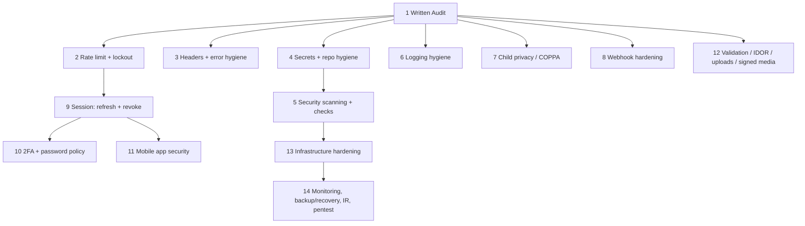

# Plan: Security Strengthening — 14-Chunk Implementation Plan

> **Status (September 2026):** Chunk 1 (written audit) **delivered** — see [SECURITY_AUDIT_2026.md](SECURITY_AUDIT_2026.md).
> * *2026-09-01* — Fix-first items 1–3 (the 3 Critical findings) shipped and tested. Committed as `8fa5e19`.
> * *2026-09-02* — Chunk 2: **per-IP rate limiting on all public auth endpoints** (RUK-SEC-007 part 1; also closed RUK-SEC-029). Committed `b0bce52`.
> * *2026-09-03* — **Chunk 2 completed**: per-account lockout, 6-digit code caps, and public-form rate limiting. pm2 confirmed `fork` mode → no shared limiter store needed. Not yet committed.
>
> **Chunk 2 is done. Next: Chunk 3 — security headers + production error hygiene.** Outstanding client actions: **(1) set/rotate a strong `JWT_SECRET` on the production server** — the API now refuses to start without one — **(2) confirm the reverse-proxy hop count** for `TRUST_PROXY` (default 1 = single nginx).
> **Source:** "Rise Up Kids — Security Strengthening Implementation Plan" (client PDF, 5-phase draft) + client follow-up email (COPPA/privacy, backup/recovery, webhook protections, logging hygiene, mobile security).
> **Scope:** `backend/` (Express + MongoDB API), `frontend/` (Vite admin/web LMS), `app/` (Expo React Native), `riseupkids-sale/` (marketing site submodule), plus organizational and infrastructure controls.
> **Audience:** Engineering + client review.
> **Related:** [[admin-module-access-control]] pattern for `protect` + `authorize('admin')`, [[notification-system-v1]] for the "a phase is not done until its written tests pass" rule this plan follows.

---

## How to read this plan

The client PDF proposed **5 phases**. This document keeps every task from that PDF and re-cuts the work into **14 sequenced chunks** so each one is small enough to implement, review, test end to end, and ship independently.

Two changes from the PDF, both requested by the client:

1. **Chunk 1 is a full written security audit** — a real assessment document, not a checklist. Every later chunk traces back to a numbered finding in it. Nothing else starts until Chunk 1 is delivered and reviewed.
2. **The client's five follow-up items are pulled forward** and given their own chunks rather than being deferred to "Phase 5 / later":
   - Child privacy & COPPA/LGPD data handling → **Chunk 7**
   - Webhook protections (Stripe / PayPal / PagBank) → **Chunk 8**
   - Logging hygiene for sensitive data → **Chunk 6**
   - Backup / recovery operational details → **Chunk 14** (runbook) with prep in **Chunk 13**
   - Future mobile-specific security → **Chunk 11**

### "Proper end-to-end testing" — what each chunk must deliver

Every chunk (2–14) is **not done** until all four of these pass:

| Layer | Meaning |
|-------|---------|
| **Unit / integration tests** | New `backend/tests/*.test.js`, `frontend` Vitest, or `app` Jest files committed with the change. Follows the existing `npm test` setup in each workspace. |
| **End-to-end scenario (staging)** | A scripted run against the deployed staging stack (real API + real MongoDB Atlas staging + real app build where relevant) proving the control works and does not break a normal user journey. Each chunk lists its E2E scenarios explicitly. |
| **Negative / abuse test** | An explicit attempt to bypass or break the control (replay the webhook, brute the login, request another user's object, etc.) that must fail closed. |
| **Exit criteria sign-off** | The chunk's checklist is ticked in this file and the client is notified. |

A checks-only GitHub Actions workflow (Chunk 5) runs the unit/integration layer on every push/PR — it never deploys. The E2E and abuse layers are run by the engineer against staging (or a scratch target / production-safe passive scan where no staging exists) and recorded in the chunk's PR description and the pre-deploy checklist.

---

## Current system — security-relevant facts (from the code)

Established by reading the repo on 2026-09-01. Chunk 1 will formalize and expand this.

| Area | Today | File(s) |
|------|-------|---------|
| Auth | JWT bearer only. `jwt.verify` with `JWT_SECRET`. No refresh token, no revocation, no "sign out everywhere". | `backend/middleware/auth.js`, `backend/services/auth.services.js:101` |
| JWT lifespan | `JWT_EXPIRE || '7d'` for **every** role including `admin`. | `backend/services/auth.services.js:102` |
| Admin login | Already has email 6-digit OTP as a second step (`verifyLoginOtp`). Parents/teachers have no 2FA. | `backend/routes/auth.routes.js:45`, `backend/services/auth.services.js:27` |
| Rate limiting | **None.** No `express-rate-limit`, no login lockout, no `helmet`, no `express-mongo-sanitize`, no `hpp`. | `backend/server.js` (confirmed absent) |
| Account lockout | **None.** Failed logins are not counted. | `backend/services/auth.services.js` |
| Security headers | **None** (no Helmet). | `backend/server.js:102` |
| Error responses | `errorHandler` returns `err.message` always; stack only in `development`. Raw `console.error(err)` on every error. | `backend/middleware/errorHandler.js` |
| CORS | Env-driven allow-list in prod; permissive localhost/Expo regex in dev; `credentials: true`; allows no-origin/null for native builds. | `backend/server.js:83` |
| Logging | `morgan('combined')` in prod. No field redaction anywhere. `console.*` used directly across services. | `backend/server.js:103` |
| Stripe webhook | Signature verified via `stripe.webhooks.constructEvent` with raw body. Idempotency via `StripeWebhookEvent` model. | `backend/middleware/stripeWebhook.js`, `backend/models/StripeWebhookEvent.js` |
| PagBank webhook | SHA256 `token-rawBody` check with `crypto.timingSafeEqual`; API-ownership fallback when signature fails; fingerprint de-dupe. | `backend/services/pagseguroWebhook.service.js` |
| PayPal | **No webhook.** Client calls `POST /api/paypal/capture-order` (`protect` + `authorize('parent')`); server captures via PayPal API. Trusts client-supplied `orderID`. | `backend/routes/paypal.routes.js:23`, `backend/services/paypalService.js:231` |
| File uploads | `multer` + `multer-s3`. MIME/size validation to be confirmed in audit. | `backend/middleware/upload.js` |
| Media delivery | S3 + CloudFront; `resolveMediaDeliveryUrl.util.js`; signed-URL coverage to be confirmed. | `backend/utils/resolveMediaDeliveryUrl.util.js` |
| Mobile token storage | `@react-native-async-storage/async-storage` (plaintext). **No `expo-secure-store`.** | `app/store/useAuthStore.ts`, `app/package.json` |
| Input validation | `express-validator` is a dependency; coverage is partial and per-route. | `backend/package.json` |
| Child data | Children are **not** User accounts — `ChildProfile` under a parent. Kids Wall has a consent model + migration. Account deletion pipeline exists (`deletionScheduler`, `AccountDeletionRequest`). | `backend/models/ChildProfile.js`, `backend/models/KidsWallPost.js`, `backend/jobs/deletionScheduler.js` |
| CI/CD | **None.** No `.github/workflows`. No automated `npm audit`, SAST, DAST, secret scanning, or test gate. | repo root |
| Deployment (current, manual) | **Frontend / sales:** `npm run build` → upload `dist/` to an S3 bucket → CloudFront invalidation. **Backend:** on the server, `git pull` → `npm install` → `pm2 restart all`. Self-hosted VPS with pm2; reverse proxy (nginx assumed — confirm). No staging/prod separation confirmed. Historic config shows the API addressed as `http://<ip>:5000/api` — **confirm TLS termination in the audit.** | `frontend/DEPLOYMENT_GUIDE.md`, `frontend/S3_DEPLOYMENT_CONFIG.md` |
| Secrets | `.env` files are git-ignored; only `.env.example` is tracked (`app/`, `backend/`). Runtime secrets live in `.env` on the VPS. Not yet scanned across full history / the `riseupkids-sale` submodule. | `backend/.gitignore`, `git ls-files` |
| Repo shape | Monorepo; `riseupkids-sale` is a git submodule (separate GitHub repo). Remote on GitHub (backend deploy is `git pull`). | `.gitmodules` |

---

## Deployment model (current) and how these chunks fit it

There is **no CI/CD pipeline**. Deploys are manual:

| Target | Steps today |
|--------|-------------|
| `frontend/` and `riseupkids-sale/web/` | `npm run build` → sync `dist/` to the S3 bucket → create a CloudFront invalidation |
| `backend/` | SSH to the VPS → `git pull` → `npm install` → `pm2 restart all` |

This plan **does not** ask the client to adopt a full pipeline. It adapts:

- **Security checks** (Chunk 5) run as a lightweight GitHub Actions workflow that only **tests and scans** — it never deploys, so it doesn't disturb the manual process. There is also a local `npm run security:check` and a written **pre-deploy security checklist** for when Actions isn't wanted.
- **Header / TLS / edge controls** (Chunks 3, 13) are configured where the traffic actually flows: **CloudFront Response Headers Policies** for the two static sites, **nginx** (reverse proxy) for the API. Not a PaaS.
- **Secrets** (Chunk 4) are hardened in place: `.env` file permissions, a dedicated deploy user, a `pm2` ecosystem file, keeping `.env` out of any served directory. A managed secrets service is noted as *optional/later*, not required.
- **Infrastructure hardening** (Chunk 13) targets a single VPS + pm2 + nginx + S3/CloudFront + MongoDB Atlas — OS hardening, firewall, `fail2ban`, TLS via nginx + certbot, Atlas IP allowlist = the server's egress IP.
- **Rollback**: frontend = re-sync a previous `dist` (enable **S3 bucket versioning**) + invalidate; backend = `git checkout <previous-sha> && npm install && pm2 restart all`. Chunk 14 documents this as the recovery path.
- **Backups** (Chunk 14): MongoDB Atlas snapshots (or a `mongodump` cron to offsite storage), S3 versioning + lifecycle, and an offline copy of `.env` / nginx / pm2 config.

**Open questions for the client** (feed Chunk 1):
1. Is `pm2 restart all` running the API in **cluster mode** (multiple workers)? If so, rate-limit and lockout state (Chunk 2) needs a shared store (Redis or Mongo), not in-memory.
2. Does the API terminate **HTTPS** today (nginx + cert), or is it still `http://<ip>:5000`?
3. Is there a **separate staging** server/bucket, or only production?
4. Who has SSH access to the VPS and AWS console access?

---

## Chunk map (PDF phase → chunk)

| PDF phase | Chunks |
|-----------|--------|
| — (client request) | **1 — Written security audit** |
| Phase 1 — Quick Security Wins | 2, 3, 4, 5 |
| (client add) Logging hygiene | 6 |
| (client add) Child privacy / COPPA | 7 |
| (client add) Webhook protections | 8 |
| Phase 2 — Authentication & Session Hardening | 9, 10, 11 |
| Phase 3 — API, Data & Media Protection | 12 |
| Phase 4 — Infrastructure & Monitoring | 13, 14 |
| Phase 5 — Advanced Security Assurance | 14 (pentest, recurring reviews, SAST/DAST folded into 5) |
| Organizational Security Requirements | Chunk 1 (assessment) + Chunk 4 (secrets) + Chunk 14 (process) |
| Incident Response Plan | Chunk 14 |

Chunks 2, 3, 4, 6, 7, 8, 12 depend only on Chunk 1 and can be parallelized across engineers. 5→13→14 and 9→10/11 are the serial spines.

---

## Chunk 1 — Full Written Security Audit  *(this is "Phase 1")*

**Goal:** Produce a written security assessment of the whole platform that becomes the backlog for Chunks 2–14. No code changes in this chunk.

### Deliverable: `docs/SECURITY_AUDIT_2026.md`

Required sections:

1. **Scope & methodology** — what was reviewed (commit SHA per workspace + the `riseupkids-sale` submodule SHA), tools used, what was explicitly out of scope.
2. **Architecture & data-flow diagram** — every trust boundary: browser/admin, Expo app, API, MongoDB Atlas, S3/CloudFront, Stripe, PayPal, PagBank, Google (Meet/Vision/YouTube), mail provider (SMTP), Expo push/FCM/APNs.
3. **Asset & data inventory** — every collection in `backend/models/`, classified: public / internal / PII / **child PII** / payment / credential. Explicitly flag `ChildProfile`, `ChildStats`, `KidsWallPost`, `User`, `PasswordResetToken`, `LoginOtpToken`, `PagSeguroCheckout`, `StripeWebhookEvent`, `AccountDeletionRequest`, `Media`.
4. **Threat model** — STRIDE per trust boundary. Priority abuse cases: account takeover (parent/admin), child-data exfiltration, IDOR across `childId`/`parentId`, payment activation without payment, webhook forgery, media URL sharing, secret leakage.
5. **Findings register** — every finding gets: `ID` (`RUK-SEC-001`…), title, severity (Critical/High/Medium/Low/Info) using CVSS-style reasoning, affected files, reproduction steps, recommended fix, **owning chunk (2–14)**.
6. **Authentication & session review** — JWT config, 7-day admin tokens, OTP flow, password reset (`PasswordResetToken`, 16-min expiry), `forgotPassword` user-enumeration check, logout behavior (currently client-side only).
7. **Authorization / IDOR review** — sample every route family for object-level checks: `course-progress`, `children`, `kids-wall`, `star-cam`, `parent-dashboard`, `cms-books`, `program-materials`, `module-access`, notifications inbox. Confirm each cross-references `req.user`.
8. **Input handling review** — `express-validator` coverage gap list; NoSQL operator injection (`$where`, `$gt` in query objects); mass-assignment on `User`/`ChildProfile` updates.
9. **Payments & webhooks review** — Stripe / PagBank / PayPal paths; can a subscription be activated without a verified payment event? Replay and idempotency analysis.
10. **File upload & media review** — `multer`/`multer-s3` config, MIME allow-list, size caps, path traversal in SCORM/HTML5 zip extraction (`adm-zip`), signed-URL coverage for private media, `/uploads`, `/scorm`, `/html5` static exposure.
11. **Secrets & configuration review** — `.env.example` diff vs required vars, `JWT_SECRET` strength policy, full git-history secret scan (all workspaces + submodule), third-party token scope (Stripe restricted keys? AWS IAM least-privilege? Google service account scope?).
12. **Logging & privacy review** — what `morgan` and `console.*` currently emit; any tokens/passwords/OTP/PII in logs; log retention and access.
13. **Child privacy / COPPA / LGPD gap analysis** — consent capture, data minimization, retention, deletion, third-party sharing (Vision API images, Kids Wall), age gating, privacy policy alignment.
14. **Infrastructure review (as far as visible)** — hosting, TLS/HSTS, MongoDB Atlas network access list, backup configuration, WAF/CDN, secret storage in the deploy platform.
15. **Dependency review** — `npm audit` snapshot for `backend/`, `frontend/`, `app/`, `riseupkids-sale/web/`; flag unmaintained/critical packages (`multer@1.x` LTS status, etc.).
16. **Organizational controls review** — MFA status on: email, hosting, MongoDB Atlas, Stripe/PayPal/PagBank, GitHub, domain registrar, Apple/Google developer accounts. Password manager usage, least-privilege access, deployment approval logs.
17. **Prioritized remediation roadmap** — the 14-chunk ordering, adjusted if findings demand it, with a severity-weighted "fix first" list.

### End-to-end testing for Chunk 1

The audit has no runtime change to test, but every finding must be **evidence-backed**:

- Each Critical/High finding includes a **working reproduction** on staging (script, `curl`, or screen recording) attached to the finding.
- Each finding names the **exact test** that Chunk N will add to prove the fix (so Chunk N's test list is pre-written here).
- Audit is reviewed live with the client; severity and ordering agreed in writing.

### Exit criteria

- [x] **`docs/SECURITY_AUDIT_2026.md` delivered (2026-09-01)** — all 17 sections, 36 findings (3 Critical, 10 High, 16 Medium, 7 Low/Info).
- [x] Findings register has an owning chunk for every finding (see [audit §17](SECURITY_AUDIT_2026.md)).
- [x] Every **Critical** finding has an attached reproduction (live-route or process-boot repro, since no staging URL exists yet — see audit Appendix B). High/Medium/Low repros still pending a staging URL.
- [ ] Client has reviewed and signed off on severity + chunk ordering.
- [x] Re-ordering note written — see "Fix-first" below and [audit §17](SECURITY_AUDIT_2026.md).

### Fix-first (raised by the audit — do before working the plan in order)

**Items 1–3 are done (2026-09-01).** Each fix has automated tests plus a live/manual reproduction proving the original PoC no longer works — see [SECURITY_AUDIT_2026.md](SECURITY_AUDIT_2026.md) for the transcripts. Item 4 is still open.

| # | Finding | Why it can't wait | Chunk | Status |
|---|---------|-------------------|-------|--------|
| 1 | **RUK-SEC-001** — unauthenticated arbitrary file read via `GET /api/scorm/:id/wrapper` path traversal | Reads `backend/.env` → every secret → forge admin JWT → total compromise | 12 | **Done** — hardened in place (mandatory token + path-containment check), not removed; see note below |
| 2 | **RUK-SEC-002** — `POST /api/auth/register` accepts `role:"admin"` | Anyone becomes admin (OTP goes to their own inbox) | 2 | **Done** — public registration now always creates `role: 'parent'`, unconditionally |
| 3 | **RUK-SEC-003** — confirm/rotate production `JWT_SECRET`; add startup strength assertion | If weak, all JWTs forgeable | 4 | **Done** (code side) — server now refuses to boot on a missing/weak secret. **Client action still needed:** set/rotate the real `JWT_SECRET` on the production server, or the API won't start |
| 4 | **RUK-SEC-004** — three unauthenticated `GET` endpoints return a full JWT keyed on a payment/session id in the URL | Account takeover from a logged/leaked id | 8 | Open — larger change, scheduled with Chunk 8 |

**On RUK-SEC-001 specifically:** the fix shipped is the *hardening* option from the audit (require a valid token, reject any path that resolves outside `backend/uploads/scorm`), not the full module deletion — SCORM authoring is retired but nothing was removed, since that needs the client to first confirm no production content still has `packageType: 'scorm'`. The endpoint is closed to the public either way; deletion remains a nice-to-have cleanup, not a blocker.

**Because RUK-SEC-001 was live and unauthenticated until this fix, rotate every secret in `backend/.env` on the production server** (`MONGODB_URI`, `AWS_*`, `STRIPE_SECRET_KEY`/`STRIPE_WEBHOOK_SECRET`, `PAYPAL_CLIENT_SECRET`, `PAGSEGURO_ACCESS_TOKEN`, `GOOGLE_VISION_PRIVATE_KEY`, SMTP password) — treat prior disclosure as possible. This is a manual/client action; it isn't something code can do.

**Estimate:** 5–8 working days (one engineer, full-time) for the whole fix-first set. **Actual for items 1–3: ~1 day.**

---

## Chunk 2 — Rate Limiting & Account Lockout · **✅ COMPLETE (2026-09-03)**

**PDF:** Phase 1 — API rate limiting (login/registration/password reset), temporary account lockout after repeated failed logins.
**Audit findings addressed:** RUK-SEC-002, RUK-SEC-007, RUK-SEC-022, RUK-SEC-029 — all closed.

> **Done:**
> * *2026-09-01* — RUK-SEC-002: public registration can no longer create an admin account (`role` hard-coded server-side). *(committed `8fa5e19`)*
> * *2026-09-02* — **per-IP rate limiting on the auth endpoints** (`backend/middleware/rateLimit.js`): `loginLimiter` (20/15min) on `login` + `verify-login-otp`; `registerLimiter` (10/60min) on `register` + `subscribe-flodesk`; `passwordResetLimiter` (10/60min, shared bucket) on `forgot-password` + `reset-password` + `resend-login-otp`. Generic `429` + `Retry-After`, all env-tunable. `TRUST_PROXY` env added to `server.js` (default 1) so keys are the real client IP — this also closed RUK-SEC-029. 15 tests incl. a full-HTTP `supertest` e2e + a live brute-force run. *(committed `b0bce52`)*
> * *2026-09-03* — **per-account lockout** (`backend/services/loginLockout.service.js` + `failedLoginAttempts` / `lockUntil` / `lastFailedLoginAt` on `User`): wrong passwords accumulate, the account locks after a threshold (default 8) for an exponentially growing window (1 min → 60 min cap), a locked account is rejected *before* the password check with the same generic error (silent), a correct password or a reset clears it, a stale count decays after 24 h. Admin endpoints: `GET /api/admin/account-security/locked` + `POST /api/admin/account-security/:userId/unlock`. All thresholds env-tunable (`LOGIN_LOCKOUT_*`). 32 tests + a full-stack e2e suite. *(not yet committed)*
> * *2026-09-03* — **6-digit code caps** (`attempts` field on `LoginOtpToken` + `PasswordResetToken`): the admin OTP / password-reset code is looked up by user, compared with `crypto.timingSafeEqual`, and destroyed after 5 wrong guesses → `"Too many attempts. Please request a new code."`. Env-tunable (`LOGIN_OTP_MAX_ATTEMPTS` / `PASSWORD_RESET_CODE_MAX_ATTEMPTS`). 20 tests + a full-stack e2e suite. *(not yet committed)*
> * *2026-09-03* — **public lead forms rate limited** (RUK-SEC-022): new `publicFormLimiter` (8/60min per IP, shared budget, env `PUBLIC_FORM_*`) on `POST /api/invitation` + `POST /api/school-application`. `subscribe-flodesk` was already covered. Full-HTTP e2e against the real route files. *(not yet committed)*
>
> **Nothing left in this chunk.** The client confirmed pm2 runs the API in **`fork` mode**, so the in-memory rate-limit store is correct — no shared Redis/Mongo store is needed. (`mongodb-memory-server` was added as a devDependency for the full-stack e2e tests.)
>
> **Remaining recommended enhancements (not blockers, deferred):** a bot check (hCaptcha/Turnstile) on the public forms; a shared limiter store *if* pm2 is ever switched to cluster mode.

### Work

- Add `express-rate-limit`. **Store choice depends on the pm2 mode** (open question in the deployment section): if `pm2 restart all` runs the API in **cluster mode**, in-memory counters are per-worker and trivially bypassed — use a shared store (`rate-limit-redis` against a local Redis, or a Mongo-backed store). If it's a single fork, in-memory is acceptable short-term but ship the shared store anyway so scaling later doesn't silently weaken the control. Same store backs the lockout counters below.
- Global soft limit on `/api` + strict limits on:
  - `POST /api/auth/login`, `/register`, `/subscribe-flodesk`
  - `POST /api/auth/forgot-password`, `/reset-password`
  - `POST /api/auth/verify-login-otp`, `/resend-login-otp`
  - `POST /api/contact-support`, lead/school-application public endpoints
- Per-account lockout: track failed attempts on `User` (`failedLoginAttempts`, `lockUntil`); exponential backoff; lock after N (e.g. 8) within a window; auto-unlock after cooldown; admin manual unlock endpoint.
- OTP endpoints: cap verify attempts per `LoginOtpToken`; invalidate token after M failures; cap resend rate.
- Rate-limit responses: `429` + `Retry-After`, generic message (no "account locked" enumeration — return the same shape as a normal failure where feasible; internal audit log records the real reason).
- Ensure webhook routes (`/api/stripe/webhook`, `/api/pagseguro/webhooks/*`) are **excluded** from user rate limits (they have their own protections in Chunk 8).

### Files

| Action | Path |
|--------|------|
| Add | `backend/middleware/rateLimit.js` (named limiters) |
| Edit | `backend/server.js` (mount global + per-route) |
| Edit | `backend/routes/auth.routes.js` |
| Edit | `backend/models/User.js` (`failedLoginAttempts`, `lockUntil`) |
| Edit | `backend/services/auth.services.js` (count failures, enforce lock, reset on success) |
| Add | `backend/routes/adminUserSecurity.routes.js` (admin unlock) or extend admin routes |
| Add | `backend/tests/rateLimit.middleware.test.js`, `backend/tests/auth.lockout.service.test.js` |

### End-to-end testing

**Unit/integration**
- Limiter returns `429` after threshold; resets after window.
- `login` increments `failedLoginAttempts`; success resets to 0.
- Account locks at threshold; `lockUntil` respected; unlocks after cooldown.
- OTP verify locks the token after M bad codes.
- Admin unlock clears the lock.

**E2E (staging)**
- Script 20 bad logins for one account → observe `429` then lockout → correct password still rejected until cooldown → succeeds after cooldown.
- Legitimate user hitting login twice is unaffected.
- Distributed attempt from 5 IPs against one account → per-account lock still triggers (not just per-IP).
- Load a real app build → normal login unaffected; confirm limits are not tripped by app retry/refresh behavior.

**Abuse test**
- Credential-stuffing simulation (100 accounts × 5 passwords) is throttled and logged.
- OTP brute (000000–999999) is stopped well before exhaustion.

### Exit criteria

- [ ] Rate limits verified in staging (PDF exit criterion).
- [ ] Lockout + cooldown + admin unlock working.
- [ ] Webhooks and health checks exempt.
- [ ] No user-enumeration via lockout messaging.
- [ ] Tests green in CI.

**Estimate:** 3–4 days.

---

## Chunk 3 — Security Headers, Error Hygiene & CORS Review

**PDF:** Phase 1 — Helmet security headers, hide detailed production error messages. Phase 3 — review CORS. Phase 4 — HSTS (header portion here; transport enforcement in Chunk 13).

### Work

- Add `helmet` with: `Content-Security-Policy` (start report-only, tune for admin SPA + SCORM/HTML5 iframes), `X-Content-Type-Options`, `X-Frame-Options`/`frame-ancestors`, `Referrer-Policy`, `Cross-Origin-*` policies, `Strict-Transport-Security` (long max-age + preload — only after Chunk 13 confirms HTTPS everywhere; ship report-only / short max-age first).
- Frontend admin (`frontend/`) and marketing site (`riseupkids-sale/web/`): these are static S3 + CloudFront, so `helmet` can't help. Attach a **CloudFront Response Headers Policy** (CSP, `X-Content-Type-Options`, `Referrer-Policy`, `frame-ancestors`, HSTS) to each distribution, plus a `<meta http-equiv="Content-Security-Policy">` fallback in `index.html`. If the API is proxied by nginx, add the same headers there for any non-helmet paths.
- `errorHandler`: in production return a generic message + error `code` + `requestId`; never `err.message` for 500s; keep 4xx validation messages (they're safe and user-facing). Log full detail server-side keyed by `requestId` (feeds Chunk 6).
- Replace `console.error(err)` with the structured logger from Chunk 6 (or land a minimal logger here and expand in 6).
- CORS: remove the permissive dev regex from any code path that can run in production; assert `CORS_ORIGIN` present in prod (already throws — add a test); tighten `credentials`/methods/headers to what's used; document the null-origin allowance for native builds as an accepted risk with compensating controls.
- Static exposure: add `X-Content-Type-Options: nosniff` + correct `Content-Type` on `/uploads`, `/scorm`, `/html5`; confirm directory listing is off.

### Files

| Action | Path |
|--------|------|
| Edit | `backend/server.js` (helmet, static headers, CORS) |
| Edit | `backend/middleware/errorHandler.js` |
| Add | `backend/middleware/requestId.js` |
| Add | `backend/tests/securityHeaders.test.js`, `backend/tests/errorHandler.test.js`, `backend/tests/cors.test.js` |
| Add | CloudFront Response Headers Policy for the `frontend` + sales distributions; `<meta>` CSP in each `index.html`; nginx header block for the API |

### End-to-end testing

**Unit/integration**
- Response carries expected headers; CSP present.
- 500 in production mode returns generic body (no stack, no `err.message`), includes `requestId`.
- 400 validation error still returns the field message.
- CORS: allowed origin passes; disallowed origin blocked; missing `CORS_ORIGIN` in prod mode throws at startup.

**E2E (staging)**
- `curl -I` staging API and both web origins → headers present, graded against a header scanner (target: A on securityheaders.com equivalent).
- Admin SPA loads and functions with CSP enforced (no console CSP violations on core flows: login, content CRUD, notifications, module access).
- SCORM/HTML5 content still renders inside its iframe under the frame policy.
- Trigger a deliberate 500 on staging → response is generic; full detail is in server logs under the same `requestId`.

**Abuse test**
- Attempt to frame the admin app from an external origin → blocked by `frame-ancestors`.
- Force an exception carrying a secret in its message → secret does not appear in the HTTP response.

### Exit criteria

- [ ] Security headers validated in staging (PDF exit criterion).
- [ ] Production errors reveal no internals; `requestId` correlation works.
- [ ] CSP enforced on admin SPA without breaking core flows.
- [ ] CORS reviewed, tightened, test-covered.

**Estimate:** 3–4 days (CSP tuning is the variable).

---

## Chunk 4 — Secret Management & Repository Hygiene

**PDF:** Phase 1 — enforce JWT secret standards, verify `.env` excluded from source control, scan repo history for leaked secrets. Phase 4 — move secrets to a managed secrets service (planning here; execution in Chunk 13). Org — never commit secrets, separate staging/production credentials.

> **Already done (fix-first, 2026-09-01):** the "JWT secret standard" item — `backend/config/jwtSecret.js` now rejects a missing/known-weak `JWT_SECRET` at startup (any env) and a sub-32-char one in production/staging; `.env.example` no longer ships a usable-looking default. **Still needed from the client:** confirm/rotate the actual `JWT_SECRET` on the production server. The full-history secret scan and `.env` hygiene work below is still to do.

### Work

- **Full-history secret scan**: `gitleaks` + `trufflehog` over `backend/`, `frontend/`, `app/`, and the `riseupkids-sale` submodule's own history. Triage every hit.
- For any **confirmed leaked live secret**: rotate it (Stripe/PayPal/PagBank keys, AWS keys, Google service-account JSON, `JWT_SECRET`, SMTP creds, MongoDB URI) and record in an incident note. History rewriting (`git filter-repo`) only if the client agrees; otherwise document + rotate is the mitigation.
- **`JWT_SECRET` standard**: require ≥ 256-bit random; add a startup assertion that rejects weak/known-default values (`your_super_secret_jwt_key_change_this_in_production` from `.env.example` must fail). Same for any other HMAC/signing secret.
- **`.env` hygiene**: confirm `.env` never tracked (verified: only `.env.example` is); add a root `.gitignore` covering all workspaces; align every `.env.example` with the real required-vars list from the audit; add a `scripts/check-env.js` that fails fast on missing vars.
- **`.env` on the VPS hardening** (this is where secrets actually live): `chmod 600 .env`, owned by a dedicated non-login `deploy` user, located **outside** any nginx-served path, not world-readable via a directory listing. Introduce a `pm2` **ecosystem file** (`ecosystem.config.js`, git-ignored or with values injected) so pm2 loads env explicitly rather than from ambient shell. Confirm `pm2 save` / dump files (`~/.pm2/dump.pm2`) don't persist secrets in a weaker-permission location.
- **Staging vs production isolation**: separate Stripe/PayPal/PagBank **restricted keys** at minimum (separate accounts if the client can), separate MongoDB databases/clusters, separate S3 buckets + IAM users (least privilege — the app's IAM user can `PutObject`/`GetObject` on its prefixes only, not `s3:*` or bucket delete), separate mail sender. Document the matrix. If there is only one server today, note that staging-on-the-same-box shares blast radius.
- **Managed secrets service — optional/later**: on a single VPS this is a bigger lift than it's worth right now. Record the *option* (AWS SSM Parameter Store is the cheapest fit given S3/CloudFront are already AWS; Doppler/Infisical as alternatives) and the migration checklist, but the Chunk 4 requirement is just the in-place `.env` hardening above. Revisit in Chunk 13 only if the client wants it.
- **Pre-commit guard**: add `gitleaks` as a pre-commit hook (`husky` or a plain hook script) and as a GitHub Actions check (Chunk 5).

### Files

| Action | Path |
|--------|------|
| Add | `.gitignore` (root), `.gitleaks.toml` |
| Add | `backend/scripts/check-env.js`; call from `server.js` startup |
| Edit | `backend/server.js` / `backend/config/*` (weak-secret assertion) |
| Add | `backend/ecosystem.config.js` (pm2 env loading); document `.env` perms + deploy user in `docs/DEPLOYMENT.md` |
| Add | `docs/SECRETS_MATRIX.md` (staging vs prod, ownership, rotation cadence) |
| Add | `backend/tests/checkEnv.test.js`, `backend/tests/jwtSecretPolicy.test.js` |

### End-to-end testing

**Unit/integration**
- Startup throws on the default/example `JWT_SECRET` and on a < 32-char secret.
- `check-env.js` exits non-zero when a required var is missing.

**E2E (staging / server)**
- Run `gitleaks`/`trufflehog` against full history (locally and in the Chunk 5 Action) → zero unresolved findings (or an accepted-risk allowlist with justification).
- On the server: `ls -l .env` shows `-rw------- deploy deploy`; `.env` is not under any nginx `root`; requesting `https://<host>/.env` → 404/403.
- Redeploy with a rotated key set (`git pull` → `npm install` → `pm2 restart all`) → app boots, payments in test mode work, mail sends.
- `~/.pm2/dump.pm2` and pm2 logs do not contain secret values.

**Abuse test**
- Add a commit containing a fake AWS key → pre-commit hook and the GitHub Action both block it.
- From the internet, try to fetch `.env` / `ecosystem.config.js` over HTTP(S) → denied.

### Exit criteria

- [ ] No unresolved critical secrets in history (all workspaces + submodule).
- [ ] Any confirmed live leak rotated; rotation logged.
- [ ] Weak-secret startup guard active.
- [ ] `.env` on the VPS: `chmod 600`, dedicated user, outside served paths, not fetchable over HTTP.
- [ ] pm2 loads env via an ecosystem file; no secrets in pm2 dump/logs.
- [ ] `.env.example` files accurate; root `.gitignore` added.
- [ ] Staging/production credential isolation documented (and true, or the shared-blast-radius risk is written down and accepted).

**Estimate:** 3–5 days (+ rotation coordination with client).

---

## Chunk 5 — Security Scanning & Pre-Deploy Checks *(no deploy pipeline — checks only)*

**PDF:** Phase 1 — automated npm vulnerability checks in CI/CD. Phase 5 — add SAST and DAST, establish dependency update schedule.

> **Deployment reality:** there is no CI/CD. Deploys stay manual (`npm run build` → S3 → CloudFront; `git pull` → `npm install` → `pm2 restart all`). This chunk adds **scanning and a test gate that never deploy anything** — GitHub Actions on push/PR for checks only, plus a local script and a written checklist for anyone who prefers not to rely on Actions.

### Work

- **GitHub Actions — checks only** (`.github/workflows/`), triggered on push + PR, no deploy steps, no secrets beyond read tokens:
  - `test.yml` — install + lint + **run every workspace's test suite** (`backend` Jest, `frontend` Vitest, `app` Jest, `riseupkids-sale/web`). This is the gate that enforces "a chunk isn't done until its tests pass" for Chunks 2–14.
  - `security.yml` — `npm audit --audit-level=high` per workspace; `gitleaks` (full history); **SAST** (`github/codeql-action` for JS/TS + `semgrep` OWASP/Node ruleset); `actions/dependency-review-action` on PRs.
  - `dast.yml` — **manually dispatched or weekly-scheduled** OWASP ZAP baseline against the running site/API (authenticated with a low-priv test user); uploads the report as an artifact. Runs against production carefully (baseline/passive) or staging if one exists.
- **Local equivalent** — `npm run security:check` at the repo root: runs `npm audit`, `gitleaks`, and `semgrep` across all workspaces so the checks work even with Actions disabled.
- **Pre-deploy security checklist** — `docs/PRE_DEPLOY_SECURITY_CHECKLIST.md`: tests green, `npm audit` clean or triaged, no new `gitleaks` hits, `.env` diff reviewed, migrations reviewed, rollback command noted. The deploying engineer ticks it in the PR / release notes.
- `dependabot.yml` — weekly updates for all four `package.json` locations + GitHub Actions; grouped minor/patch.
- **Dependency update schedule** — `docs/DEPENDENCY_AND_SCANNING_SCHEDULE.md`: weekly Dependabot review, monthly `npm outdated` triage, immediate for Critical advisories. Named owner.
- Triage the current `npm audit` backlog from Chunk 1 to zero unresolved Critical/High (or an accepted-risk list).
- **Branch protection** on `master`: require `test.yml` + `security.yml` green before merge (the branch backend deploy pulls from stays trustworthy).

### Files

| Action | Path |
|--------|------|
| Add | `.github/workflows/test.yml`, `security.yml`, `dast.yml` |
| Add | `.github/dependabot.yml` |
| Add | root `package.json` script `security:check` + `scripts/security-check.sh` |
| Add | `docs/PRE_DEPLOY_SECURITY_CHECKLIST.md`, `docs/DEPENDENCY_AND_SCANNING_SCHEDULE.md` |
| Add | `.semgrep.yml`, CodeQL config |

### End-to-end testing

**Workflow self-test**
- Throwaway PR adding a known-vulnerable package → `security.yml` fails.
- PR with a Semgrep-flagged pattern (`eval`, unparameterized `$where`) → SAST fails.
- PR with a planted secret → `gitleaks` job fails.
- All existing workspace suites run and pass in `test.yml`.
- `npm run security:check` locally reproduces the audit + gitleaks + semgrep results.

**E2E**
- ZAP baseline run completes and uploads a report; findings triaged into the audit register.
- Dependabot opens at least one real PR; review → checks → merge → manual deploy works end to end.
- A deploy is performed following `PRE_DEPLOY_SECURITY_CHECKLIST.md`; the checklist is attached to the release.

**Abuse test**
- Attempt to merge to `master` with a red `security.yml` → blocked by branch protection.

### Exit criteria

- [ ] No unresolved critical dependency vulnerabilities (PDF exit criterion).
- [ ] SAST + secret scan + `npm audit` run on every push/PR (and locally via `security:check`).
- [ ] DAST runnable on demand + scheduled; first report triaged.
- [ ] Dependabot active on all workspaces; update schedule documented with an owner.
- [ ] `master` protected by required checks; pre-deploy checklist in use.

**Estimate:** 4–5 days.

---

## Chunk 6 — Logging Hygiene for Sensitive Data  *(client follow-up)*

**Client:** "logging hygiene for sensitive data". **PDF:** implicit in Phase 4 monitoring.

### Work

- Introduce a **structured logger** (`pino`) with levels, `requestId` (from Chunk 3), and environment-aware output (pretty in dev, JSON in prod).
- **Redaction layer**: a single serializer that strips/masks `password`, `token`, `authorization`, `refreshToken`, `otp`, `code`, `cardNumber`, `cvv`, `client_secret`, Stripe/PayPal/PagBank secrets, `MONGODB_URI`, JWTs, and **child PII** (name, DOB, photos) from anything logged.
- Configure `morgan` (or replace with `pino-http`) to **not** log query strings that can carry tokens, to omit `Authorization`/`Cookie` headers, and to hash/truncate any user identifier rather than logging raw email.
- Sweep the codebase: replace direct `console.log/warn/error` in `services/`, `controllers/`, `jobs/`, `middleware/` with the logger. Grep-gate in CI (no new raw `console.*` in backend runtime code).
- Audit existing noisy spots: `pagseguroWebhook.service.js` diagnostics (currently logs body fingerprints — keep fingerprints, never raw body), `auth.services` OTP logging (`console.log` of "OTP email sent" is fine; never log the code in prod — currently returns code "for tests/logging only", ensure prod path never logs it), mail config dump at startup (mask user/host).
- **Log retention & access**: define retention (e.g. 30–90 days hot, then purge), who can read logs, and that logs go to a store with access control (Chunk 13/14 for the transport). No PII in log-based alerts.
- Ensure error `requestId` correlation works end to end (client sees a code, engineer finds the full context).

### Files

| Action | Path |
|--------|------|
| Add | `backend/config/logger.js` (pino + redaction) |
| Edit | `backend/server.js` (pino-http / morgan config), `backend/middleware/errorHandler.js` |
| Edit | sweep `backend/services/**`, `backend/controllers/**`, `backend/jobs/**`, `backend/middleware/**` |
| Add | `backend/tests/logger.redaction.test.js`, `backend/tests/logging.noSecrets.test.js` |
| Edit | `.github/workflows/security.yml` (no-raw-console gate) |

### End-to-end testing

**Unit/integration**
- Logger given an object with `password`/`token`/JWT/`otp` → output shows `[Redacted]`, not the value.
- `pino-http` request log omits `Authorization` header and token-bearing query params.
- Error log includes `requestId`; HTTP response includes the same `requestId`.
- Startup mail-config log masks credentials.

**E2E (staging)**
- Drive full auth flow (register, login, admin OTP, forgot/reset password), a Stripe test checkout, a PagBank webhook, a Kids Wall post, an account-deletion request on staging.
- Dump the staging logs for that window and **grep for**: raw JWTs, `password`, OTP codes, card data, `MONGODB_URI`, child names/photos URLs, webhook raw bodies → **zero hits**.

**Abuse test**
- Send a login request with password `SUPERSECRET123` → confirm that string never appears in any log line.
- Trigger a validation error containing a token in the payload → token redacted in logs.

### Exit criteria

- [ ] Structured logger with central redaction in place.
- [ ] Staging log grep for secrets/PII over a full-flow exercise returns nothing.
- [ ] `requestId` correlation works.
- [ ] Retention + access policy documented.
- [ ] CI blocks new raw `console.*` in backend runtime code.

**Estimate:** 4–6 days (sweep is the bulk).

---

## Chunk 7 — Child Privacy & COPPA / LGPD Data Handling  *(client follow-up)*

**Client:** "possible earlier attention to child/privacy considerations (COPPA-related thinking, data handling, etc.) — (Already done)". Treated here as: formalize, verify, and close gaps early rather than at Phase 5.
**PDF:** Phase 5 — compliance review (COPPA, LGPD). Pulled forward.
**Audit findings addressed:** RUK-SEC-006 (**High** — no verifiable consent, opt-out Kids Wall, cross-family feed), RUK-SEC-026 (purge gaps).

> **Audit corrections to earlier assumptions:** Star Cam camera captures are **not stored** — `googleVision.service.js` sends the image as an in-memory buffer to Vision and discards it; `StarCamEvent` holds only game telemetry. So there is no Star Cam image retention/deletion to build — only a privacy-policy disclosure of the transient Vision call and confirmation of Google's data-usage terms. The real consent problem is **Kids Wall** (RUK-SEC-006).

### Work

- **Data-flow & retention map for child data**: `ChildProfile`, `ChildStats`, `StarEarning`, `KidsWallPost`, `VideoWatch`, `BookReading`, `CourseProgress`, `StarCamEvent` (telemetry only — no images), `Media` uploaded by/of children. For each: what's collected, why, where stored, who can see it, how long kept, how deleted.
- **Kids Wall consent + exposure fix (RUK-SEC-006 — the core of this chunk)**:
  - Make `assertKidsWallEnabled` require a real `kidsWallConsentAt` (not just `kidsWallEnabled !== false`); block post creation and display when consent is null.
  - Stop auto-setting `kidsWallConsentAt` in `createChild` — consent must be an explicit parent action, logged with timestamp + parent user + IP.
  - Remove or hard-scope `GET /api/kids-wall/all` (global cross-family feed exposing every child's name/age/avatar/photos). Never honour a client `?isApproved=false` on a family-facing route.
  - Confirm `migrateKidsWallConsentDefault` — re-migrate to opt-out (consent null / disabled) for existing children if it set them enabled.
- **Data minimization pass**: `age` is a band not DOB (good). Challenge whether the global Kids Wall feed and cross-family visibility are needed at all.
- **Parental consent**: document the consent model against COPPA's "verifiable" bar and LGPD Art. 14.
- **Third-party sharing**: Google Vision receives Star Cam captures **transiently** (not stored by us) — disclose in the privacy policy, confirm Google Cloud's data-usage / zero-retention terms, minimize the payload. Same review for Expo push, S3/CloudFront, mail, YouTube Live/Meet.
- **Retention & deletion (RUK-SEC-026)**: `accountDeletion.service.js` already purges most child collections + S3 media. Close the gaps: add `DevicePushToken` + `NotificationReceipt` to `purgeParentAccount`; sweep orphaned `Media` by `uploadedBy`. Add a data-deletion integration test asserting no residual rows/objects.
- **Access controls specific to child data**: which admin/teacher roles can view child PII and photos; least privilege; audit-log every access (feeds Chunk 12 audit logging).
- **Age gating & self-serve**: no direct child login (confirmed — `ChildProfile` only); ensure registration flows can't create a child as a `User`.
- **Deliverable docs**: `docs/CHILD_DATA_PRIVACY.md` (data map + retention + deletion proof), a COPPA/LGPD gap checklist with owner + due date per gap, and privacy-policy change requests handed to the client.

### Files

| Action | Path |
|--------|------|
| Add | `docs/CHILD_DATA_PRIVACY.md`, `docs/COPPA_LGPD_GAP_CHECKLIST.md` |
| Edit | `backend/services/kidsWallConsent.service.js` (require `kidsWallConsentAt`), `backend/services/children.services.js` (stop auto-consent), `backend/controllers/kidsWall.controller.js` (kill global feed / `isApproved` passthrough) |
| Edit | `backend/services/accountDeletion.service.js` (add `DevicePushToken`, `NotificationReceipt`, orphaned `Media` sweep) |
| Edit | `backend/services/googleVision.service.js` call site — minimize payload; privacy-policy note (no code retention change needed — image not stored) |
| Add | `backend/tests/childDataDeletion.e2e.test.js`, `backend/tests/kidsWallConsent.enforcement.test.js`, `backend/tests/kidsWallFeed.scoping.test.js` |

### End-to-end testing

**Unit/integration**
- Consent required before Kids Wall publish AND before a post is shown; `kidsWallConsentAt: null` → blocked.
- `createChild` no longer auto-sets `kidsWallConsentAt`; new children default to no-consent.
- `GET /api/kids-wall/all` no longer returns other families' children (or the route is gone); `?isApproved=false` is ignored on family-facing routes.
- Account deletion removes rows from every child-data collection **plus** `DevicePushToken` / `NotificationReceipt` for the parent; no orphaned `Media`.

**E2E (staging)**
- Create parent → add child → generate progress, stars, a Kids Wall post (with explicit consent). Request account deletion. After the scheduler runs: query every collection + list the S3 prefix → **no child data or objects remain**; media URLs 404.
- As parent A, call `GET /api/kids-wall/all` and `...?isApproved=false` → only parent A's own children's approved posts (or 403) — never another family's child.
- Attempt to view child PII/photos as a teacher role that shouldn't have access → denied; the attempt is audit-logged.

**Abuse test**
- Try to register a child as a `User` via the API directly → rejected.
- Try to fetch another parent's child's Kids Wall media by ID → denied (IDOR, cross-links to Chunk 12).

### Exit criteria

- [ ] Child-data map + retention schedule documented.
- [ ] Deletion pipeline provably purges all child data + media (E2E passes).
- [ ] Parental consent is verifiable, logged, and opt-in.
- [ ] Third-party sharing (esp. Vision) documented and minimized.
- [ ] COPPA/LGPD gap checklist delivered with owners + dates.
- [ ] Privacy-policy change requests handed to client.

**Estimate:** 5–7 days (+ client/legal input on policy).

---

## Chunk 8 — Webhook Hardening (Stripe / PayPal / PagBank)  *(client follow-up)*

**Client:** "explicit webhook protections (Stripe / PayPal / PagBank)". **PDF:** Phase 4 — monitoring for webhook verification failures.

### Work — common

- **Signature verification is mandatory and fail-closed** for every provider. No "process anyway" path that isn't a documented, tightly-scoped fallback.
- **Idempotency**: every provider gets a persisted event-ID/fingerprint check before side effects (Stripe has `StripeWebhookEvent`; PagBank has `webhookEvents` fingerprints; PayPal needs one — see below).
- **Replay window**: reject events whose provider timestamp is older than a threshold (e.g. 5 min) where the provider supplies one (Stripe `t=` in signature; PagBank — add received-at + dedupe).
- **Raw-body integrity**: keep `express.raw()` before `express.json()` (already correct for Stripe/PagBank); add a test that a JSON-parsing regression would catch.
- **Response discipline**: `2xx` only after the event is safely persisted; `4xx` on bad signature; `5xx` only on genuine server fault (so providers retry). Never leak verification internals in the response body.
- **Alerting**: every signature/verification failure emits a metric + alert (wired in Chunk 14). Spike in failures = someone probing or a rotated-secret misconfig.
- **Least privilege**: webhook endpoints do exactly one thing (activate/deactivate subscription); they never accept amounts/entitlements from the payload without re-fetching from the provider API (PagBank already does `verifyWebhookPayloadOwnership` — extend the principle to all).
- **Rate limiting / WAF**: webhook paths excluded from user rate limits (Chunk 2) but IP-allowlisted to provider ranges at the WAF where feasible (Chunk 13), plus a generous absolute cap.

### Work — per provider

**Stripe** (`middleware/stripeWebhook.js`, `controllers/stripe.controller.js`)
- Confirm `STRIPE_WEBHOOK_SECRET` per environment; add startup assertion.
- Verify the tolerance window is Stripe's default (don't widen).
- Confirm every handled event type re-reads the object from Stripe if it grants entitlement (don't trust `data.object` amounts/status blindly).
- Idempotency: ensure `StripeWebhookEvent` is written **before** activation and checked first; concurrent duplicate delivery → one activation.

**PagBank** (`services/pagseguroWebhook.service.js`)
- The API-ownership fallback when SHA256 fails is powerful but is an auth bypass surface — tighten: require `reference_id` **and** a successful provider API re-fetch that matches the local record; log every use as `authMethod: api_ownership` with an alert; add a kill-switch env to disable the fallback.
- Ensure CloudFront/WAF forwards the raw POST body byte-for-byte (documented in Chunk 13) — a mangled body silently forces the fallback path today.
- Add replay/age protection (store `receivedAt`, dedupe by fingerprint — partly present, make it authoritative).

**PayPal** (`services/paypalService.js`, `controllers/paypal.controller.js`)
- Today activation is via client-initiated `capture-order` with a client-supplied `orderID`. Harden:
  - Verify the captured order's `custom_id` (`{userId}_{tier}`) matches `req.user._id` and the tier the client claims — reject mismatch (possible privilege/tier escalation today).
  - Verify captured amount/currency against the expected plan price server-side.
  - Idempotency: persist `captureId`; a replayed `capture-order` for an already-captured order must not extend the subscription twice.
  - **Add a PayPal webhook** (`PAYMENT.CAPTURE.COMPLETED`, `BILLING.SUBSCRIPTION.*`) with `verify-webhook-signature` API verification, raw body, its own event-log model — as defense in depth and to catch out-of-band changes (refunds, disputes, subscription cancellations) the client-capture flow never sees.

### Files

| Action | Path |
|--------|------|
| Edit | `backend/middleware/stripeWebhook.js`, `backend/controllers/stripe.controller.js` |
| Edit | `backend/services/pagseguroWebhook.service.js` (tighten fallback, kill-switch) |
| Edit | `backend/services/paypalService.js`, `backend/controllers/paypal.controller.js` (custom_id + amount checks, idempotency) |
| Add | `backend/routes/paypalWebhook` + `backend/middleware/paypalWebhook.js` + `backend/models/PayPalWebhookEvent.js` |
| Edit | `backend/server.js` (mount PayPal webhook raw-body before `express.json()`) |
| Add | `backend/tests/stripeWebhook.idempotency.test.js`, `backend/tests/pagseguroWebhook.fallback.test.js` (extend), `backend/tests/paypalCapture.security.test.js`, `backend/tests/paypalWebhook.test.js` |

### End-to-end testing

**Unit/integration**
- Stripe: tampered payload / wrong secret → `400`, no activation. Duplicate event ID → single activation.
- PagBank: bad SHA256 + no matching local record → `401`. Bad SHA256 + matching `reference_id` **and** API re-fetch match → processed and alerted. Kill-switch on → fallback path returns `401`.
- PayPal: `capture-order` where order `custom_id` userId ≠ caller → rejected. Captured amount ≠ plan price → rejected. Replayed capture → no second period added.
- PayPal webhook: forged signature → rejected; valid `PAYMENT.CAPTURE.COMPLETED` → recorded; refund event → subscription flagged.

**E2E (staging)**
- Stripe CLI: `stripe trigger checkout.session.completed` → subscription activates once; re-send the same event → no change.
- PagBank sandbox: real webhook → activates; replay the exact payload → deduped; send with a corrupted body → rejected (not silently falling back).
- PayPal sandbox: full buyer flow → activates once; call `capture-order` again with the same `orderID` → idempotent; issue a sandbox refund → webhook marks the subscription.
- Confirm every verification failure in the above produced an alert event.

**Abuse test**
- POST a hand-crafted "payment succeeded" body to each webhook with no/invalid signature → all rejected, no entitlement granted.
- As parent A, capture a PayPal order whose `custom_id` encodes parent B / a higher tier → rejected.
- Flood a webhook endpoint → absolute cap + WAF allowlist hold; user-facing API unaffected.

### Exit criteria

- [ ] All three providers verify signatures fail-closed.
- [ ] Idempotency proven for all three (no double activation / double period).
- [ ] PayPal capture validates `custom_id` owner + tier + amount server-side.
- [ ] PayPal webhook live for refunds/disputes/cancellations.
- [ ] PagBank API-ownership fallback tightened, alerted, kill-switchable.
- [ ] Verification failures alert (Chunk 14 integration point stubbed and firing).

**Estimate:** 5–7 days.

---

## Chunk 9 — Session Hardening: Short-Lived Access + Refresh Tokens + Revocation

**PDF:** Phase 2 — short-lived access tokens, refresh token architecture, token revocation, "Sign Out Everywhere", reduce JWT lifespan for privileged users, active device/session management.
**Audit findings addressed:** RUK-SEC-003 (7-day non-revocable tokens — the half not covered by the fix-first secret-strength change), RUK-SEC-012(b) (JWT + user/child data in web `sessionStorage`), RUK-SEC-019, RUK-SEC-021.

### Work

- **Access tokens**: short TTL (e.g. 15 min all roles; admins already gated by OTP at login). Signed as now.
- **Refresh tokens**: opaque, random, hashed at rest in a `RefreshToken` collection (`userId`, `tokenHash`, `deviceLabel`, `userAgent`, `ip`, `createdAt`, `expiresAt`, `revokedAt`, `replacedBy`). Rotation on every use; reuse-detection (a used-then-seen-again token → revoke the whole chain + alert).
- **Endpoints**: `POST /api/auth/refresh`, `POST /api/auth/logout` (revoke current), `POST /api/auth/logout-all` ("Sign Out Everywhere" — revoke all for user), `GET /api/auth/sessions` (list active), `DELETE /api/auth/sessions/:id` (revoke one).
- **Revocation on security events**: password change, password reset, role change, `isActive=false`, and admin force-logout all revoke refresh tokens. `protect` optionally checks a `tokenVersion`/`sessionInvalidBefore` on `User` so existing access tokens die early on those events.
- **Web token storage (RUK-SEC-012(b))** — the reason this can't be a standalone change:
  - The refresh token goes in an **httpOnly, `Secure`, `SameSite=None`** cookie scoped to `api.riseup.kids` (the frontend is static S3/CloudFront on a different origin). httpOnly = JS/XSS cannot read it.
  - The access token is kept **in memory only** (a module variable / store), never in `sessionStorage` / `localStorage`.
  - `frontend/src/services/authService.js` `persistSession()` stops writing `token` to storage. On app boot / hard reload / new tab / externally-opened deep link, the app calls `POST /api/auth/refresh` (browser sends the cookie automatically) → new access token in memory → **session survives reload and navigation with no re-login**.
  - React-router in-app navigation keeps JS state alive and is unaffected either way; only the full-reload paths depend on the refresh call, so those are the E2E cases to test hardest.
  - Also stop persisting `childProfiles` / `childProfile` / `parent` in `sessionStorage` — `/auth/me` already returns them; hold in memory and re-fetch on boot. (`user`/role can stay in `sessionStorage` short-term to avoid a route-guard flash on first paint, or move to memory + a boot-time `/auth/me` gate — decide during implementation.)
- **CSRF**: with a cookie now in play for `/auth/refresh` (and any other cookie-authed route), add a CSRF token / double-submit check on state-changing requests — coordinate with Chunk 12.
- **Clients**:
  - `frontend/` axios interceptor: on `401`, try `/auth/refresh` once, else redirect to login; send the access token from memory in the `Authorization` header.
  - `app/` `authService` + `useAuthStore`: store refresh token (securely — depends on Chunk 11; interim: AsyncStorage with a note), silent refresh on launch/foreground, handle rotation.
- **Reduce privileged lifespan** immediately even before full refresh lands: `JWT_EXPIRE` split by role (`admin`/`teacher` shorter).

### Files

| Action | Path |
|--------|------|
| Add | `backend/models/RefreshToken.js`, `backend/services/session.services.js`, `backend/routes` additions, `backend/controllers/session.controller.js` |
| Edit | `backend/services/auth.services.js` (issue access+refresh, revoke on pw change/reset), `backend/middleware/auth.js` (tokenVersion check) |
| Edit | `backend/models/User.js` (`tokenVersion` / `sessionInvalidBefore`) |
| Edit | `frontend/src/services/*` (axios refresh interceptor), `app/services/authService.ts`, `app/store/useAuthStore.ts` |
| Add | `backend/tests/session.services.test.js`, `backend/tests/auth.refresh.e2e.test.js`, `frontend` interceptor test, `app/__tests__/services/authService.refresh.test.ts` |

### End-to-end testing

**Unit/integration**
- Access token expires at the short TTL; refresh issues a new pair and rotates.
- Reused (already-rotated) refresh token → chain revoked + event logged.
- Password change / reset / `isActive=false` / role change → all sessions invalid.
- `logout-all` kills every session; `sessions` list + single revoke work; parent A cannot revoke parent B's session.

**E2E (staging) — includes explicit navigation/reload regression checks for RUK-SEC-012(b):**
- Web: log in, wait past access TTL, make a request → silent refresh, request succeeds. Click "Sign out everywhere" from device 1 → device 2 is logged out on its next call.
- **Web reload/nav (must not regress):** log in → **hard-refresh (F5)** → still logged in, lands on the same route. Open a deep link (e.g. `/admin/notifications`) in a **new tab** → still logged in. Click through several in-app routes → no flicker, no redirect to login. Close the tab and reopen the app URL within the refresh-token window → still logged in. Confirm `sessionStorage` / `localStorage` contain **no `token`** at any point.
- **Web offline/expired refresh:** let the refresh token expire (or revoke it) → next boot cleanly redirects to login, no infinite refresh loop, no stuck spinner.
- App: log in, background for > access TTL, foreground → silent refresh works; force-logout from admin → app drops to login.
- Change password on web → app session (different device) is terminated.

**Abuse test**
- Steal a refresh token (copy it), use it after the legit client has rotated → reuse detection revokes everything, both clients must re-auth.
- Old 7-day access token minted before this chunk → rejected after deploy (via `tokenVersion` bump) or at least within the new short window.

### Exit criteria

- [ ] Session lifecycle fully tested (PDF exit criterion).
- [ ] Token revocation functioning correctly (PDF exit criterion).
- [ ] Admin/privileged access tokens are short-lived.
- [ ] "Sign Out Everywhere" + per-session management work on web and app.
- [ ] Refresh-token reuse detection proven.
- [ ] No `token` in web `sessionStorage`/`localStorage`; hard-refresh, new-tab, and deep-link navigation all keep the session (RUK-SEC-012(b) fixed with **zero** reload/navigation regression).
- [ ] Child PII (`childProfiles`/`childProfile`/`parent`) no longer persisted in web storage.

**Estimate:** 6–9 days (the web-storage + cookie/CSRF piece adds ~1–2 days over the pure backend session work).

---

## Chunk 10 — 2FA / MFA + Password Policy + Reset Hardening

**PDF:** Phase 2 — 2FA for admins (required) + optional for parents/teachers, improve password policy, compromised-password checking, harden password reset workflows.

### Work

- **Admin 2FA**: upgrade from email-OTP to TOTP (authenticator app) with email-OTP as fallback; enrollment flow with QR; recovery codes (hashed, single-use). Make TOTP **required** for `admin` (block admin actions until enrolled). Keep email OTP for `teacher` optional-to-required per client.
- **Optional 2FA** for parents/teachers: same TOTP flow, self-serve enable/disable (disable requires current TOTP + password).
- **Password policy**: min length 12, block top-N breached passwords + obvious patterns, no composition rules theater; enforce on register, change, reset. Show a strength meter client-side (advisory only).
- **Compromised-password check**: HaveIBeenPwned k-anonymity range API (send only the SHA-1 prefix) on register/change/reset; soft-block with clear messaging; never store or log the password or full hash.
- **Reset workflow hardening**:
  - `forgotPassword` must not reveal whether an email exists (uniform response + timing).
  - Reset codes: already 16-min expiry — add attempt cap (Chunk 2 covers rate), single-use, invalidate all other reset codes for the user on issue, invalidate on successful login.
  - On reset success: revoke all sessions (Chunk 9), send a "your password was changed" email, log the event.
- **Step-up auth**: sensitive admin actions (user role change, bulk data export, deletion overrides) require a fresh TOTP within the last N minutes.

### Files

| Action | Path |
|--------|------|
| Add | `backend/services/twoFactor.services.js`, `backend/models/TwoFactorSecret.js`, `backend/models/RecoveryCode.js` |
| Edit | `backend/services/auth.services.js` (login → 2FA branch, policy, HIBP), `backend/routes/auth.routes.js`, `backend/controllers/auth.controller.js` |
| Edit | `frontend/src/pages` (2FA enroll/verify, strength meter), `app/` parent settings 2FA |
| Add | `backend/tests/twoFactor.services.test.js`, `backend/tests/passwordPolicy.test.js`, `backend/tests/hibp.test.js` (mocked), `backend/tests/passwordReset.hardening.test.js` |

### End-to-end testing

**Unit/integration**
- TOTP verify accepts a valid code within skew, rejects outside; recovery code works once then is dead.
- Admin without 2FA enrolled → blocked from admin endpoints, forced to enroll.
- Password below policy / known-breached → rejected on register/change/reset (HIBP mocked).
- `forgotPassword` response + timing identical for existing vs non-existing email.
- Reset success revokes sessions + sends notification + invalidates other reset codes.
- Step-up: stale TOTP → sensitive admin action blocked until re-verified.

**E2E (staging)**
- Enroll admin TOTP with a real authenticator app → log out → log in requires code. Lose device → recovery code path works.
- Parent enables optional 2FA, logs in on the app with a code, disables it with password + code.
- Full forgot→reset on staging: request, receive email, reset, get "password changed" email, old sessions dead, new login works.

**Abuse test**
- Brute TOTP codes → Chunk 2 rate limit + per-token cap stop it.
- Try to disable another user's 2FA / enroll on their behalf → denied.
- Reset-code reuse and cross-user reset-code use → rejected.
- Email-enumeration probe on `forgot-password` → indistinguishable responses.

### Exit criteria

- [ ] Admin accounts require 2FA (PDF exit criterion).
- [ ] Optional 2FA works for parents/teachers.
- [ ] Password policy + breached-password check enforced everywhere passwords are set.
- [ ] Reset workflow: no enumeration, single-use, session-revoking, notified.
- [ ] Step-up auth on sensitive admin actions.

**Estimate:** 7–9 days.

---

## Chunk 11 — Mobile App Security  *(client follow-up + PDF)*

**Client:** "future mobile-specific security considerations". **PDF:** Phase 2 — migrate mobile authentication storage to secure storage.

### Work

- **Secure token storage**: add `expo-secure-store`; migrate access token, refresh token, and any cached user object off `AsyncStorage` (Keychain / Keystore). One-time migration on app update (read old, write secure, wipe old). Non-sensitive prefs can stay in AsyncStorage.
- **Transport**: enforce HTTPS-only base URLs; enable ATS (iOS) with no exceptions; Android `network_security_config` disallowing cleartext. Evaluate **certificate/public-key pinning** for the API domain (ship as a documented recommendation with rollout risk; implement if client accepts the ops cost of cert rotation).
- **WebView hardening**: the app uses `react-native-webview` (SCORM/HTML5/CMS book player). Restrict `originWhitelist`, disable file access, disable `allowsInlineMediaPlayback` where not needed, validate every URL loaded, no `injectedJavaScript` carrying secrets, block navigation to non-allowlisted origins.
- **Deep links**: `expo-linking` scheme `riseupkids` + notification deep links. Validate/parse every deep link; never auto-perform a sensitive action from a link; unknown routes fail safe (already a Chunk-tested principle in the notification plan).
- **At-rest & cache**: don't cache child photos / PII to disk unencrypted; clear sensitive caches on logout; disable screenshot/backup of sensitive screens where feasible (`FLAG_SECURE` on Android for auth + child data screens).
- **Device integrity (evaluate)**: root/jailbreak detection and its trade-offs — recommend posture, implement only if client wants it (can hurt legitimate users).
- **Build & secrets**: confirm no API secrets in the JS bundle or `app.json`/`eas.json` (grep gate); push credentials stay EAS-only (already a rule in the notification plan).
- **Permissions**: camera (Star Cam), notifications, photo library — request just-in-time with clear rationale; least scope.
- **Logout completeness**: logout wipes secure store + AsyncStorage + in-memory + WebView cookies/storage.

### Files

| Action | Path |
|--------|------|
| Add dep | `expo-secure-store` in `app/package.json` |
| Add | `app/services/secureStorage.ts` (+ migration), edit `app/services/authService.ts`, `app/store/useAuthStore.ts` |
| Edit | `app/app.json` / config plugins (ATS, `network_security_config`, `FLAG_SECURE`) |
| Edit | WebView usages (`app/components/**`, CMS book player, SCORM/HTML5 screens) |
| Edit | deep-link handler in `app/app/_layout.tsx` |
| Add | `app/__tests__/services/secureStorage.test.ts`, `app/__tests__/services/authStorageMigration.test.ts`, `app/__tests__/utils/deepLinkValidation.test.ts`, `app/__tests__/webviewPolicy.test.tsx` |
| Edit | `.github/workflows/security.yml` (no-secrets-in-bundle grep for `app/`) |

### End-to-end testing

**Unit/integration**
- Tokens read/write via SecureStore; migration moves an existing AsyncStorage token then clears it.
- Deep-link parser: valid routes resolve; unknown/hostile links (`riseupkids://admin/deleteEverything`, external URL) are rejected/no-op.
- WebView policy: navigation to a non-allowlisted origin is blocked.
- Logout clears all stores.

**E2E (staging / device)**
- Install previous build, log in, install the new build over it → still logged in (migration), and the old AsyncStorage key is gone (verified via a debug probe).
- On a rooted Android emulator / jailbroken sim, pull app data → token is not in plaintext files.
- Open the app from a crafted deep link and from a push notification → lands correctly, no sensitive auto-action.
- SCORM + CMS book player still work inside the hardened WebView.
- Logout, then inspect storage → nothing sensitive remains; re-open app → login screen.
- MITM proxy with an untrusted cert → app refuses the connection (and, if pinning is enabled, refuses even with a trusted-but-wrong cert).

**Abuse test**
- Attempt cleartext HTTP to the API from the app → blocked by ATS / network config.
- Feed the WebView a `javascript:`/`file:` URL → blocked.

### Exit criteria

- [ ] Auth storage migrated to secure storage on iOS + Android (PDF exit item).
- [ ] HTTPS/ATS/cleartext-blocked enforced; pinning decision recorded.
- [ ] WebView + deep-link inputs validated and fail safe.
- [ ] No secrets in the JS bundle (CI gate).
- [ ] Logout is complete; sensitive screens not screenshot/backup-leaking (where feasible).
- [ ] Root/jailbreak posture documented.

**Estimate:** 6–9 days (+ real-device QA).

---

## Chunk 12 — API Validation, NoSQL Injection, IDOR, File Upload & Signed Media

**PDF:** Phase 3 — comprehensive request validation, NoSQL injection protection, harden file uploads (MIME, size, optional malware scan), signed URLs for private media, IDOR review/tests, admin activity audit logs, CSRF where applicable.

> **Already done (fix-first, 2026-09-01):** RUK-SEC-001 — the SCORM wrapper's path traversal is closed (mandatory token + path-containment check; see [audit](SECURITY_AUDIT_2026.md#ruk-sec-001)). Full module removal, the IDOR matrix, signed media, NoSQL sanitisation, and the rest of this chunk are still to do.

### Work

- **Validation framework**: standardize on `express-validator` with a shared `validate` middleware; a schema per mutating route; reject unknown fields (block mass-assignment on `User`/`ChildProfile`/`Course` updates). Inventory of missing coverage comes from Chunk 1.
- **NoSQL injection**: add `express-mongo-sanitize` (strip `$`/`.` from user input) + `hpp`; audit every place a request value flows into a query object or `$where`; enforce type coercion (IDs cast to `ObjectId`, never passed raw).
- **IDOR**: for every route touching a user-owned object (`childId`, `parentId`, `postId`, `progressId`, receipt id, media id, checkout id), assert ownership against `req.user`. Build a matrix (from Chunk 1) and add a test per row. Prioritize: `course-progress`, `children`, `kids-wall`, `star-cam`, `parent-dashboard`, `cms-books`, `program-materials`, notifications inbox, account deletion.
- **File uploads**: strict MIME allow-list (magic-byte sniff, not just extension/header), per-type size caps, filename sanitization, store outside webroot / in S3 with random keys, block SVG (or sanitize), reject archives with path-traversal entries (`adm-zip` extraction guard for SCORM/HTML5), optional ClamAV scan hook for admin-uploaded packages.
- **Signed media**: private `Media` served only via short-lived signed CloudFront/S3 URLs bound to the authorized user; direct-object access denied; `/uploads`, `/scorm`, `/html5` static paths either removed in favor of signed delivery or gated. Verify `resolveMediaDeliveryUrl.util.js` never returns a public URL for private assets.
- **Admin activity audit log**: `AdminAuditLog` collection — actor, action, target, before/after summary, ip, requestId, timestamp — written for every admin mutation (role changes, content publish/unpublish, module-access lock/unlock — the [[admin-module-access-control]] plan already anticipated this, deletion approvals, notification sends). Read-only admin UI to view it.
- **CSRF**: JWT-in-header APIs aren't classically CSRF-vulnerable, but any cookie-based path (if introduced by Chunk 9 refresh cookies) needs `SameSite=Strict` + CSRF token. Document the decision.

### Files

| Action | Path |
|--------|------|
| Add | `backend/middleware/validate.js`, per-route validator schemas |
| Edit | `backend/server.js` (`express-mongo-sanitize`, `hpp`) |
| Edit | `backend/middleware/upload.js` (magic-byte, caps, sanitize), zip-extraction guards |
| Add | `backend/models/AdminAuditLog.js`, `backend/services/adminAudit.service.js`, admin read route + `frontend` viewer |
| Edit | media resolution + static route gating |
| Add | `backend/tests/idor.matrix.test.js`, `backend/tests/nosqlInjection.test.js`, `backend/tests/upload.hardening.test.js`, `backend/tests/signedMedia.test.js`, `backend/tests/adminAudit.test.js` |

### End-to-end testing

**Unit/integration**
- Unknown/extra fields on update payloads are stripped/rejected.
- `{"email": {"$gt": ""}}` style login/query payloads are neutralized.
- IDOR matrix: for each route, user A requesting user B's object → `403/404`, never data.
- Upload: `.png` with PHP/script magic bytes → rejected; oversized file → rejected; zip with `../` entry → rejected.
- Private media: unauthenticated or wrong-user request → denied; authorized → short-lived signed URL that expires.
- Every admin mutation writes exactly one `AdminAuditLog` row with actor + target.

**E2E (staging)**
- Run the IDOR matrix as an automated staging script with two real parent accounts + a teacher + an admin.
- Upload a real SCORM package (valid) → works; a crafted malicious zip → blocked.
- Copy a signed media URL, wait past expiry → 403; share it with a logged-out browser before expiry → still works only within the window (accepted) — confirm window is short (e.g. ≤ 5 min) and per-user where the CDN allows.
- Perform 5 admin actions → audit log shows all 5 with correct before/after.

**Abuse test**
- Automated object-ID fuzzing across `childId`/`postId`/`mediaId` endpoints → zero cross-tenant leaks.
- Operator-injection sweep on all list/filter endpoints → no injection.
- Direct `GET` on `/uploads/<guessed>` and `/scorm/<guessed>` → denied or not enumerable.

### Exit criteria

- [ ] IDOR tests pass (PDF exit criterion).
- [ ] Private media requires authorization (PDF exit criterion).
- [ ] Validation coverage completed for all mutating routes (PDF exit criterion).
- [ ] NoSQL sanitization active and tested.
- [ ] Upload hardening + zip-traversal guard in place.
- [ ] Admin activity audit log written for every admin mutation, with a viewer.

**Estimate:** 8–11 days (IDOR matrix is broad).

---

## Chunk 13 — Infrastructure Hardening (self-hosted VPS + pm2 + nginx + S3/CloudFront + Atlas)

**PDF:** Phase 4 — enforce HTTPS everywhere, HSTS, restrict DB network exposure, network segmentation, configure WAF and CDN protections.

> **Target environment:** one (or few) Linux VPS running the API under **pm2**, fronted by **nginx**; `frontend/` and `riseupkids-sale/web/` are static in **S3 + CloudFront**; data in **MongoDB Atlas**. No PaaS, no Kubernetes. Hardening is done on the box and in the AWS/Atlas consoles.

### Work

- **TLS / HTTPS everywhere**:
  - nginx terminates TLS for the API (`api.<domain>`), certs via **certbot/Let's Encrypt** with auto-renew (`systemd` timer); modern config (TLS 1.2+/1.3, strong ciphers, OCSP stapling) — target A+ on SSL Labs.
  - Kill the plain `http://<ip>:5000` path: bind pm2/Express to `127.0.0.1:5000` only; nginx is the sole public listener; port 5000 closed at the firewall.
  - CloudFront: "Redirect HTTP to HTTPS", TLS 1.2_2021 policy, ACM cert for both static sites.
  - **HSTS** long `max-age` + `includeSubDomains` + `preload` — in the nginx server block and the CloudFront Response Headers Policy — after Chunk 3's staged rollout verifies nothing breaks.
- **Server (OS) hardening**:
  - `ufw` (or cloud security group): allow only 22 (restricted source), 80, 443. Everything else denied.
  - SSH: key-only, no root login, non-standard admin user, `fail2ban` on sshd + on nginx auth/`4xx` floods.
  - Unattended security upgrades for the OS; documented patch cadence.
  - Dedicated non-login `deploy` user owns the app dir and `.env` (Chunk 4); pm2 runs as that user, not root.
  - `nginx`: request body size limits, timeouts, `server_tokens off`, a basic rate-limit zone for `/api/auth/*` as defense-in-depth alongside Chunk 2.
- **MongoDB Atlas**:
  - Network access list = the VPS's **static egress IP only** (assign an Elastic IP if needed). No `0.0.0.0/0`.
  - Least-privilege DB user for the app (`readWrite` on the app DB; **not** `dbAdmin`/`atlasAdmin`; cannot drop the database).
  - Separate DB (or cluster) for staging vs production (Chunk 4).
  - Enable Atlas alerts (auth failures, IP-list changes) and, if the tier allows, database auditing.
  - Confirm encryption at rest + in transit (Atlas default) and that **cloud backup / PITR is enabled** (feeds Chunk 14).
- **S3 / CloudFront**:
  - Both content buckets: **Block Public Access = ON**, no public ACLs/policies; served only via **CloudFront with Origin Access Control**.
  - App's IAM user scoped to `s3:GetObject`/`s3:PutObject` on its prefixes only (Chunk 4).
  - Enable **S3 versioning** (frontend rollback + ransomware resilience) + lifecycle rules; consider replication for the media bucket.
  - CloudFront: never cache authenticated responses (the API is not behind CloudFront today — keep it that way, or if it ever is, forward `Authorization` and raw webhook bodies unchanged).
- **Edge protection (right-sized)**:
  - **AWS WAF on the CloudFront distributions** (managed core rule set + bad-bot + rate rule) for the static sites.
  - For the API (nginx origin, no CloudFront): nginx `limit_req` + `fail2ban` + `ufw`; optionally **Cloudflare in front of `api.<domain>`** (free tier: WAF managed rules, rate limiting, bot mitigation, DDoS) — recommended as the cheapest real WAF for the API. Document the DNS change.
  - **Payment webhook source allowlisting**: restrict `/api/stripe/webhook`, `/api/paypal/webhook`, `/api/pagseguro/webhooks/*` to the providers' published IP ranges in nginx (`allow`/`deny`), plus the signature checks from Chunk 8. Ensure whatever sits in front (nginx/Cloudflare) forwards the **raw request body byte-for-byte** (no buffering transform) so PagBank's SHA256 passes on the primary path.
- **`trust proxy`**: *(done 2026-09-02)* — `server.js` sets `app.set('trust proxy', …)` from a `TRUST_PROXY` env var (default 1). Remaining here: bind Express to `127.0.0.1` only, and migrate the ad-hoc `req.headers['x-forwarded-for']` reads in the payment / children / auth controllers to `req.ip`.
- **Managed secrets**: still optional (Chunk 4). If the client opts in, AWS SSM Parameter Store + a small fetch-on-boot step in the pm2 start script; otherwise the hardened `.env` stands.

### Files / artifacts

| Action | Path |
|--------|------|
| Add | `docs/INFRASTRUCTURE_HARDENING.md` (current vs target, every setting + owner) |
| Add | `deploy/nginx/api.conf` (TLS, headers, rate-limit zone, webhook allowlist), checked into the repo |
| Add | `deploy/README.md` (server bootstrap: ufw, fail2ban, certbot, pm2 as deploy user) |
| Edit | `backend/server.js` (`trust proxy`, bind `127.0.0.1`, HSTS via helmet as backup to nginx) |
| Add | `backend/tests/hsts.test.js`, `backend/tests/trustProxy.test.js` |
| Add | CloudFront Response Headers Policy + WAF web ACL definitions (Terraform or documented console steps) |

### End-to-end testing

**Config verification**
- SSL Labs scan of `api.<domain>` + both CloudFront sites → A/A+; HSTS present; TLS 1.2+ only.
- `nmap <vps-ip>` from outside → only 22/80/443 open; `curl http://<vps-ip>:5000` → refused/timeout.
- Atlas access list has no `0.0.0.0/0`; `mongosh` from a random host → connection refused.
- `aws s3 cp` of a private object via its S3 URL by an anonymous client → `AccessDenied`; via CloudFront → served.
- Express `req.ip` in a logged request = the real client IP.

**E2E**
- Full user journey over HTTPS with WAF/Cloudflare in blocking mode → no false positives (login, Stripe/PayPal/PagBank checkout, uploads, admin CRUD, notifications, Star Cam).
- Fire each provider's real webhook through nginx/Cloudflare → raw body byte-identical; PagBank passes on the **primary** signature path (not the ownership fallback).
- `certbot renew --dry-run` succeeds; simulate cert expiry handling.
- Manual deploy still works unchanged: `git pull && npm install && pm2 restart all`; `npm run build` → S3 → invalidation.
- Frontend rollback drill: re-sync a previous `dist` from an S3 version + invalidate → prior version live.

**Abuse test**
- Connect to MongoDB from outside the allowlist → refused.
- Hit `/api/stripe/webhook` from a non-provider IP → blocked at nginx before the app.
- SSH brute-force from one IP → `fail2ban` bans it.
- Request-flood `/api/auth/login` → nginx `limit_req` + Chunk 2 limiter both push back; site stays up.
- Fetch a private S3 object by guessed key → denied.

### Exit criteria

- [ ] HTTPS enforced everywhere (API via nginx+certbot, sites via CloudFront); plain `:5000` closed; HSTS live.
- [ ] VPS hardened: `ufw`, key-only SSH, `fail2ban`, non-root pm2, OS auto-patching.
- [ ] MongoDB Atlas: network list = VPS egress IP only; least-privilege app user; alerts on.
- [ ] S3 Block Public Access on; CloudFront OAC; versioning enabled.
- [ ] A real WAF in front of the API (Cloudflare or equivalent) + AWS WAF on the static distributions.
- [ ] Payment webhook paths IP-allowlisted; raw body preserved end to end.
- [ ] `trust proxy` correct; `req.ip` is the true client IP.
- [ ] Manual deploy + rollback still work and are documented in `deploy/README.md`.

**Estimate:** 7–10 days (+ client access to VPS, AWS, Atlas, DNS).

---

## Chunk 14 — Monitoring & Alerting, Backup/Recovery Runbook, Incident Response, Pentest & Ongoing Reviews

**PDF:** Phase 4 — monitoring/alerting (failed login spikes, authz failures, webhook verification failures, API error spikes), backup restoration test, incident response procedures documented. Phase 5 — third-party penetration test, bug bounty evaluation, recurring security reviews. Incident Response Plan. **Client:** "backup / recovery operational details".

### Work — Monitoring & Alerting

- Ship logs (structured, redacted — Chunk 6) to a centralized store with access control and retention.
- Metrics + alerts (to a real channel — email/Slack/PagerDuty), each with a threshold, an owner, and a runbook link:
  - Failed-login spike / lockout spike (per account and global).
  - Authorization-failure spike (`403` rate) — possible IDOR probing.
  - **Webhook verification-failure alerts** (Stripe/PayPal/PagBank) — from Chunk 8 hooks.
  - PagBank API-ownership fallback used — always alert.
  - API 5xx spike / latency spike.
  - New admin created / admin role granted / 2FA disabled / `logout-all` triggered by an admin on another user.
  - Account-deletion volume anomaly.
  - Dependency Critical advisory (from Chunk 5).
- Uptime + synthetic checks for the auth and checkout paths.
- A lightweight security dashboard (can reuse the admin dashboard shell).

### Work — Backup & Recovery (operational detail — client ask)

- `docs/BACKUP_AND_RECOVERY_RUNBOOK.md` covering (tuned to the actual stack — VPS + pm2 + S3/CloudFront + Atlas):
  - **Inventory**: MongoDB Atlas; S3 buckets by purpose (frontend build, sales build, media/uploads); the VPS itself (`.env`, `deploy/nginx/*`, `ecosystem.config.js`, certbot certs, `~/.pm2`, any cron); DNS/zone file; EAS credentials + Apple/Google signing; provider dashboards config (Stripe/PayPal/PagBank).
  - **Backup config per store**:
    - *Atlas* — enable Cloud Backup + Continuous PITR (retention agreed with client, e.g. 7-day PITR + weekly snapshots 4 weeks). If the tier lacks PITR, a `mongodump` cron on the VPS to a **separate** S3 bucket (different AWS account/credentials ideally) with lifecycle + Object Lock.
    - *S3* — versioning ON (Chunk 13), lifecycle to expire noncurrent versions after N days, optional cross-region replication for the media bucket.
    - *VPS config* — the `deploy/` dir lives in git; `.env` and certs backed up encrypted (age/gpg) to the backup bucket weekly. The VPS is **cattle, not pet**: `deploy/README.md` must be able to rebuild it from a blank Ubuntu box.
  - **RPO / RTO targets** agreed with the client (starting point: RPO ≤ 24h, RTO ≤ 4h) and whether current config meets them.
  - **Restore procedures** — step-by-step:
    (a) Atlas PITR / snapshot restore to a new cluster, repoint `MONGODB_URI`, `pm2 restart all`.
    (b) single-collection / single-document restore (`mongorestore --nsInclude` into a scratch DB, copy the doc).
    (c) S3 object/version restore (`aws s3api list-object-versions` → `copy-object` the prior version).
    (d) full VPS rebuild from `deploy/README.md` (provision box → bootstrap script → restore `.env` + certs → `git clone` → `npm install` → `pm2 start ecosystem.config.js` → point DNS).
    (e) frontend/sales rebuild (`npm run build` → `aws s3 sync` → invalidate) or roll back to a prior S3 version.
  - **Restore drills**: actually perform (a), (b), (c), and (d)-into-a-throwaway-VPS; record wall-clock time vs RTO; fix gaps.
  - **Ransomware / destructive-actor scenario**: the app's Atlas user and IAM user **cannot delete backups** (separate credentials/account for the backup bucket; S3 Object Lock / Atlas backup in a separate project); an **offline copy** of critical secrets and the DNS zone.
  - **Verification**: monthly job (cron on a separate small box or a scheduled GitHub Action against a scratch target) that restores the latest snapshot and runs a smoke suite; alert if it fails.

### Work — Incident Response

- `docs/INCIDENT_RESPONSE_PLAN.md` expanding the PDF's outline into an actionable runbook:
  - Roles (incident lead, comms, engineering), contact list, severity definitions.
  - **Detection** → which alerts map to which severity.
  - **Containment** playbooks: disable a compromised account (`isActive=false` + `logout-all`), rotate a specific secret (link to `SECRETS_MATRIX`), block traffic at the WAF, revoke provider keys.
  - **Assessment**: log queries to run, deployment history to check.
  - **Notification**: stakeholder + user templates; **COPPA/LGPD breach-notification obligations and timelines** (tie to Chunk 7) — when regulators/parents must be told.
  - **Recovery**: restore from backups (link runbook), forced credential resets, re-enable services.
  - **Post-incident review** template; feed actions back into the audit register.
- Tabletop exercise: run one simulated incident (e.g. "leaked admin credential") end to end with the client.

### Work — Assurance & Process

- **Third-party penetration test**: scope (web admin, API, mobile app, payment flows, child-data access), pick a vendor, schedule after Chunks 2–13 land, feed results into the register, remediate, request a retest of criticals.
- **Bug bounty**: evaluate a private program (HackerOne/Intigriti) vs a `security.txt` + responsible-disclosure inbox to start. Recommend the lighter option first.
- **Recurring reviews**: quarterly access review (admin list, provider MFA, third-party OAuth apps, DNS), quarterly dependency deep-dive, annual full re-audit + pentest. Calendarized with an owner.
- **`SECURITY.md` + `/.well-known/security.txt`** published.

### Files

| Action | Path |
|--------|------|
| Add | `docs/BACKUP_AND_RECOVERY_RUNBOOK.md`, `docs/INCIDENT_RESPONSE_PLAN.md`, `docs/SECURITY_REVIEW_CALENDAR.md`, `SECURITY.md`, `frontend`/sales `/.well-known/security.txt` |
| Add | alerting config (as code), synthetic checks, restore-drill job |
| Edit | `backend` metrics emission points (auth, authz, webhooks) |
| Add | `backend/tests/securityMetrics.test.js` (events emitted on the right triggers) |

### End-to-end testing

**Unit/integration**
- A burst of failed logins emits the "failed-login spike" metric/event.
- A webhook signature failure emits the webhook-failure alert event.
- PagBank fallback path emits its always-alert event.
- Admin-role-grant emits the admin-change alert event.

**E2E (staging)**
- Trigger each alert condition on staging → the alert actually arrives in the configured channel within the target time, with a runbook link.
- **Backup restoration verified** (PDF exit criterion): restore a staging DB snapshot into a fresh environment, run the smoke suite → app works; record RTO.
- Restore a single deleted document and a prior S3 object version → succeeds.
- Run the monthly automated restore-and-smoke job once by hand → green.

**Abuse / tabletop**
- Run the "leaked admin credential" tabletop: detect (alert) → contain (`isActive=false` + `logout-all` + rotate) → assess (log queries) → notify (templates, COPPA timeline check) → recover (restore if needed) → post-incident note. Time each phase.
- Simulate destructive actor deleting data with a stolen app DB user → confirm immutable backups are untouched and restorable.

### Exit criteria

- [ ] Monitoring alerts tested — each fires and reaches a human (PDF exit criterion).
- [ ] Backup restoration verified with a real drill; RPO/RTO measured vs target (PDF exit criterion).
- [ ] Incident response procedures documented and tabletop-tested (PDF exit criterion).
- [ ] Backup & recovery runbook complete, including immutable-backup / ransomware scenario.
- [ ] Third-party pentest completed; criticals remediated and retested.
- [ ] Bug bounty / disclosure path decided and `security.txt` published.
- [ ] Recurring review calendar established with named owners.
- [ ] Security testing integrated into the development lifecycle (PDF Phase 5 exit criterion).

**Estimate:** 8–12 days (excludes the external pentest vendor's own timeline).

---

## Organizational security requirements (runs alongside; owned by client + engineering)

From the PDF's "Organizational Security Requirements". Tracked in Chunk 1 (assessment) and Chunk 14 (recurring review); actioned by the client:

- [ ] MFA on: email provider, hosting, MongoDB Atlas, Stripe, PayPal, PagBank, GitHub (org-enforced), domain registrar, Apple Developer, Google Play / Google Cloud.
- [ ] Unique passwords per service, stored in a shared password manager.
- [ ] Rotate credentials after any incident (procedure in `SECRETS_MATRIX` + IR plan).
- [ ] Quarterly: revoke unused sessions, review authorized third-party OAuth apps, audit DNS/domain settings.
- [ ] Enable login/security alerts on every provider that offers them.
- [ ] Least-privilege access for all team members; separate staging/production credentials.
- [ ] Maintain deployment approval logs; review admin access quarterly.

---

## Summary table

| Chunk | Title | PDF phase | Depends on | Est. |
|-------|-------|-----------|-----------|------|
| 1 | Full written security audit | (client) Phase 1 | — | 5–8 d |
| 2 | Rate limiting & account lockout | P1 | 1 | 3–4 d |
| 3 | Security headers, error hygiene, CORS | P1 / P3 | 1 | 3–4 d |
| 4 | Secret management & repo hygiene | P1 / P4 | 1 | 3–5 d |
| 5 | Security scanning & pre-deploy checks (checks-only Actions; no deploy pipeline) | P1 / P5 | 4 | 4–5 d |
| 6 | Logging hygiene for sensitive data | (client) | 1 (3) | 4–6 d |
| 7 | Child privacy & COPPA / LGPD | (client) / P5 | 1 | 5–7 d |
| 8 | Webhook hardening (Stripe/PayPal/PagBank) | (client) / P4 | 1 | 5–7 d |
| 9 | Session hardening: refresh + revocation + web token storage (RUK-SEC-012b) | P2 | 2 | 6–9 d |
| 10 | 2FA + password policy + reset hardening | P2 | 9 | 7–9 d |
| 11 | Mobile app security | (client) / P2 | 9 | 6–9 d |
| 12 | Validation / NoSQL / IDOR / uploads / signed media | P3 | 1 | 8–11 d |
| 13 | Infrastructure hardening (VPS + pm2 + nginx + S3/CloudFront + Atlas) | P4 | 5 | 7–10 d |
| 14 | Monitoring, backup/recovery, IR, pentest | P4 / P5 | 13 | 8–12 d |

Rough total: **~77–107 engineering days** for one engineer, excluding the external pentest vendor's timeline and client-side org tasks. Chunks 2/3/4/6/7/8/12 parallelize across engineers if staffed.

Deployment stays manual throughout (`npm run build` → S3 → CloudFront invalidation; `git pull` → `npm install` → `pm2 restart all`). No chunk introduces a deploy pipeline — Chunk 5 adds checks-only GitHub Actions, and Chunk 13 hardens the VPS/nginx/AWS the manual process already targets.

---

## Notes on the client's follow-up email

| Client point | Where it lands | Note |
|--------------|----------------|------|
| Earlier COPPA / privacy / data handling | **Chunk 7** (was PDF Phase 5) | Pulled to right after the audit; deletion pipeline gets a proving E2E test; Vision API sharing documented. |
| Backup / recovery operational details | **Chunk 14** runbook, prep in **Chunk 13** | Adds RPO/RTO targets, real restore drills, immutable-backup / ransomware scenario, monthly automated restore-and-smoke. |
| Explicit webhook protections (Stripe / PayPal / PagBank) | **Chunk 8** (was implicit in PDF Phase 4) | Its own chunk. Notably: PayPal has **no webhook today** and trusts a client-supplied `orderID` — this chunk adds server-side owner/tier/amount checks + a real PayPal webhook. |
| Logging hygiene for sensitive data | **Chunk 6** (new) | Central redaction layer + full codebase sweep + a staging "grep the logs for secrets" gate. |
| Future mobile-specific security | **Chunk 11** | Secure storage migration (real gap — app uses plaintext `AsyncStorage` today), WebView + deep-link hardening, ATS/cleartext, pinning decision, device-integrity posture. |

All five are additive and do not block the PDF's original phases — they're sequenced so the highest-leverage ones (privacy, webhooks, logging) come right after the audit.
